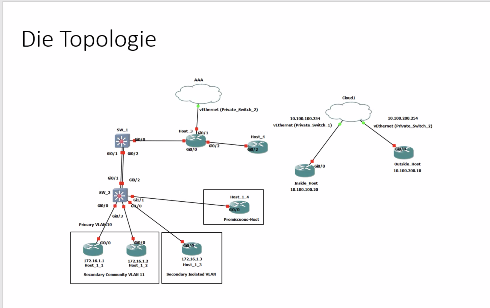
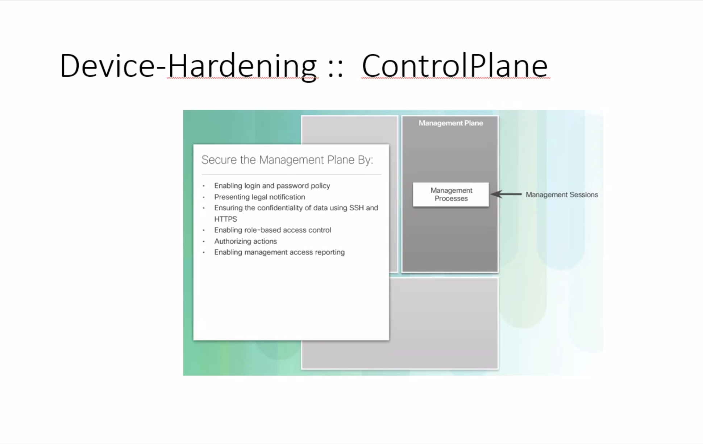
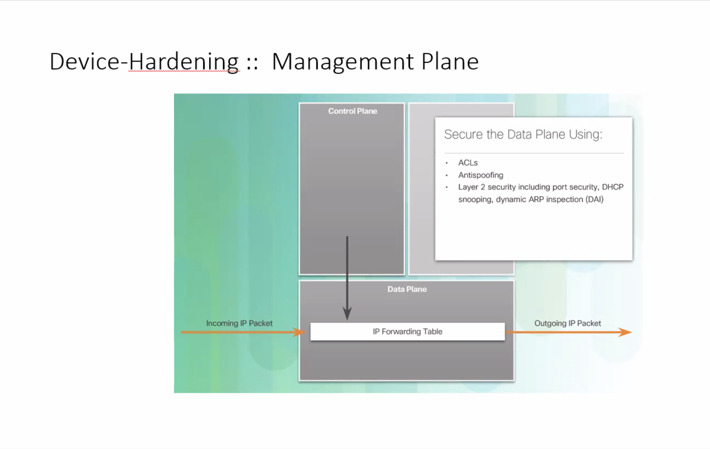
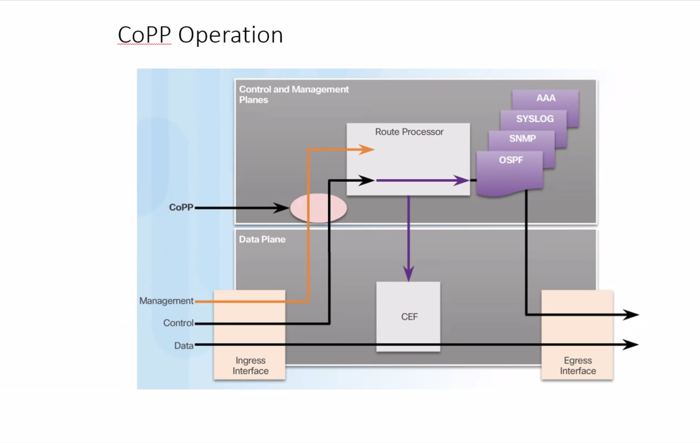

Schöndorfer

# RSA

Intuitiver Zugang

ITSI 4. Jahrgang

Nicht jede Restklasse ist bzgl. der Multiplikation eine Gruppe

Phi-Funktion, einer Primzahl

Primzahlen finden, Sieb des Erathostenens, Bildungsgesetze: Fermat, Mersene, Primzahltests ..., Monte Carlo Verfahren, Schüler müssen eins dieser Verfahren als Abgabe programmieren (4JG ca. 1 Monat)

Schüler rechnen Euklid (halbe Stunde)

MAÜ: 3 Buchstaben aus dem Familiennamen verschlüsseln, TI-30 erlaubt

Franz Fuchs hat seine Verschwörungstheorien mit RSA verschlüsselt. Im Spiegel abgedruckt. Schwäche bei der Wahl der Größenordnung der Zahlen.

# Diffie Hellman

Aussage: Zahlenraum eher klein. Von Rechenpotentem Angreifer knackbar.

# Gerätehärtung / Device Hardening

Im IV Jahrgang umfangreiche Übung

