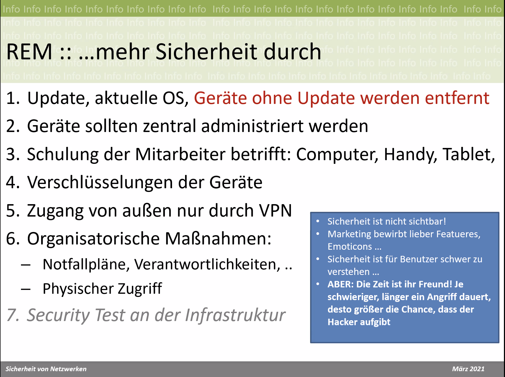
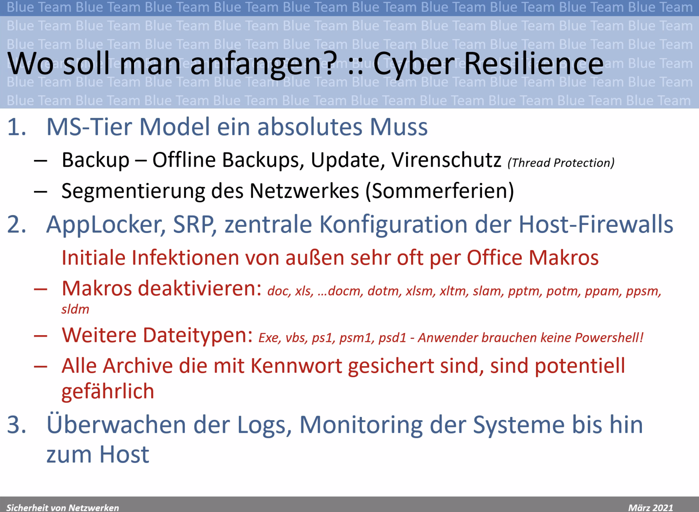
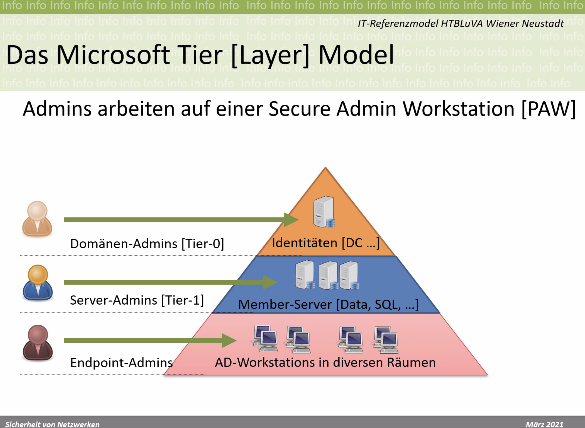
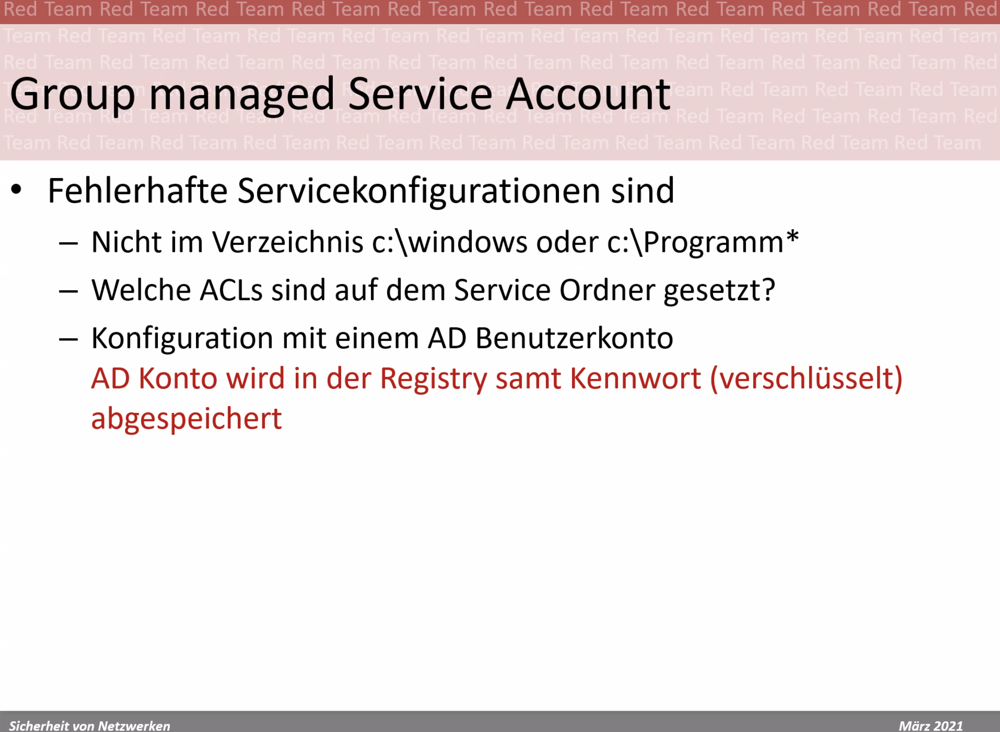
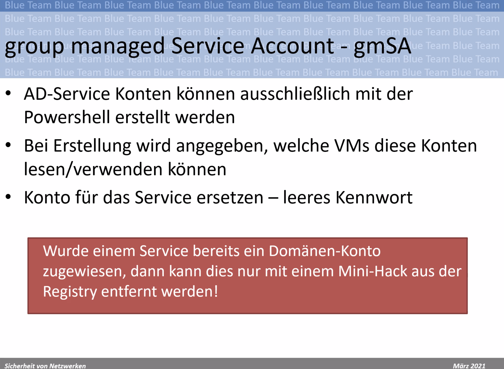
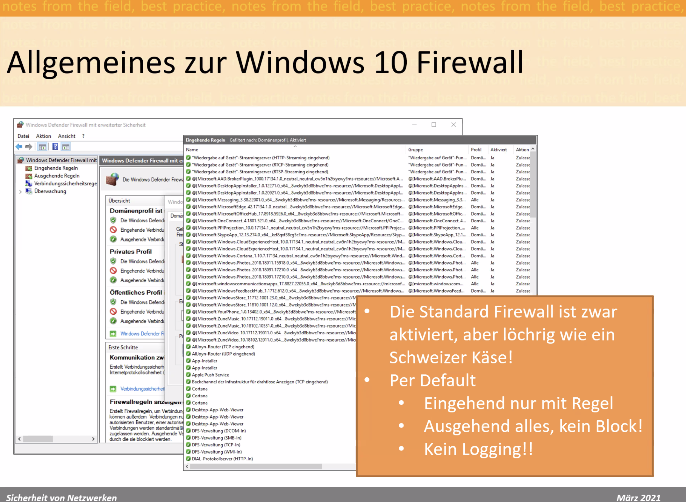
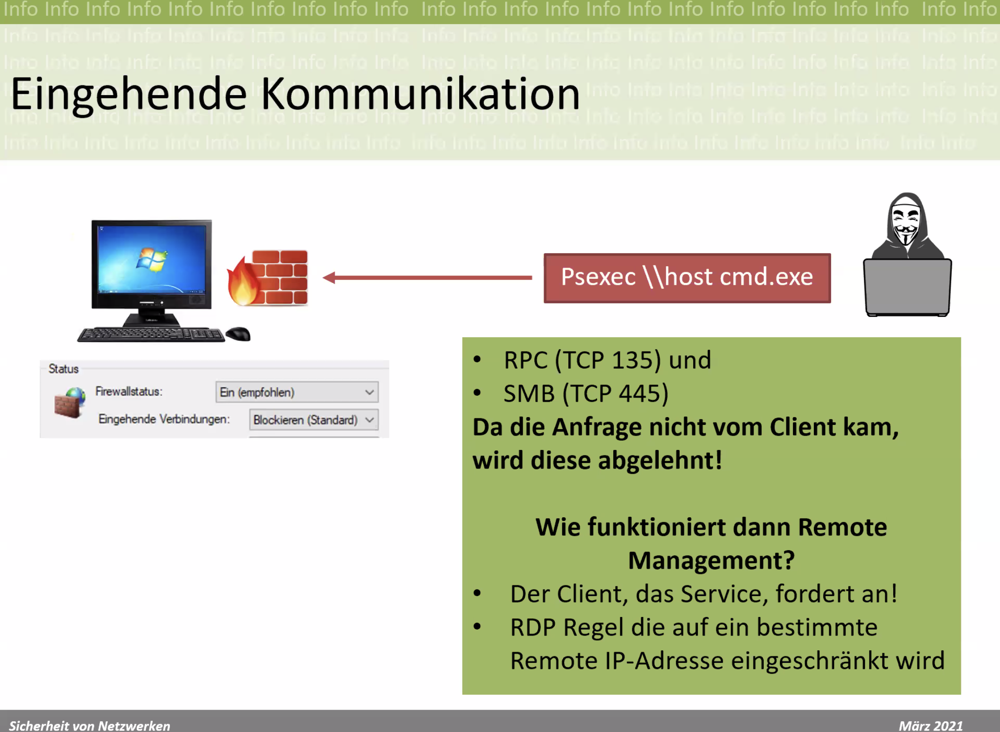
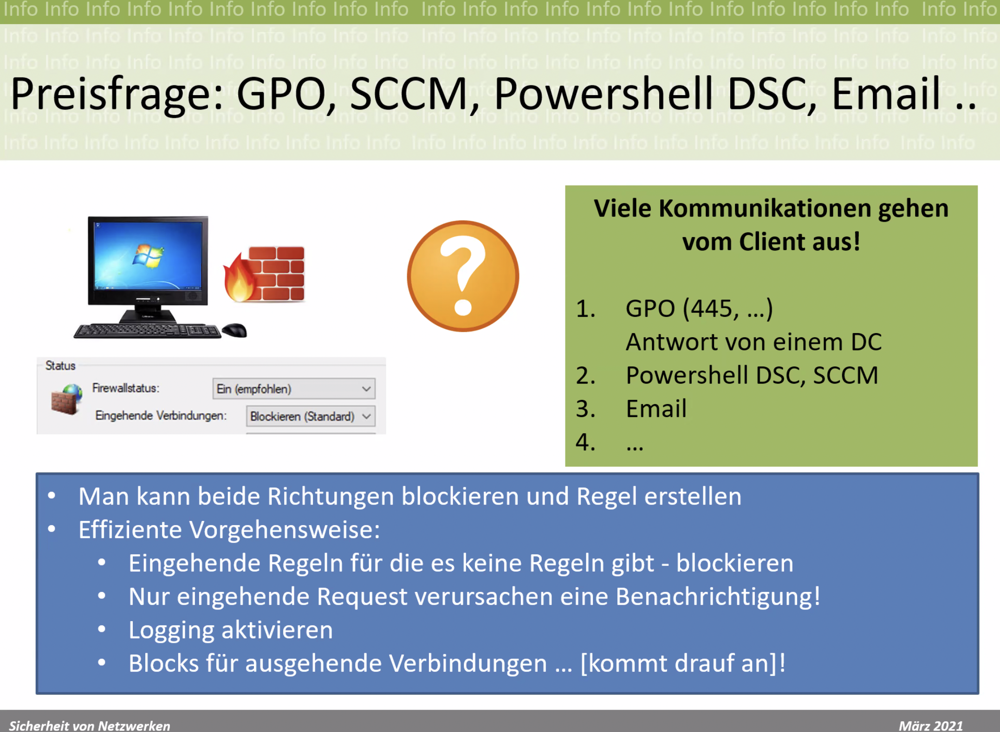
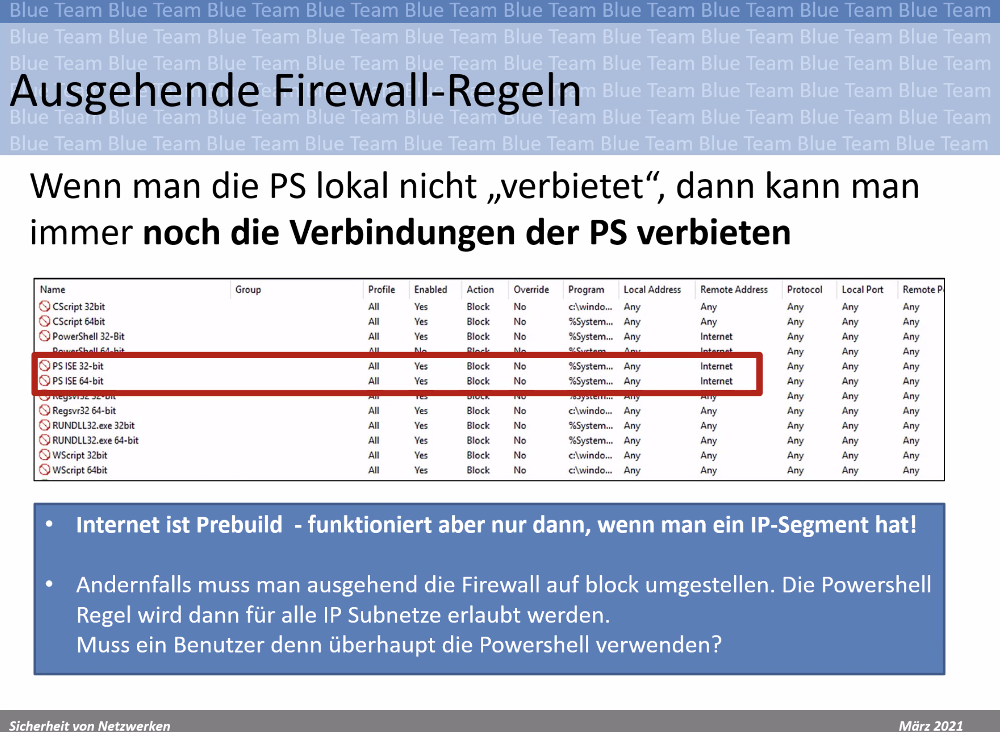

Dienstag Start um 08:00

# Montag 31.05.2021

## Robert Beron

HTL Wiener Neustadt

Privileged Access Workstation(PAW)

Credential harvesting

AD – Active Directory

Hat keiner Konfiguriert! 10%?

Roter Rahmen: Win10 Firewall

Verwirrend

Standard Einstellungen sollen den Standard Benutzer nicht am Arbeiten hindern. Dieser hat kein Wissen über Firewalls.

Zur Konfiguration gibt es kaum Infos im Internet

Anderes Verhalten wie andere Firwalls.

