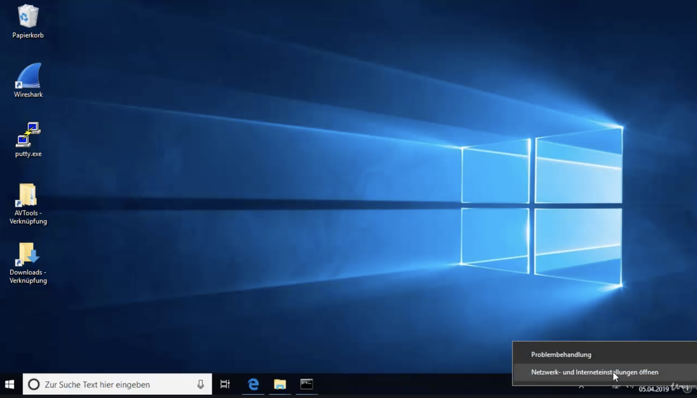
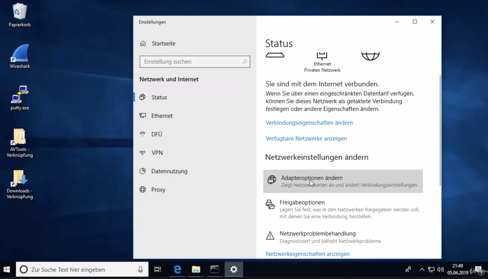
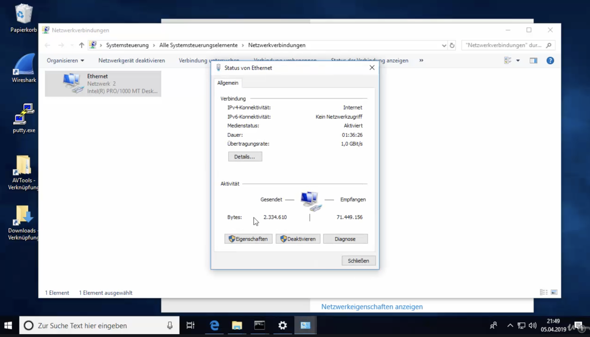
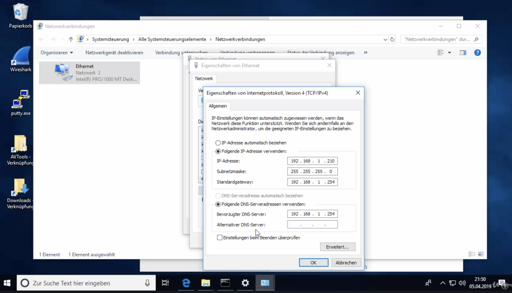

* TOC
{:toc}

# Überblick

## Passwörter

- Kali
  - kali/kali
  - `sudo -i`
  
- Ubuntu
  - root/toor
  - ubuntu/ubuntu
  
- Debian

  - root/toor
  - eric/debiantest

- Metasploitable

  - msfadmin/msfadmin
  - `sudo -i`
  
  

Idee: user / resu bzw. root / toor verwenden.

Oder: kali / kali, debian/debian


# Netzwerk-Adressen


Fritz.Box:

- Kali: 192.168.178.?
- Metasploitable: 192.168.178.71


# Virtual Box

## NAT

VirtualBox hat einen internen DHCP Server der aus 10.0.2.0/24 eine IP Adresse zuweist. Zugriff auf das Internet ist möglich. VMs können nicht untereinander kommunizieren.

## Bridged / Netzwerkbrücke

Virtual Box verbindet die VM mit einer Bridge (ein in Software implementierter Switch). Die VM wird dadurch ein "echter" Teilnehmer im Netzwerk. Die VMs können untereinander kommunizieren und sind auch vom Netzwerk aus erreichbar.

## Internal Network

Netzwerk das nur die VMs untereinander verbindet. Keine Verbindung nach außen. Um die IP Adressen muss man sich selber kümmern (z.B. statisch). Interne Netze haben einen Namen.


# Netzwerkkonfiguration – Linux

## Check der Netzwerkkonfiguration

Überprüfen der Neztwerkkonfiguration (IP Adressen, ...)

```bash
$ ifconfig
```

Debian – kein `ifconfig`

```bash
$ su - # substitute user
toor # root pwd
# ifconfig
... nicht gefunden
$ ip addr show # neuerer und besserer Befehl
```


## KALI

GUI Netzwerkkonfiguration

Rechte obere Ecke Symbol in der Form einer Netzwerkbuchse

- Rechts-Klick >> Edit Connections...
- Verbindung auswählen, Zahnrad-Symbol
- Tab IPv4 Settings
- Bei wieder aktivieren von DHCP müssen die statischen IP Adressen gelöscht werden

Änderungen werden erst übernommen wenn man Disconnected und wieder Connected (Netzwerksymbol)

## Debian

GUI Netzwerkkonfiguration

Rechte obere Ecke Netzwerksymbol. 

- "Kabelgebunden verbunden" >> LAN-Einstellungen
- Zahnrad-Symbol >> IPv4
- evtl. Verbindung beenden und wieder starten (Schalter neben Zahnrad-Symbol)


## Metasploitable

```bash
cd /etc/network
ls
sudo nano interfaces
# iface eth0 inet static
# address 192.168.1.206
# netmask 255.255.255.0
# # gateway 192.168.1.254 (auskommentieren damit Metsploitable nicht raus kann)
sudo ifdown eth0
sudo ifup eth0
ifconfig
```


# Netzwerkkonfiguration – Windows

## Check der Netzwerkkonfiguration

Überprüfen der Neztwerkkonfiguration (IP Adressen, ...)

```
C:> ipconfig
```

## Statische IP

Click rechts unten auf Netzwerksymbol





 Adapteroptionen ändern / Adapter auswählen

Eigenschaften:




# Installation

## Kali Linux

- [Download](https://www.kali.org)

- Kali Linux 64-bit VirtualBox, OVA Datei – Vorteil: ist vorkonfiguriert

- ca. 4 GB!

- These images have a default login/password of “kali/kali” and may have pre-generated SSH host keys.

- `kali-linux-2020.4-vbox-amd64.ova`, In Virtual Box importieren, 1024 MB Arbeitsspeicher reichen (2048 voreingestellt). USB Controller und Sound Card deaktivieren, >Import<, ca. 2min, Legt eine Kopie der ova Datei an, die ova Datei kann man dann löschen.

- Starten in vbox

- Login: kali/kali

- Darstellung kann sehr klein sein auf Retina Displays, >View>Virtual Screen 1>Scale to 200%

- Verwenden einer deutschen Tastatur

  ```bash
  $ setxkbmap -layout de
  # bis zum nächsten Booten!
  ```

  Über GUI: auf Kali Symbol klicken. "Keyboard" eintippen, Layout ... Add ... German (Austria) ... English entfernen ... System Reboot


## Metasploitable 2

installieren – auf Ubuntu basierend, mit vielen Sicherheitslücken

  - [Download](https://sourceforge.net/projects/metasploitable/files/Metasploitable2/), ca. 900MB
  - zip File, Enthält einen Ordner mit einer vmware VM, diesen Ordner in den vbox Ordner verschieben
  - `Metasploitable.vmdk` ist die virtuelle Festplatte, diese ist in einer neuen vbox VM einzubinden
  - vbox

  - neue VM erstellen
  - Name: Metasploitable
  - Type: Linux
  - Version: Ubuntu 32 Bit
  - Continue
  - 512 MB ausreichend
  - Use an existing virtual hard drive file/Vorhandene Festplatte verwenden, Add, `Metasploitable.vmdk` auswählen
  - Starten der VM und anmelden mit msfadmin/msfadmin
  - Start in der Kommandozeile
  - `ifconfig` zeigt aktuelle IP Konfiguration, IP Adresse von eth0 interessant, IP Adresse passt nicht (kommt vom DHCP?)
  - `sudo shutdown -h now`, (Hinweis: englische Tastatur eingestellt `-` ist bei `ß`)
    - VirtualBox hat einen internen DHCP Server der aus 10.0.2.0/24 eine IP Adresse zuweist (wenn auf NAT gestellt), dadurch können die VMs nicht untereinander kommunizieren. VMs sollen Teilnehme im "echten" Netzwerk sein. Einstellen auf "Netzwerkbrücke"/"Bridged Adapter". (Bridge = ein in Software implementierter Switch)
    - Auch Kali Linux umstellen
    - Beide VMs nehmen nun am normalen Netzwerk teil
    - Starten von Kali Linux Fehler: `VERR_SUPDRV_COMPONENT_NOT_FOUND` (macOS), Reinstall von vbox hilft (Fehlermeldung beim ersten Installieren?)
    - Mit `ifconfig` in Kali und Metasploitable prüfen
