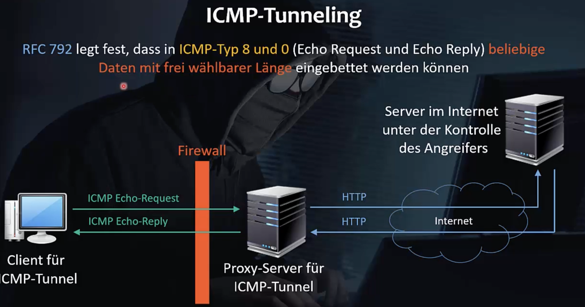
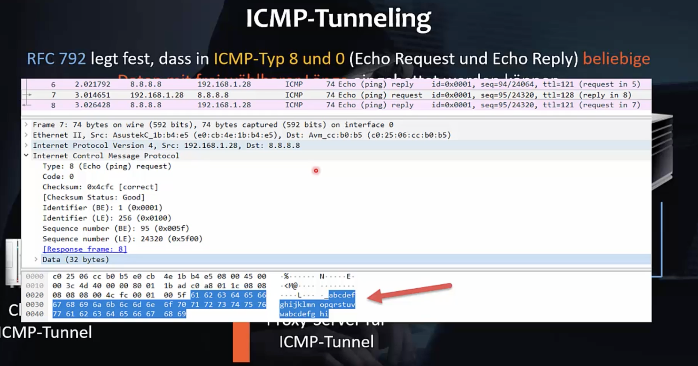

Um Daten an Überwachungssystemen (Firewall, IDS, IPS, [SIEM](https://en.wikipedia.org/wiki/Security_information_and_event_management)) vorbeizuschwindeln gibt es mehrere Ansätze:

"Amberg Video 193. ICMP-Tunneling"

Unter Windows werden einfach Buchstaben verschickt.

Demo:

- icmptunnel über github und compilieren
- Auf Kali icmptunnel als Server starten
  - Erstellt ein eigenes Netzwerkdevice
- Debian: `client.sh` editieren
-  Beispiel: Tunneln eines http Traffics über einen ICMP Tunnel

