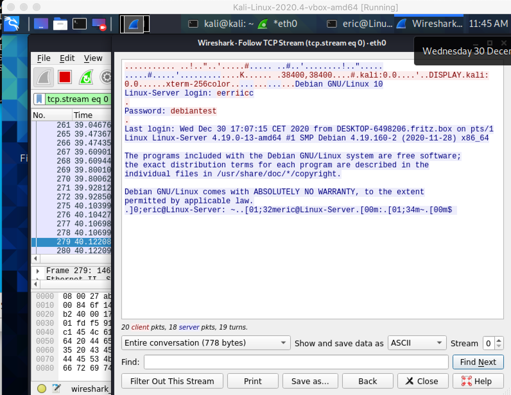

#### Übung (telnet Test)

Voraussetzung: Kali VM

Öffne unter Kali Linux ein Terminal und teste ob `telnet` installiert ist:

```sh
$ telnet
telnet> 

```

Mit `^C` beenden.

Sollte bereits installiert sein – falls nicht installieren mit `apt`

```bash
$ sudo apt update
$ sudo apt install telnet
```

Test mit Netzwerkkomunikation durch Zugriff auf einen Web-Server per HTTP Protokoll.

```sh
$ telnet www.example.com 80
```

Test durch eingeben von folgendem HTTP Request:

```sh
GET /path/to/file.html HTTP/1.1
Host: www.example.com
Connection: close

```

2x Enter Taste in der letzten Zeile, es sollte eine Antwort vom Server dargestellt werden.

Dies geht bei HTTP weil dieses Protokoll nach demselben Prinzip wie telnet arbeitet:
- Text vom Client zum Server (Request)
- Server antwortet mit einem Text zurück zum Client (Response)

Schau dir den Text des HTTP Protokolls an. Wie viel kannst du über die Funktionsweise aussagen?


---

#### Übung (telnet login)

Voraussetzungen: Kali VM + Metasploit VM

Unter metasploitable einen user `alice` anlegen, pass: `alice1234`.

```sh
# Metasploitable
$ adduser alice
...
```

User `alice` testen:

```sh
# Metasploitable
$ su alice
...
$ id
...
$ whoami
...
$ pwd
...
$ exit
...
$ id
...
$ whoami
...
$ pwd
...
```


Verwende telnet um dich Remote von Kali aus auf Metasploitable einzuloggen. Die dafür notwendige IP Adresse kann per `ifconfig` ermittelt werden:

```sh
# Metasploitable
$ ifconfig en0
...
```


---

#### Übung (telnet password sniffing)

Beim Sniffing werden am Netzwerk gesendete Daten mitgelesen. Wir verwenden dazu das unter Kali installierte Programm "wireshark".

- Starte wireshark

- Starte die Aufzeichnung auf der Netzwerkschnittstelle `eth0`

- Wiederhole das telnet Login von Kali auf Metasploitable

- Kannst du die Kommunikation in der Wireshark Aufzeichnung finden?

- Setze Display Filter auf: `ip.addr==<Metasp_IP> and tcp.port==23 `

- Suche die Buchstaben des Passworts in den einzelnen Paketen

- Verwende Menüpunkt: Analyze>Follow>TCP Stream (oder rechte Maustaste auf Packet: Follow>TCP Stream)

