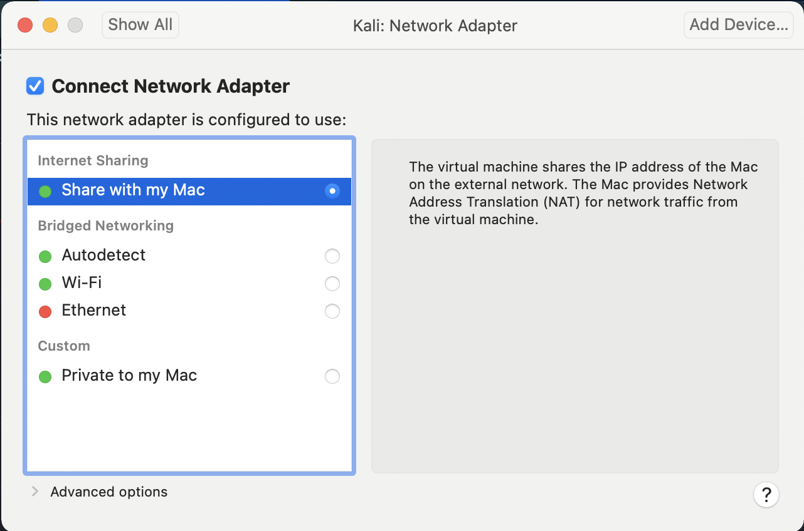
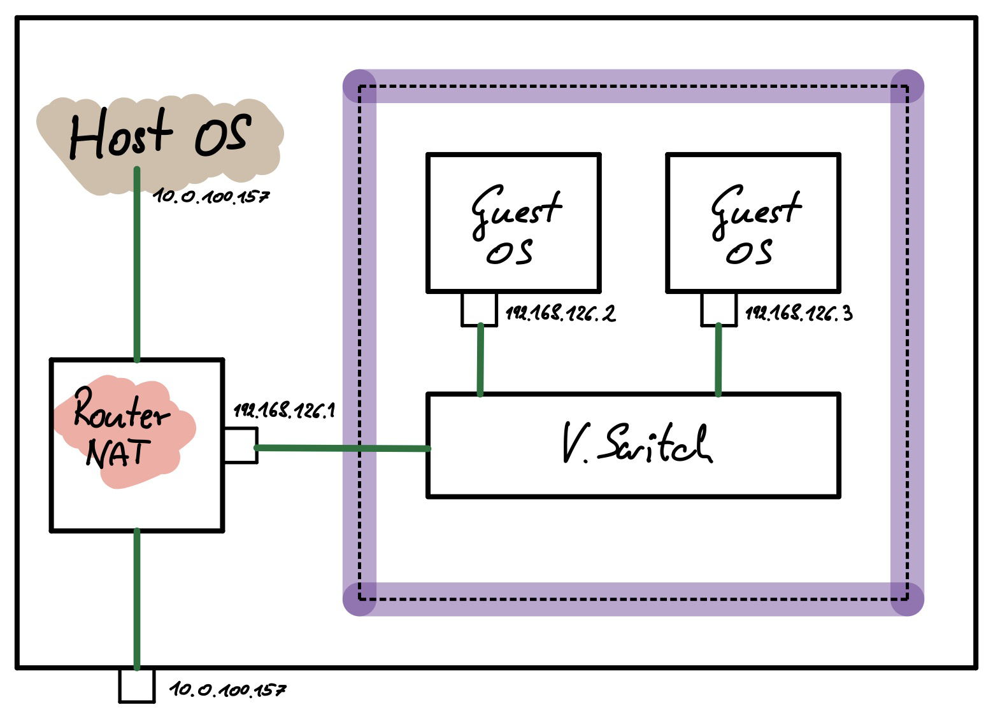
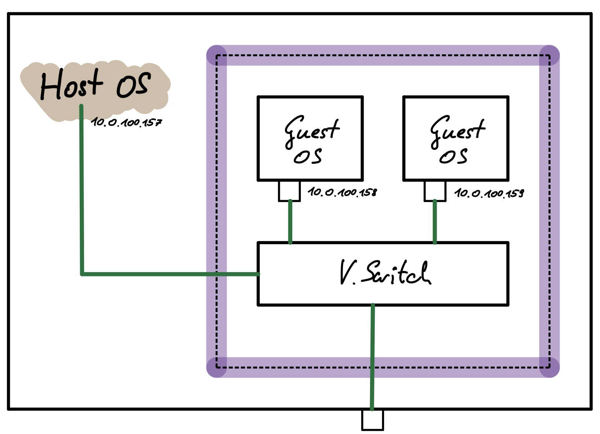

# Allgemein

VMs: Auf einem Rechner (host OS) laufen weitere Betriebssysteme (guest OS). Dabei wird die darunterliegende HW jedem einzelnen guest OS zur Verfügung gestellt. Die guest OS merken davon nichts – "sehen" eine virtuelle Maschine.

Die Software die dies möglich macht nennt man **Hypervisor** bzw. VMM (Virtual Machine Monitor):

- [VmWare](https://www.vmware.com/products/workstation-pro.html) (Windows, Linux, macOS). Kommerziell. Gratis in der Variante *Workstation Player*.
- [VirtualBox](https://www.virtualbox.org) (Windows, Linux, macOS) von Oracle gewartet. Open Source
- [Parallels](https://www.parallels.com/) (macOS)


Typische guest OS:

- Windows
- Linux

Warum VM?

- Experimente mit Betriebssystemen (Linux auf einem Windows Rechner)
- Programme die nur für bestimmte OS existieren
- Load Balancing, z.B. 5 Server die jeweils 20% CPU benötigen
- Einfaches deployment und migration
- Sandboxing für SW Entwicklung und Cybersec


# Netzwerk

Jedes guest OS hat virtuelle Netzwerkadapter. Der Hypervisor im Host OS sorgt für den Zugang zum Netzwerk. Modi:

- NAT (Sharing)
- Bridged
- Host-only (Privat)





## NAT

= Network Adress Translation = wie ein Home-WLAN-Router

Alle VM sind in einem eigenen IP subnet – Hypervisor stellt DHCP Server zur Verfügung. VMs können nach außen kommunizieren sind aber von außen nicht erreichbar. Das Host OS bekommt eine eigene IP Adresse im NAT subnet.

Die guest OS untereinander und das host OS sind mittels eines virtuellen Switch miteinander verbunden.

Das guest OS routet die Paket ins öffentliche Netzwerk und führt dabei NAT durch, d.h. nach außen sichtbar ist nur die IP Adresse des Hosts.

Beispiel. VmWare hat das subnet `192.168.126.0/24` erzeugt. Host hat `192.168.126.1` und guest OS (Kali) `192.168.126.2` als lokale IP und `192.168.126.1` als default Gateway.

```sh
# Kali Guest OS:
$ ifconfig eth0      
eth0: flags=4163<UP,BROADCAST,RUNNING,MULTICAST>  mtu 1500
        inet 192.168.126.2  netmask 255.255.255.0  broadcast 192.168.126.255
...
$ route -n       
Kernel IP routing table
Destination     Gateway         Genmask         Flags Metric Ref    Use Iface
0.0.0.0         192.168.126.1   0.0.0.0         UG    100    0        0 eth0
192.168.126.0   0.0.0.0         255.255.255.0   U     100    0        0 eth0
```




## Bridged

Der virtuelle Netzwerkadapter des guest OS wird einem physischen Netzwerkadapter am host OS zugeordnet. Das verhält sich so als wenn beide Netzwerkadapter über einen Switch mit dem öffentlichen Netzwerk verbunden wären.

In diesem Mode nimmt das guest OS direkt an der Netzwerkkomunikation teil und erhält die IP Adresse typischerweise vom DHCP Server im Netz. Von außen ist ein guest OS im bridged mode zugänglich und nicht von einem normalen Computer unterscheidbar.




## Host-only

Alle guest OS erhalten eine IP vom Hypervisor-DHCP. Eine Kommunikation untereinander und mit dem host OS ist möglich. Andere Computer im Netzwerk können nicht mit den Guest OS kommunizieren.
