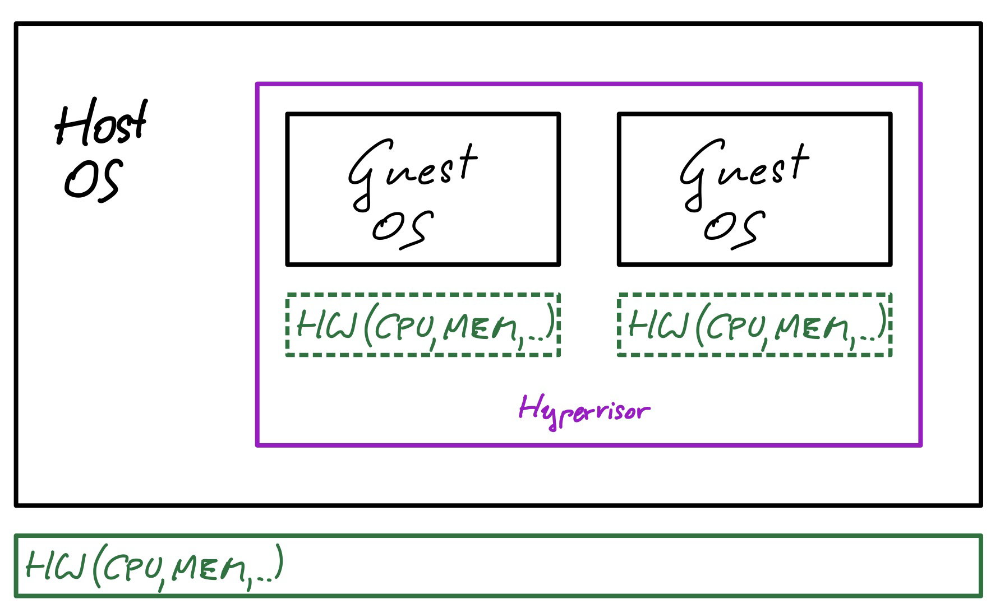

VMs: Auf einem Rechner (host OS) laufen weitere Betriebssysteme (guest OS). Dabei wird die darunterliegende HW jedem einzelnen guest OS zur Verfügung gestellt. Die guest OS merken davon nichts – "sehen" eine virtuelle Maschine.

Die Software die dies möglich macht nennt man **Hypervisor** bzw. VMM (Virtual Machine Monitor):

- [VmWare](https://www.vmware.com/products/workstation-pro.html) (Windows, Linux, macOS). Kommerziell. Gratis in der Variante *Workstation Player*.
- [VirtualBox](https://www.virtualbox.org) (Windows, Linux, macOS) von Oracle gewartet. Open Source
- [Parallels](https://www.parallels.com/) (macOS)

Typische guest OS:

- Windows
- Linux

Warum VM?

- Experimente mit Betriebssystemen (Linux auf einem Windows Rechner)
- Programme die nur für bestimmte OS existieren
- Load Balancing, z.B. 5 Server die jeweils 20% CPU benötigen
- Einfaches deployment und migration
- Sandboxing für SW Entwicklung und Cybersec