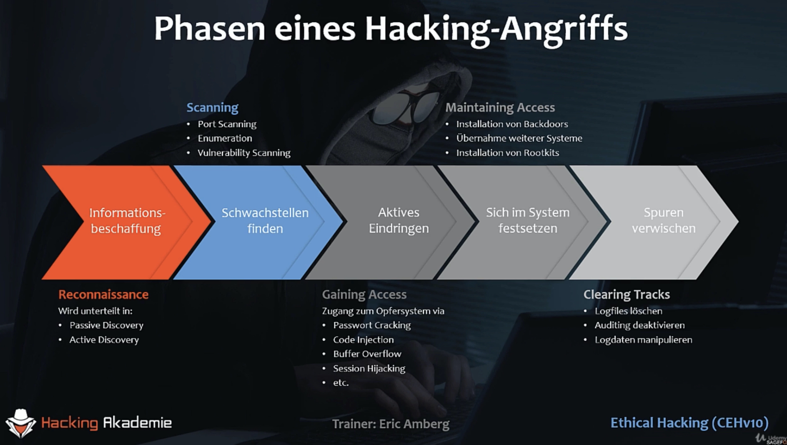
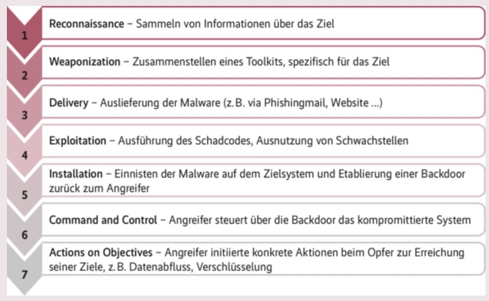

APT (**Advanced Persistent Threat**). Zielgerichteter Angriff auf ein Ziel (Firma, Behörde, ...). Kann Monate bzw. Jahre andauern.

Vorgehen der Angreifer kann in **Phasen** gegliedert werden. Ein **IT-Sicherheitskonzep** sollte Maßnahmen gegen Aktionen in jeder Phase enthalten.

# Variante 1 (nach Eric Amberg)

- **Reconaissance** – (Footprinting, Information gathering, Informationsbeschaffung)

  - passive discovery (Webauftritt, Veröffentlichungen, ...)
  - active discovery (z.B. Telefonanruf, falscher Handwerker, soziale Netzwerke)
  - wichtigste und am längsten dauernde Phase

- Scanning – Schwachstellen finden

  - Port scanning
  - Enumeration (Usernamen, Netzwerkresourcen, Services, ...)
  - Vulnerability Scanning

- Gaining access

  - Schwachstelle nutzen
  - Default Passwörter, Weak configuration, Code execution vulnerability, Trojaner, ...

- Post exploitation

  - Maintaining access (sich festsetzen)
  - Backdoors installieren
  - Weitere Systeme anvisieren
  - Rootkits (versteckt installierte Software)

- Clearing Tracks (Spuren verwischen)

  - Log Files löschen/manipulieren

  

# Variante 2 (iX Zeitschrift)

