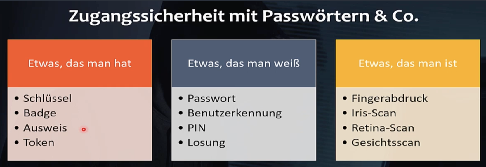
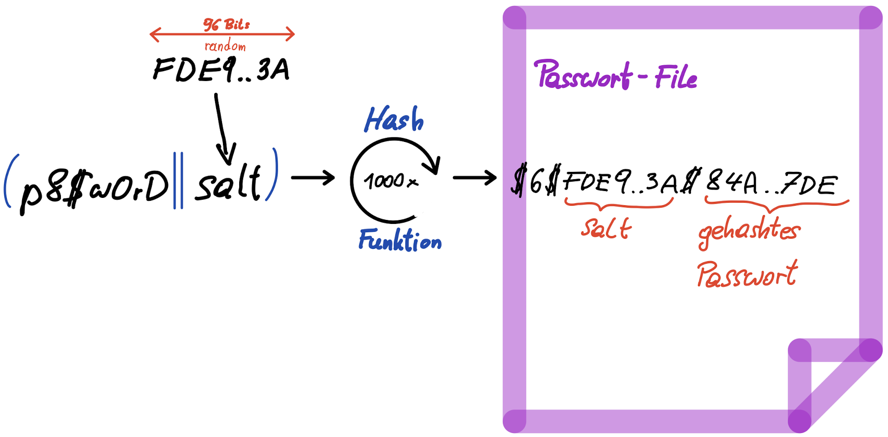

<script src="https://cdn.mathjax.org/mathjax/latest/MathJax.js?config=TeX-AMS-MML_HTMLorMML" type="text/javascript"></script>

* TOC
{:toc}

# Authentifizierung

Kriterium für Zugang zu Systemen bzw. Feststellen der Identität eines Users



Zusätzliche Sicherheit durch **Zwei-Faktor**-Authentifizierung (aus 2 Kategorien) (2FA)

Häufig:

- Passwort (was man weiß)
- Code aufs Handy (was man hat)


# Passwörter

Ein Passwort ist eine geheime Zeichenfolge die zusätzlich zu einem Benutzernamen verwendet wird um die Identität einer Person zu bestätigen (engl. credentials). Benutzername/Passwort ist die **häufigste** Methode zur **Authentifizierung**.

Passwörter sollen:

- nicht aufgeschrieben werden
- eine gewisse Komplexität aufweisen (Länge, Sonderzeichen, Zahlen, ...)
- nicht erraten werden können (Geburtsdatum, Name der Kinder, ...)

Aus technischer Sicht:

- nicht im Klartext speichern (Hashing)
- nicht im Klartext versenden (Verschlüsselung)


# Passwörter speichern

Es wird nicht dass Passwort gespeichert sondern dessen Hashwert. Mit dem Hashwert:

- kann man das Passwort auf Gültigkeit prüfen,
- aber nicht dieses wiederherstellen.

Fällt dieser Hashwert in unbefugte Hände ist dieser erst einmal nutzlos. 

Linux Passwort File (`/etc/passwd`)

Format:

```
Username:Password_Hash:UID:GID:Info:Home:Shell
```

Beispiel:

```
matejka:$6$Y.6vLGlD1cGsutIg$Hn2/2.hNyojM19F1AwNHPAzAHEk.3vPhsOqWOGyds5hieGvedb45DCxV5aqZ194w12zhaet1rhWJyCx/mzePk.:1000:1000:Franz MATEJKA,,,:/home/matejka:/bin/bash
```

**Passwort festlegen**: Legt ein Benutzer erstmalig sein Passwort fest wir dieses gehasht und der Hashwert im Passwort-File gespeichert. Der Klartext wird nicht länger als notwendig gespeichert.

**Passwort prüfen**: Benutzer gibt Name und Passwort ein. Der Hashwert des eingegebenen Passworts wird mit dem gespeicherten Hashwert verglichen – ist dieser gleich ist der Benutzer authentifiziert.


# Angriffe

Möglichkeit um in den Besitz von Passwörtern zu kommen 

- **Erraten** (*password guessing*) – erfolgreich bei schwachen Passwörtern und Default Passwörtern. [[Default Passwörter von Netzwerkgeräten](https://datarecovery.com/rd/default-passwords/)] [[Weitere Liste von Default Passwörtern](https://cirt.net/passwords)]
- **Erfragen**, social engineering ("this is  technical support calling, please be kind and help me, this is very urgent, your computer was hacked ... please tell me your password")
- **Phishing** (gefälschte Login Seiten)
- **Keylogger** (Hardware, Malware, *side channel attack*)
- Passwort File stehlen (***password breach***) und Passwörter knacken (*password cracking*)


# Password Breach

Passwort Datei wird gestohlen. Kommt häufig vor und betrifft sehr viele Benutzerdaten

- [wikipedia - List of data breaches](https://en.wikipedia.org/wiki/List_of_data_breaches)
- [Data breach](https://en.wikipedia.org/wiki/Data_breach#2019)

- [;--have i been pwned?](https://haveibeenpwned.com)

> For  3.77M users the attacker got their email address and a hash of their password. For 3.55M of these users, the method to hash the password is bcrypt, and for the remaining 229K users the method was salted MD5. Since then we have updated the hash of all users to bcrypt. [2020, [Statement on Security Incident at Freepik Company](https://www.freepik.com/blog/statement-on-security-incident-at-freepik-company/)]

Damit kommt ein Hacker in den Besitz der Hashwerte – per **PW cracking** werden daraus die ursprünglichen Passwörter wiederhergestellt. 

Grundidee: alle möglichen Passwörter durchprobieren, d.h. Hashwert berechnen und mit dem gestohlenen Hashwert vergleichen. Stimmen die Hashwerte überein ist das gesuchte Passwort gefunden. 

Es gibt mehrere Möglichkeiten:

- brute force attack (alle Varianten durchprobieren ob der gesuchte Hash herauskommt)
- dictionary attack (häufige Wörter probieren)

- Namen, Geburtsdatum, etc. Kombinationen

Um diese Angriffe zu beschleunigen wird häufig die Rechenleistung von Grafikkarten genutzt.


# Verteidigung

Das PW cracking muss sehr zeitintensiv sein. Dies wird durch 3 Maßnahmen erreicht

- Password Complexity
  - Langes Passwort
  - Viele mögliche Zeichen (Groß, Klein, Ziffern, Sonderzeichen)
  - Keine erratbaren Bestandteile (Namen, Geburtsdatum, ...)
- Key stretching
- Salting


## Complexity

Ausgangspunkt: Anzahl der Möglichkeiten für das Passwort.

Beispiel: 5 Zeichen lang, aus den 26 Buchstaben a-z → $$26^5=11881376$$ Möglichkeiten

Bei 1000 guesses/second, ca. 3 Stunden

Maßzahl für Komplexität ist die **Entropie** = `log_2(# Möglichkeiten)`
$$
log_2(26^5)=23,5 \ \text{bits}\\
2^{23,5}=26^5
$$
Anzahl der Bits die notwendig sind um alle Möglichkeiten durchzunummerieren.

Ziel z.B. 40 Bits Entropie (online guessing): $$2^{40}$$ Möglichkeiten bei 1000 guesses/second, ca. 35 Jahre.

Bei offline guessing z.B. 80 Bits Entropie

Mehr Zeichen:

```
26 Uppercase letters: A-Z
26 Lowercase letters: a-z
10 Numbers: 0-9
32 Symbols: ~`!@#$%^&*()_-+={[}]|\:;"'<,>.?/
=============
94 Zeichen
```

Entropie bei Länge von 5
$$
log_2(94^5)=32,8 \ \text{bits}
$$
Wie lange muss ein Passwort sein um eine Entropie von 80 Bits zu erreichen (Zeichenvorrat 94)?

Im Duden stehen 145.000 Wörter 

- wenn daraus zufällig ein Passwort gewählt wird was ergibt sich für eine Entropie?

- Wenn ein Passwort aus dem Duden gewählt wird und wahlweise der erste oder der letzte Buchstabe groß- oder kleingeschrieben wird was ändert das an der Entropie?

- Zusätzlich wird ein Symbol aus `#+*?=&%$§!` (10) hinten angefügt wie sieht es nun mit der Entropie aus.

- Nun wird ein Symbol und eine Zahl in zufälliger Reihenfolge angefügt.

- Beurteile nun die Stärke dieser (nicht unwahrscheinlichen) Passwortwahl.


## Key stretching

Mittels **key derivation** wird der Hashwert aus dem Passwort ermittelt. **key stretching**: Hash Funktion wird wiederholt (1000-100000x, Runden, rounds). Macht brute force Angriff aufwändig.

> Die Anzahl der Wiederholungen wird so gewählt, dass man die bestmögliche HW Ausstattung eines Angreifers annimmt und dafür die key derivation eine bestimmte Mindestzeit in Anspruch nehmen soll (z.B. 10 ms). Da sich die HW ständig verbessert steigert sich auch die Rundenzahl mit der Zeit. Zusätzlich müsste man auch noch Grafikkarten und FPGA unterstützte Angriffe berücksichtigen.


## Salt

Wählen zwei unterschiedliche Nutzer das gleiche Passwort so ergibt sich auch der gleiche Hashwert. 

```
alice : mypass123 -> 3AF9
bob   : mypass123 -> 3AF9
```

Nachteile:

- Information für einen Angreifer
- Angriff per rainbow-tables möglich. Enorme Beschleunigung des brute-force-attacks. Hashwerte werden vorberechnet (riesige Tabellen)

Lösung: 

Ein "salt" (kryptographisches Salz) ist eine zufällige Zahl die vor dem Hashing an das Passwort angefügt wird. Der Hashwert gleicher Passwörter ist dann unterschiedlich.

```
        pw        salt    hash
alice : mypass123|7CA5 -> D016
bob   : mypass123|BE7F -> 04FF
```

Bei jedem Ändern des Passworts wird ein neues, zufälliges salt gewählt.

> *salt* should be about 16 or more bytes from a proper source, e.g. [`os.urandom()`](https://docs.python.org/3/library/os.html#os.urandom).

Das gehashte PW wird gemeinsam mit dem Salt gespeichert. Das Salt ist nicht sicherheitsrelevant.


## Salted key stretching

Aktuell Stand der Technik



Standard Algorithmen:

- [crypt](https://en.wikipedia.org/wiki/Crypt_(C)) (UNIX)
- [PBKDF2](https://en.wikipedia.org/wiki/PBKDF2)
- [scrypt (RFC7914)](https://tools.ietf.org/html/rfc7914.html) – neuerer Standard (2016), berücksichtigt die ständig steigende Rechenleistung die Anfreifern zur Verfügung steht.

