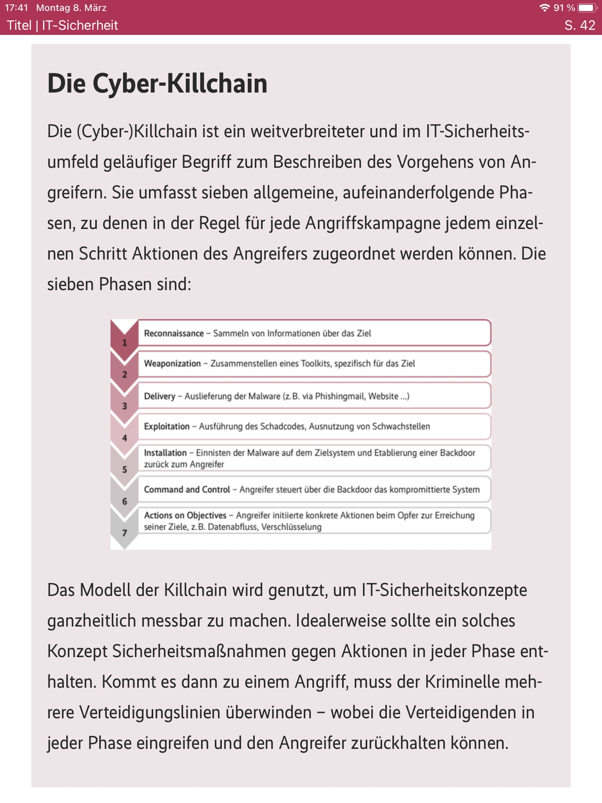
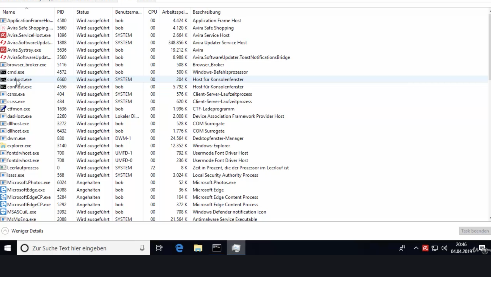
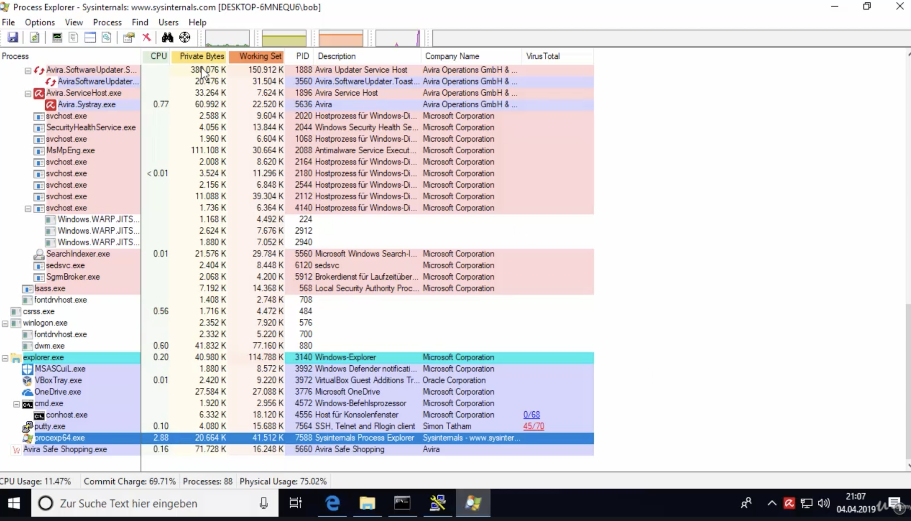
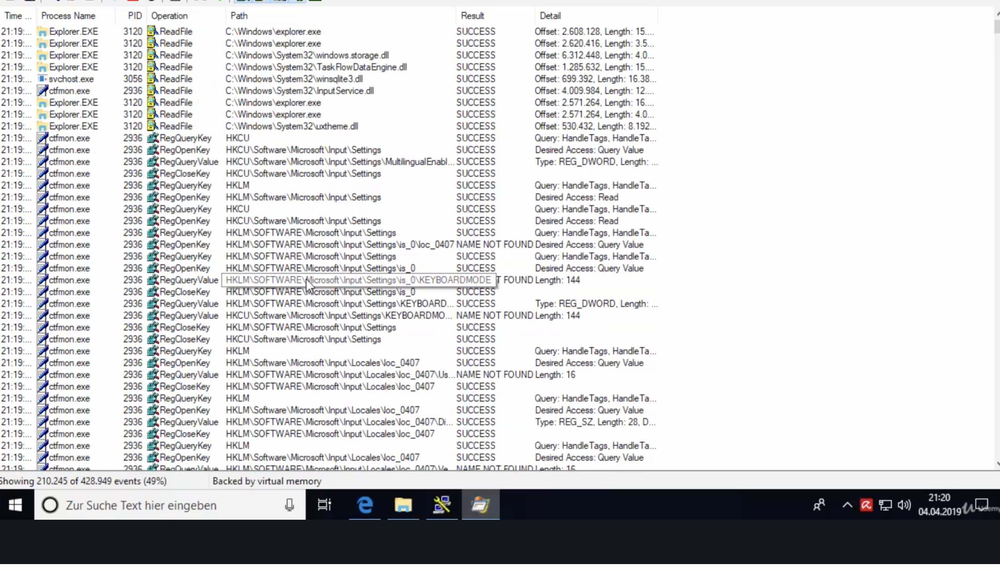
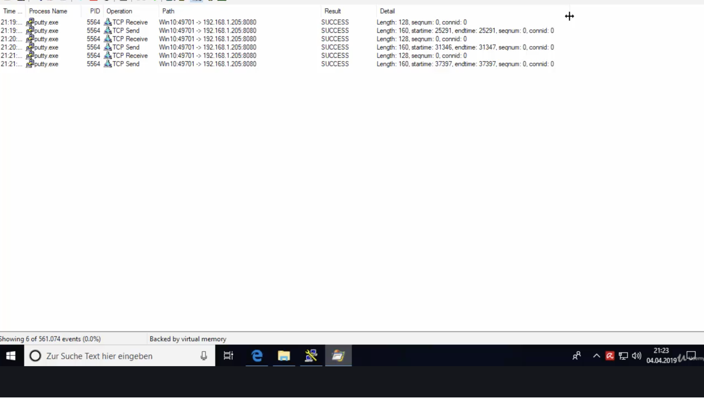
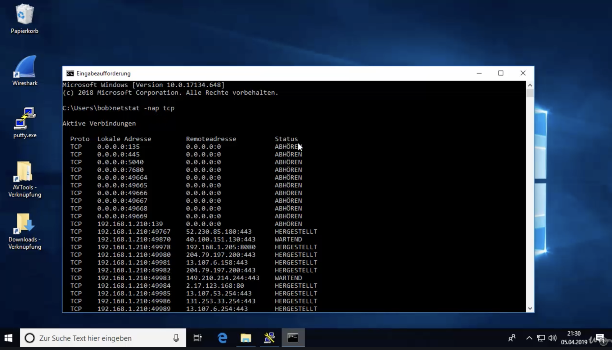

# Cyber Killchain

# Amberg Video 211 – Prozesse überprüfen

**Task Manager**, Details Tab, begrenzte Infos

**sysinternals – Process Explorer**, bessere Anzeige, z.B. Prozesshierarchie

- VirusTotal Überprüfung eines Prozesses kann mit rechtcklick angestoßen werden
- 

**sysinternals – Process Monitor**,  Einblick in die aktuellen Aktivitäten von Prozessen

Hier sieht man z.B. die Reverse Shell des putty Trojaners:

Malware versucht typischerweise sich zu verstecken und nicht als eigener Prozess aufzuscheinen, daher schwindeln diese sich gerne in andere Prozesse (z.B. explorer.exe) per process injection.

# 212. Netzwerkaktivitäten prüfen (Amberg)

`netstat -nap tcp`

Mehr Übersicht mit Tool `CurrPorts` von [NirSoft](http://www.nirsoft.net)

