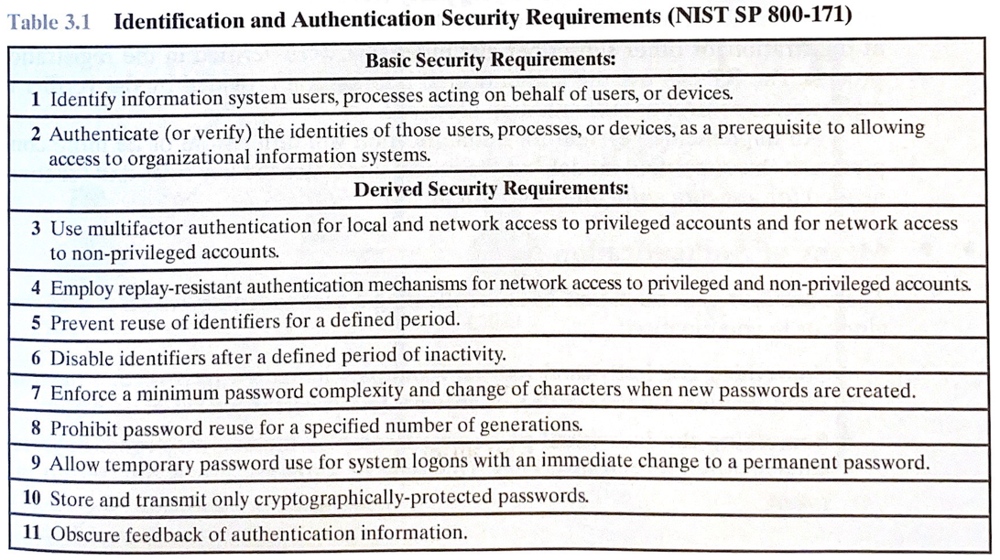

- **Identifizieren** (Wer sind sie?)
- **Authentifizieren** (Zeigen sie ihren Ausweis!)
- **Autorisierung** / access control (Sie dürfen (nicht) rein)
  - kann auch selektiv sein (hier OK, da drüben nicht)

Stallings - S65 Table 3.1:

## Identifikation

- Username
- Nummer
- Email Adresse

## Authentifikation

Arten:

- Was jemand weiß (Passwort)
- Was jemand hat (Token, Smart-Card, ...)
- Was jemand ist (Statische Biometrie - Fingerabdruck, Gesichtserkennung)
- Was jemand tut (Dynamische Biometrie - Sprachmuster, Handschrift, ...)

Multi-Faktor- Athentifizierung wenn mehr als eine Art.

## Investigate:

- [Principle of least privilege](https://en.wikipedia.org/wiki/Principle_of_least_privilege) (das am wenigsten privilegierte Modell)
- Unterschied zu Zero-Trust?