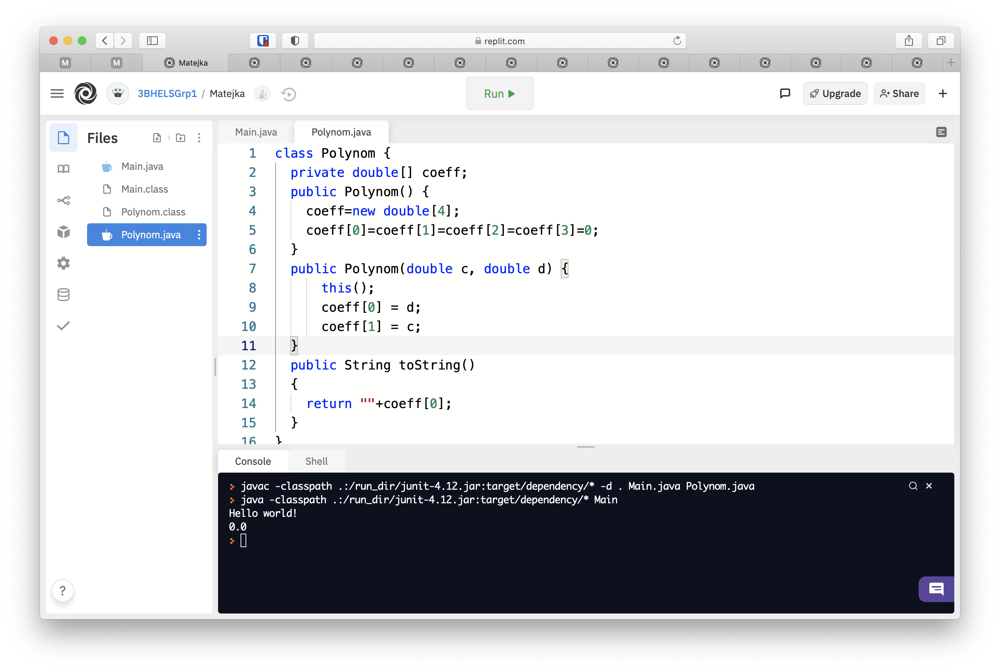
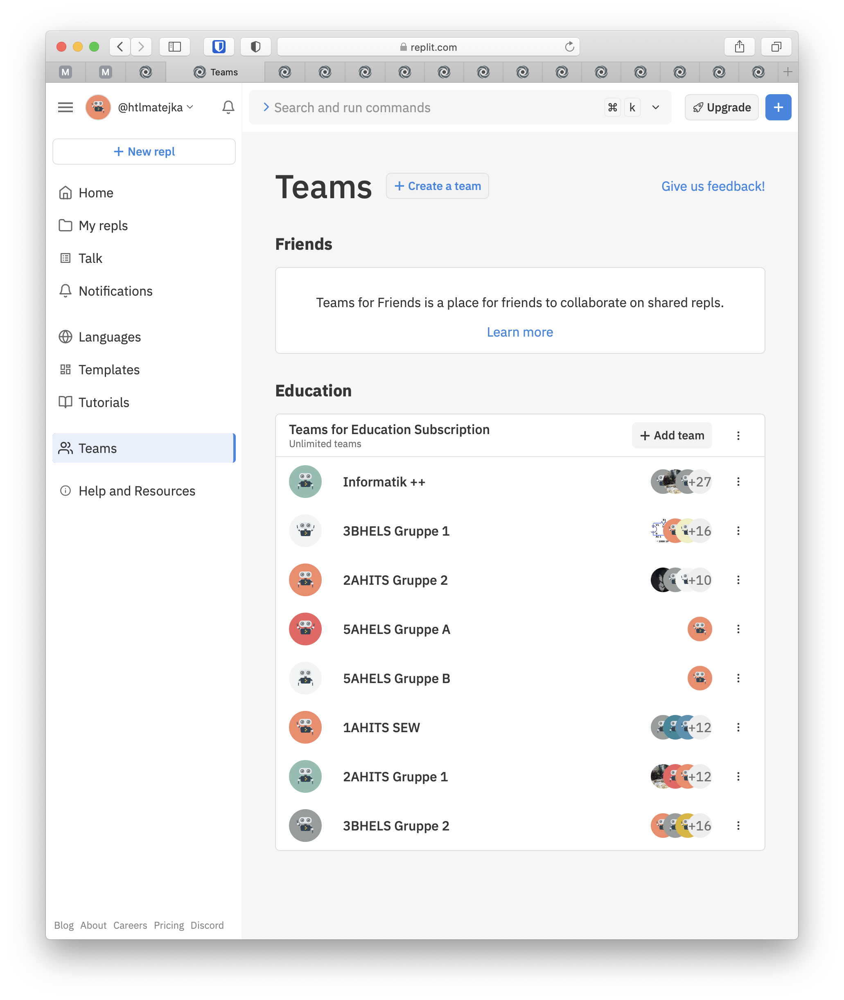
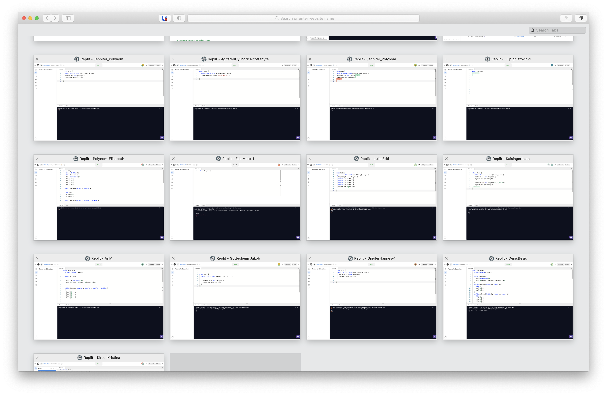
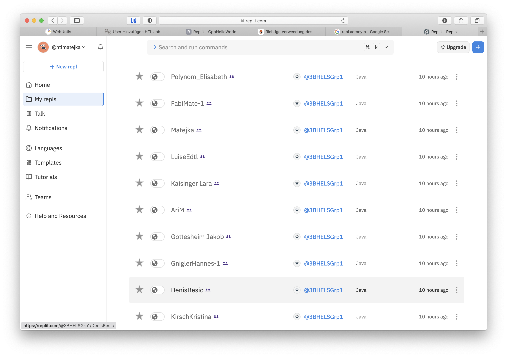

[replit.com](https://replit.com) ist eine Web basierte Entwicklungsumgebung. Editor, Compiler und Laufzeitumgebung sind online. Es genügt ein Browser, es sind keine Installationen notwendig. Internetverbindung vorausgesetzt sind alle erstellten Programme von überall verfügbar. Auch auf Tablets und Handys ist es möglich an den Programmen (genannt REPL – read eval print loop) zu arbeiten.

Erstellte REPL können weitergegeben werden, siehe:

- [CppHelloWorld](https://replit.com/@htlmatejka/CppHelloWorld) – öffnen und starten!

Ein paar Features:

- Jedes REPL läuft in einer eigenständigen, virtuellen Linux Umgebung.
- Es ist möglich Dateien hochzuladen und z.B. von einem Programm aus darauf zuzugreifen
- Mit Flask (Python) können Webserver erstellt werden, statische Webseiten, generierte Webseiten und sogar kompette RESTful APIs (todo: Link einfügen) sind möglich.
- Einfache Spiele im Terminal sind möglich. Implementierung einer `conio.h` ähnlichen Library – siehe hier.

## Mit Schülern

Mit C, C++, Java und Python werden alle für FSST, SEW, AIT und teilweise SEN nötigen Programmiersprachen unterstützt. Auch C# ist möglich, dabei handelt es sich aber leider um Mono (vielleicht kommt ja einmal .NET Core).

Die Schüler müssen sich nur auf replit.com anmelden. Probleme beim Installieren von Entwicklungsumgebungen und verlieren von Programmen kommen nicht mehr vor.

## Teams for education

Kostenpflichtiger Dienst

Schüler können zu Teams hinzugefügt werden

Auf alle in einem Team erstellte REPLs hat man Zugriff und kann den Schülern sogar live beim Coden zusehen:

Im Code der Schüler können Kommentare eingefügt bzw. dieser gleich direkt (auch gemeinsam mit dem Schüler) editiert werden (Multiplayer Editor).

Die REPLs bleiben gespeichert und können in Ordern organisiert werden.

## Persönliches Fazit

Bin ziemlich begeistert. In fast allen Klassen auf dieses Tool umgestiegen. Hat noch ein paar Macken ist aber in ständiger Entwicklung/Verbesserung.