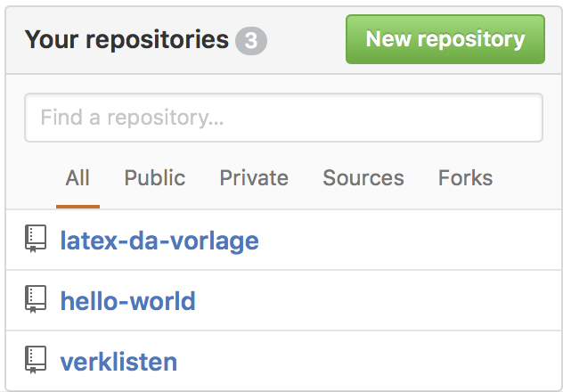

* TOC
{:toc}

**git** ist eine Software zur verteilten Versionsverwaltung.
git ist ein Projekt von Linus Torvalds, dem "Erfinder" von Linux.

- Eine Versionsverwaltung (*VCS - version control system*) hat allgemein die Aufgabe Änderungen an Dateien zu verfolgen.
- Außerdem erleichtert ein VCS das Zusammenarbeiten mehrerer Personen am gleichen Projekt.
- Für jede Datei werden unterschiedliche Versionen mit **Zeitstempel** und **Benutzerkennung** gespeichert.
- Die Versionsverwaltung hat auch die Information welche Versionen der Dateien zusammenpassen.


## Basics

git unterscheidet 3 Stellen in der sich eine Datei befinden kann:

- working directory/tree
- staging area (auch "index" oder "cache", Sammlung abgeschlossener Änderungen)
- repository (.git subdir)
  


## Getting Started

[gittutorial](https://git-scm.com/docs/gittutorial)

git installieren. Z.B. für Ubuntu

```bash
$ sudo apt install git
```

Erstmalige Konfiguration:

```bash
$ git config --global user.name "John Doe"
$ git config --global user.email johndoe@example.com
```

## Initialisierungen

Ein neues **Repository** anlegen und Dateien einfügen.

```bash
$ mkdir tests
$ cd tests
$ touch index.html
```

Inhalt von `index.html`

```html
<!DOCTYPE html>
<html lang="en">
<head>
    <meta charset="UTF-8">
    <title>Document</title>
</head>
<body>
    <p>Best webpage ever</p>
</body>
</html>
```

Ein leeres git Repository anlegen:

```bash
$ git init
```

Die Datei `index.html` in die staging area geben:

```bash
$ git add index.html
```

Anschließend alles was sich in der staging area befindet mit **commit** in das Repository übernehmen.

```bash
$ git commit -m 'Erste Version'
```

Vorgang:

\ 


## Änderungen

Ergänzung im `index.html` File:

```html
<p>Really - believe me</p>
```

git erkennt die geänderten Dateien:

```bash
$ git status
```

Auch die genauen Änderungen bekommt man mit

```bash
$ git diff
```

Die Änderungen ins Repository übernehmen:

```bash
# stage
$ git add index.html 

# commit
$ git commit -m 'Text Erweiterungen'
```

Versionshistorie ansehen:

```bash
$ git log index.html
```

Unterschied zwischen 2 Versionen ansehen:

```bash
$ git diff 2957..f436 index.html 
```

Es reichen die ersten Stellen des Hashs.

Unterschied zwischen den letzten beiden Commits:

```bash
git diff HEAD HEAD^
git difftool HEAD HEAD^
```


## Änderungen rückgängig machen

Mit `git` ist es einfach Änderungen wieder rückgängig zu machen.
Z.B. um zur letzten noch funktionierenden Version eines Programms zurückzukehren (nach dem man einen Punkt erreicht hat an dem gar nichts mehr geht).

Erweiterung in `index.html`:

```html
<p>Ein kurzfristiger Test</p>
```

```bash
$ git status
```

Änderungen rückgängig machen mit `checkout`

```bash
$ git checkout -- index.html 
$ git status
```

## Version wiederherstellen

Eingecheckte Versionen lassen sich jederzeit wiederherstellen.

Über den Hash.
Der Hash wird durch `git log` angezeigt.

```bash
$ git log index.html
$ git checkout 2957 index.html 
```

Zurück zur aktuellsten Version:

```bash
$ git checkout master index.html 
```

Die Bedeutung von `master` wird weiter unten erläutert.


## Zusätzliche Files einfügen

Neue Datei:

```bash
$ touch index.js
```

Inhalt:

```javascript
console.log('up and running')
```

In `index.html`

```html
<script src="index.js"></script>
```

*unstaged* Änderungen und ein `Untracked file`:

```bash
$ git status
```

Staging:

```bash
$ git add index.html index.js
$ git status
```

Commit:

```bash
$ git commit -m 'Javascript ergänzt'
```

```bash
$ git log
```

Zurück zur Vorgängerversion (`index.js` verschwindet).

```bash
$ git checkout f436
```

Letztgültige Version wiederherstellen:

```bash
$ git checkout master
```


## Remotes anlegen

Das lokale Repository kann mit einem remote Repository (git Server) verbunden werden.
Mehrere Entwickler können damit gemeinsam an einem Projekt arbeiten.

[GitHub](http://www.github.com/) user notwendig.
(`gituser` / `gitpassw`)

Über die GitHub Homepage ein neues Repository anlegen:

\ 


Lokales mit remote Repository verknüpfen (Link von der GitHub Homepage):

```bash
git remote add origin https://github.com/matejkaf/htl-test.git
```

Remote Repository erhält den Namen `origin`

Lokales Repository of Remote "pushen"

```bash
git push -u origin master
```

Mit der Option `-u` werden die Parameter gespeichert, es genügt später:
`git push`

`git status` berücksichtigt nun auch das Remote Repository `origin`

(Um remote Änderungen zu sehen muss vorher `git remote update` ausgeführt werden)

Anzeige über [github.com](https://github.com/matejkaf/htl-test).

Üblich ist ein `readme.md` (Markdown) anzulegen in dem allgemeine Information stehen.

```markdown
Dieser Text beschreibt das Projekt.

Es ist in **Markdown** *Syntax*


# Dies ist eine Überschrift

Und normaler Text.
```

```bash
$ git add README.md
$ git commit -m 'README.md hinzugefügt'
$ git status
```

Es wird der Unterschied zum Remote Repository angezeigt.

```bash
$ git push
```

Beachte die Änderungen auf github.


## Remotes verwenden

Ein bestehendes remote repository laden:

```bash
$ git clone https://github.com/matejkaf/htl-test tests_remote
```

Es wird ein Directory mit dem Namen des `tests_remote` angelegt

Aufgabe:
Ausprobieren mit dem github Projekt eines anderen Schülers.

Zeigt das Lokale Repository das mit dem Remote Repository `origin` verknüpft ist:

```bash
$ git remote
```

Änderungen aus dem Remote Repository übernehmen.
Test - Eigenen Namen in `index.html` übernehmen, commiten und auf Remote pushen. 

```bash
$ git add index.html 
$ git commit -m 'Name hinzugefügt'
$ git push
```

Nun im geklonten Projekt die Änderungen übernehmen:

```bash
git pull
```

## Tagging

Mit Tags können **Versionsbezeichnungen** vergeben werden.

Tag erzeugen:

```
$ git tag -a v1.0 -m 'Erste offizielle Version'
```

Tags anzeigen:

```
$ git tag
```

Tags müssen extra auf den Remote Server gepusht werden:

```
git push origin v1.0
```

## Branching

Branching bedeutet, von der Hauptentwicklungslinie (`master` branch) abzuzweigen (branching).
Dieser Branch kann unabhängig vom `master` branch bearbeitet werden.
Branching ist eine der wichtigsten Funktionen eines VCS. 

Die Änderungen in Branches können durch **mergen** zusammengeführt werden.


Der Name des Branch (z.B. `master`) ist ein beweglicher Zeiger auf ein commit.
Welcher Branch gerade der aktuelle ist bestimmt der `HEAD` Zeiger:

```bash
$ git log --oneline --decorate
```

Siehe [Branches in a Nutshell](https://git-scm.com/book/en/v2/Git-Branching-Branches-in-a-Nutshell)


Ein neuer Branch erzeugt einen neuen Zeiger auf das aktuelle commit.
Befehl:

```bash
$ git branch working
```

Dies erzeugt einen neuen Branch, der aktuelle ist aber immer noch `master`

Umschalten auf neuen Branch mit `checkout`:

```bash
$ git checkout working
```

Dies bewegt `HEAD` auf `working`.
Alle weitere commits bewegen diese beiden Zeiger weiter, `master` verändert sich nicht.

Beispiel:
Änderungen in `index.html` / `index.js` im Branch `working` und commiten dieser Änderungen:

```bash
$ git add index.html index.js
$ git commit -m 'Diverse Erweiterungen'
```

## Branching - Anwendung

Annahme:    
die Version am `master` Branch ist die Produktivversion (beim Kunden).
Am Branch `working` wird an Erweiterungen gearbeitet, diese sind noch nicht fertig.
Was passiert wenn an der Produktivversion eine Fehlerkorrektur (Hotfix) notwendig ist?

Ablauf für dieses Szenario:    
Nach dem commit der Änderungen im `working` Branch wird zurück in den `master` Branch gewechselt:

```bash
$ git checkout master
```

Im Arbeitsverzeichnis wird dadurch der Stand der Files aus dem `master` Branch wiederhergestellt.

Nun kann die Fehlerkorrektur durchgeführt werden, z.B. in `index.html`.
Diese wird commited:

```bash
$ git add index.html
$ git commit -m 'fixed bug #1234 - typo'
```

Folgender Befehlt gibt einen guten Überblick der aktuellen Situation:

```bash
$ git log --oneline --decorate --graph --all
```

Nach dem Hotfix wird wieder auf den `working` Branch gewechselt:

```bash
$ git checkout working
```

Nun weitere Änderungen z.B. in `index.html`, und commit dieser Änderungen.

Usw.


## Merging

Änderungen die in unterschiedlichem Branches auseinanderlaufen werden durch merging wieder zusammengeführt.

### Beispiel 1 für Merging

Für umfangreichere Änderungen am `master` Branch ist es besser dafür einen eigenen Branch einzuführen und diesen dann nach Abschluss mit `master` zu mergen.

```bash
$ git checkout master
$ git branch hotfix234
$ git checkout hotfix234
```

Änderungen durchführen, stagen und commiten:

```bash
$ git add .
$ git commit -m 'fixed issue #234 - changed doc title'
```

Der `hotfix234` Branch ist nun vor dem `master` Branch.

Ist die Änderung erfolgreich abgeschlossen kann diese zurück in den `master` Branch gemerged werden:

```bash
$ git checkout master
$ git merge hotfix234
```

Durch diesen Merge werden die Änderungen in den `master` Branch übernommen.
Dies ist ein einfacher *fast-forward* Fall, der `master` Zeiger schließt zum `hotfix234` Zeiger auf.

Den Branch kann man dann löschen:

```bash
$ git branch -d hotfix234
```

### Beispiel 2 für Merging

Der Branch `working`, soll nun in das Produktivsystem (`master`) übernommen werden. Allerdings hat sich auch `master` geändert.

```bash
$ git checkout master
$ git merge working
```

git versucht einen automatischen *three-way merge* durchzuführen.
Geht es nicht automatisch so kommt es zu einem Konflikt der manuell aufgelöst werden muss.

Konflikt:

```
Auto-merging index.html
CONFLICT (content): Merge conflict in index.html
Automatic merge failed; fix conflicts and then commit the result.
```

`git status` zeigt nun `You have unmerged paths.` an

Die nicht auflösbare Situation wird direkt in der Datei dargestellt:

```html
<!DOCTYPE html>
<html lang="en">
<head>
    <meta charset="UTF-8">
    <title>Wunderbare Webseite</title>
</head>
<body>
    <p>Best webpage ever von Franz Matejka</p>

<<<<<<< HEAD
    <p>Really - believe me</p>
    <script src="index.js"></script>
=======
    <p>Realy - believe me</p>

    <div id="mydiv"></div>

    <p>Really working hard on this project</p>

    <script src="index.js"></script>    
>>>>>>> working
</body>
</html>
```

Konflikt auflösen und den Merge mit einem `commit` endgültig durchführen.

```bash
git commit
```

Öffnet den Texteditor `vi`

Ergebnis des Merge siehe:

```bash
$ git log --oneline --decorate --graph --all
```

Der Branch `working` kann entfernt werden:

```bash
$ git branch -d working
```


## vi Basics

In manchen Situation öffnet `git` den Text Editor `vi`

Dieser hat 2 Modi
- Command mode (Standard)
- Insert Mode

Mit `i` nach Insert mode, mit `ESC` zurück in Command mode

Command Mode:

- `:x` speichern & beenden
- `:q!` beenden (Änderungen verwerfen)


