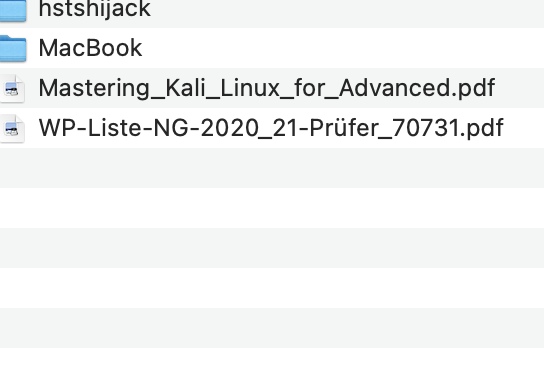

<script src="https://cdn.mathjax.org/mathjax/latest/MathJax.js?config=TeX-AMS-MML_HTMLorMML" type="text/javascript"></script>

#### **Übung (Kreisumfang):**

Schreibe ein Programm das den Umfang eines Kreises berechnet. Der **Radius** kann eine **Kommazahl** sein. Mit Ein- und Ausgabe. Inklusive Benutzerführung.

---

#### **Übung (Taschenrechner):**

Schreibe ein Programm das zwei Kommazahlen von der Tastatur einliest. Beide Werte und deren Summe sollen danach ausgegeben werden. Beispiel-Programmablauf:

```
Gib Wert 1 ein: 2.438
Gib Wert 2 ein: 9.339
2.438 + 9.339 = 11.777
```

---

#### **Übung (Celsius nach Fahrenheit):**

Die Umrechnungsformel von Celsius nach Fahrenheit lautet: 

`fahrenheit = (celsius * 9)/5 + 32`

$$
fahrenheit = \frac{celsius \cdot 9}{5} + 32
$$


Schreibe ein Programm, welches eine Temperatur in (Grad Celsius) einliest und diese in Grad Fahrenheit umgerechnet am Bildschirm ausgibt. 

Teste das Programm (z.B. mit Hilfe eines Einheiten Umrechners im Internet).

---

#### **Übung (Fahrenheit nach Celsius):**

Verändere das Programm aus voriger Übung so, dass auch die umgekehrte Rechnung – Fahrenheit nach Celsius – ausgeführt wird.

---

#### **Übung (Taschenrechner II):**

Erweitere vorige Übung  auf 3 Zahlen und formatiere die Ausgabe ansprechender. Die Kommas sollen untereinander stehen, ganz egal wieviele Stellen die Zahlen benötigen. Alle Werte sollen mit 3 Stellen vor dem Komma und 2 Nachkommastellen ausgegeben werden. 

Beispiel-Programmablauf:

``` 
Gib Wert 1 ein: 2.438
Gib Wert 2 ein: 9.339
Gib Wert 3 ein: 123.899
----------
      2.44
+     9.34
+   123.90
----------
  = 135.68
```

---

#### **Übung (Mopedkosten):**

Du besitzt ein Moped 50 ccm, 2-Takter. Versicherung und Pickerl kosten im Jahr EUR 180,--. Der Spritverbrauch liegt bei 3,6 l/100km (Liter pro 100 gefahrenen Kilometern). Ein Liter kostet EUR 1,3. Schreibe ein Programm das die Eingabe der monatlich gefahrenen Kilometer ermöglicht und die Jahreskosten ermittelt.

Die Ausgabe des Programms soll so aussehen:


```
km/Monat: 120
Du bist 1440 km im Jahr gefahren.
Es hat dich 247.39 Euro gekostet.
```


<b>Das ist ein Test</b>


```c++
// code fence test
if(test==42)
{
  printf("Hurra\n");
}
```




