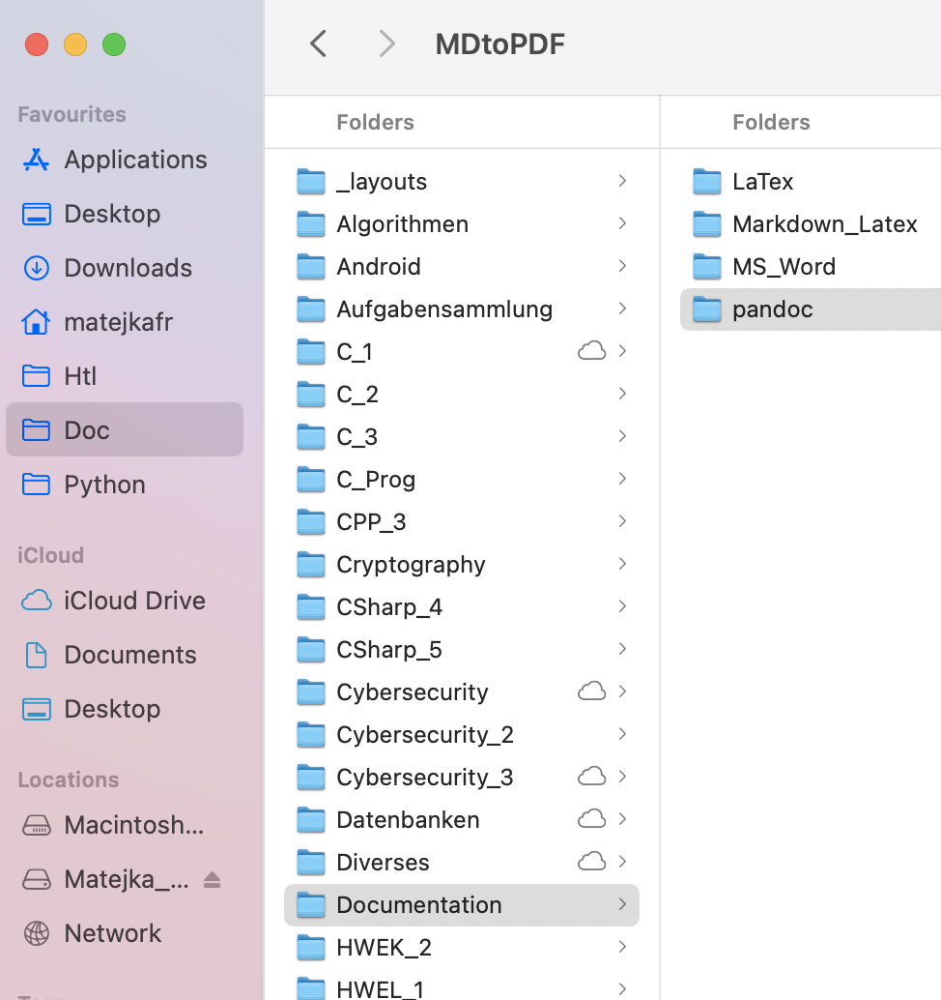

Das ist ein Test $x^2$ und so 

#### Übung (Schreibe die ersten 11 Zweierpotenzen an)

$$
\begin{aligned}
    2^0 &= 1 \\        
    2^1 &= 2 \\
    2^2 &= 4 \\
    2^3 &= 8 \\
    2^4 &=  \\
    2^5 &=  \\
    2^6 &=  \\
    2^7 &=  \\
    2^8 &=  \\
    2^9 &=  \\
    2^{10} &=  \\
\end{aligned}
$$

---

#### Übung (Wandle Binär nach Dezimal)

(a) $01011101_{2}=$
(a) $11011110_{2}=$
(a) $11000001_{2}=$
(a) $10010011_{2}=$
(a) $01110000_{2}=$

Diese Nummerierung wird von jekyll nicht unterstützt.

---

#### Übung (Wandle Dezimal nach 8-Bit Binär)

(a) 51
(a) 103
(a) 215
(a) 198
(a) 253

```java
if( test== 5) {
    System.out.println("Hurra\n");
}
```

```html
Funktioniert mit jekyll HTML:
{: width="250" }
ohne den Doppelpunkt gehts nicht in Jekyll aber in Pandoc (und vice versa)
Für Pandoc
{ width="250" }

```


Mit Bildunterschrift:

{ width="400" }

Ohne Bildunterschrift

{ width="400" }
