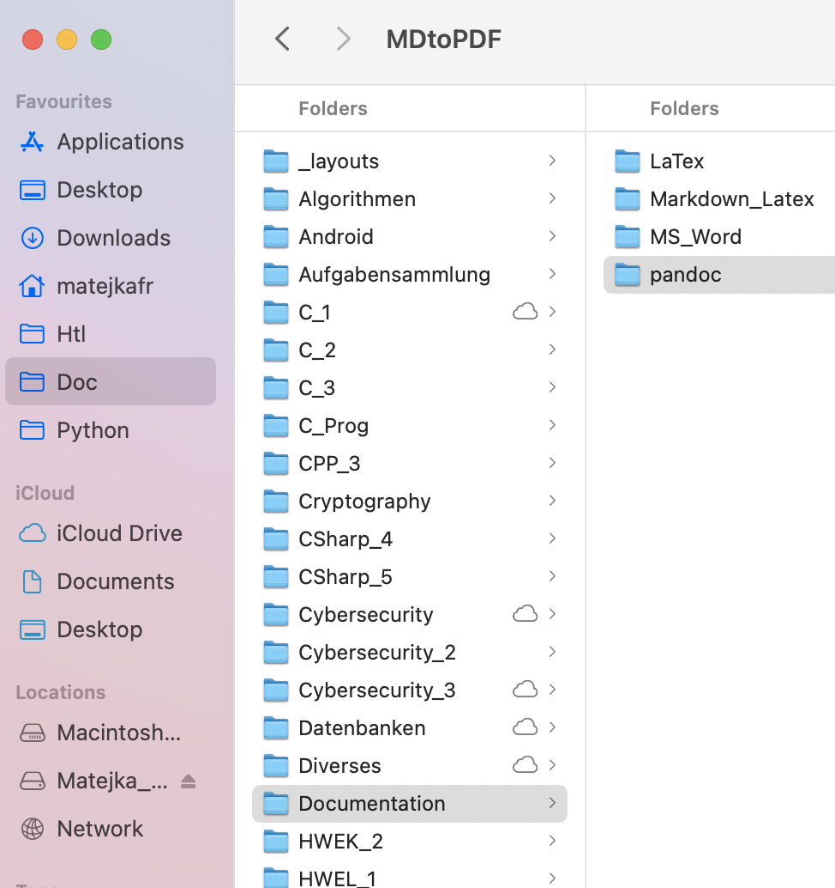

* TOC
{:toc}

# Installation LaTeX – REPL

[Quelle](https://tex.stackexchange.com/questions/397174/minimal-texlive-installation)

1 – Download and prepare a fully portable distro without root:

```sh
wget -qO- \
  "https://github.com/yihui/tinytex/raw/master/tools/install-unx.sh" | \
  sh -s - --admin --no-path
```

Installiert ins Dir `~/.TinyTeX`

Ins REPL Datenverzeichnis bewegen (sonst wird es wieder gelöscht):

```sh
mv ~/.TinyTeX $HOME/$REPL_SLUG
```

2 - Setze Pfad Variable (alternativ zu symlinks)

```sh
$ PATH="$HOME/$REPL_SLUG/.TinyTeX/bin/x86_64-linux:$PATH"
```

3 - Each user initializes its own package tree

```sh
tlmgr init-usertree
```

dann kann `pdflatex` ausgeführt werden

```sh
$ pdflatex mini.tex
```

## pandoc generiertes LaTeX

Test mit `pandoc` per `pandoc_latex.template` generiertem Latex File.

```
! LaTeX Error: File `scrartcl.cls' not found.
```

```sh
$ tlmgr --usermode install koma-script
```

```sh
# ! LaTeX Error: File `anysize.sty' not found.
$ tlmgr --usermode install anysize
$ tlmgr --usermode install listings
$ tlmgr --usermode install caption
$ tlmgr --usermode install bookmark
```

Und funktioniert!!!

Alles zusammen installieren:

```sh
$ tlmgr --usermode install koma-script anysize listings caption bookmark
```


# pandoc

Tarball install – [Quelle](https://pandoc.org/installing.html#linux)

[Latest Release](https://github.com/jgm/pandoc/releases/latest) (`https://github.com/jgm/pandoc/releases/download/2.14.2/pandoc-2.14.2-linux-amd64.tar.gz`)

```sh
wget https://github.com/jgm/pandoc/releases/download/2.14.2/pandoc-2.14.2-linux-amd64.tar.gz
TGZ=pandoc-2.14.2-linux-amd64.tar.gz
#DEST=~/.pandoc
DEST=$HOME/$REPL_SLUG/.pandoc
mkdir $DEST
tar xvzf $TGZ --strip-components 1 -C $DEST
rm $TGZ
PATH=$DEST/bin:$PATH
pandoc --version
```

Nur den Pfad neu setzen

```sh
PATH=$HOME/$REPL_SLUG/.pandoc/bin:$PATH
```


Erfolgreicher Test:

```sh
$ pandoc test.md -o test.pdf
```

Mit Template:

```sh
FILE=$1
# strip of ".md" at the end and append ".pdf"
OUTFILE=${FILE%.md}.pdf
pandoc $FILE --from=markdown --template=pandoc_latex.template --listings -o $OUTFILE
echo $OUTFILE ready
```

Ein Test:

```sh
$ pandoc arbeitsbericht_01.md --template=latex.template --listings -o arbeitsbericht_01.pdf
```


# Anhang

## Lessons Learnt

Alles im `~` Directory wird beim REPL neuladen auf den Ursprungszustand zurückgesetzt.


## REPL Pfade

```
REPL_SLUG=PunyLightcyanQueryoptimizer
HOME=/home/runner
```


## mini.tex

```latex
% This is a simple sample document.  For more complicated documents take a look in the excersice tab. Note that everything that comes after a % symbol is treated as comment and ignored when the code is compiled.

\documentclass{article}
 % \documentclass{} is the first command in any LaTeX code.  It is used to define what kind of document you are creating such as an article or a book, and begins the document preamble

\usepackage{amsmath} % \usepackage is a command that allows you to add functionality to your LaTeX code

\title{Simple Sample} % Sets article title
\author{My Name} % Sets authors name
\date{\today} % Sets date for date compiled

% The preamble ends with the command \begin{document}
\begin{document} % All begin commands must be paired with an end command somewhere
    \maketitle % creates title using infromation in preamble (title, author, date)
    
    \section{Hello World!} % creates a section
    
    \textbf{Hello World!} Today I am learning \LaTeX. %notice how the command will end at the first non-alphabet charecter such as the . after \LaTeX
     \LaTeX{} is a great program for writing math. I can write in line math such as $a^2+b^2=c^2$ %$ tells LaTexX to compile as math
     . I can also give equations their own space: 
    \begin{equation} % Creates an equation environment and is compiled as math
    \gamma^2+\theta^2=\omega^2
    \end{equation}
    If I do not leave any blank lines \LaTeX{} will continue  this text without making it into a new paragraph.  Notice how there was no indentation in the text after equation (1).  
    Also notice how even though I hit enter after that sentence and here $\downarrow$
     \LaTeX{} formats the sentence without any break.  Also   look  how      it   doesn't     matter          how    many  spaces     I put     between       my    words.
    
    For a new paragraph I can leave a blank space in my code. 

\end{document} % This is the end of the document
```


## pandoc_latex.template

```latex
\documentclass[12pt]{scrartcl}  

\usepackage{hyperref} % für links
\usepackage{amsmath}  % Mathematische Formeln

%~~~~~~~~~~~~~~~~~~~~~~~~~~~~~~~~~~~~~~~~~~~~~~~~~~~~~~~~~~~~~~~~~~~~~~~~~~~~~~~~
% Seitenränder und Textgröße
\setlength{\parindent}{0ex}
\setlength{\parskip}{0ex}

\usepackage{anysize} % mehr Text auf eine Seite
\marginsize{2cm}{1cm}{0.5cm}{1cm}  % {left}{right}{top}{bottom}
%\addtolength{\headsep}{-15pt}
%\addtolength{\textheight}{45pt}

%~~~~~~~~~~~~~~~~~~~~~~~~~~~~~~~~~~~~~~~~~~~~~~~~~~~~~~~~~~~~~~~~~~~~~~~~~~~~~~~~
% header and footer (KOMA)

\usepackage{scrlayer-scrpage} % Anpassen von Kopf-/Fußzeile
\pagestyle{scrheadings} % Vordefinierter Stil (Kopf-/Fußzeile jeweils 3-teilig)
\usepackage{scrlayer-scrpage}
\pagestyle{scrheadings}
\lohead[]{\color[gray]{0.5}$title$}
\cohead[]{\color[gray]{0.5}3AHITS}
\rohead[]{\color[gray]{0.5}$subtitle$}
\cofoot[]{\ifnum\value{page}>1 \color[gray]{0.5}\thepage\fi}

% lcr: left center right
% o: odd pages, bei einseitigen Dokumenten gibt es nur odd pages


%~~~~~~~~~~~~~~~~~~~~~~~~~~~~~~~~~~~~~~~~~~~~~~~~~~~~~~~~~~~~~~~~~~~~~~~~~~~~~~~~
\usepackage{color}
\definecolor{color-gray-25}{gray}{0.25}
\definecolor{color-gray-40}{gray}{0.4}
\definecolor{color-gray-50}{gray}{0.5}
\definecolor{color-gray-75}{gray}{0.75}
\definecolor{listingbackground}{gray}{0.92}
\definecolor{textblue}{RGB}{0, 91, 230}
\definecolor{lightyellow}{RGB}{255,255, 190}

%~~~~~~~~~~~~~~~~~~~~~~~~~~~~~~~~~~~~~~~~~~~~~~~~~~~~~~~~~~~~~~~~~~~~~~~~~~~~~~~~
\usepackage{listings}
\lstset{
	frame=single,
	language=c++, 
	tabsize=4,
  breaklines=true,
	backgroundcolor=\color{listingbackground},
	showstringspaces=false,
	basicstyle=\ttfamily\footnotesize,
	keywordstyle=\color{blue},
	commentstyle=\color{color-gray-40},
	emphstyle=\color{magenta},
	columns=fullflexible,		% damit keine extra Leerzeichen bei copy/paste
	escapeinside={(*@}{@*)},
	morekeywords={String},
	extendedchars=true,
    literate={ä}{{\"a}}1 {Ä}{{\"A}}1 {ö}{{\"o}}1 {Ö}{{\"O}}1 {ü}{{\"u}}1 {Ü}{{\"U}}1 {ß}{{\ss}}1, % no UTF8 support in listings
}


%
% Pandoc Sepcial
%

% non floating images
\usepackage{float}
\floatplacement{figure}{H}

\usepackage{graphicx}
% -- We will generate all images so they have a width \maxwidth. This means
% -- that they will get their normal width if they fit onto the page, but
% -- are scaled down if they would overflow the margins.
\makeatletter
\def\ScaleWidthIfNeeded{ %
 \ifdim\Gin@nat@width>0.7\linewidth
    0.7\linewidth
  \else
    \Gin@nat@width
  \fi
}
\def\ScaleHeightIfNeeded{ %
  \ifdim\Gin@nat@height>0.7\textheight
    0.7\textheight
  \else
    \Gin@nat@width
  \fi
}
\makeatother
\setkeys{Gin}{width=\ScaleWidthIfNeeded,height=\ScaleHeightIfNeeded,keepaspectratio}%

\usepackage[labelformat=empty]{caption}


% pandoc braucht \tightlist
\providecommand{\tightlist}{ %
  \setlength{\itemsep}{0pt}\setlength{\parskip}{0pt}}

% itemize auf compactitem umdefinieren 
% \usepackage{paralist}
% \renewenvironment{itemize}{\begin{compactitem}[\textbullet]}{%
%     \end{compactitem}\ignorespacesafterend% as suggested above
% }

% enumerate auf compactenum umdefinieren 
% \renewenvironment{enumerate}{\begin{compactenum}[(a)]}{%
%     \end{compactenum}\ignorespacesafterend% as suggested above
% }

% pandoc verwendet ein passthrough makro rund um inline code, siehe
% https://github.com/laboon/ebook/issues/139#issuecomment-408696480
\newcommand{\passthrough}[1]{#1}


%--------------------------------------------------------------------------------
% Title
% https://golatex.de//wiki/Titelseite_mit_KOMA-Script

\title{Title}

\subtitle{Subtitle}

\date{} % blank the date


%--------------------------------------------------------------------------------

\begin{document}

%\maketitle

Das ist ein Test \(x^2\) und so

\hypertarget{uxfcbung-schreibe-die-ersten-11-zweierpotenzen-an}{%
\paragraph{Übung (Schreibe die ersten 11 Zweierpotenzen
an)}\label{uxfcbung-schreibe-die-ersten-11-zweierpotenzen-an}}

\[
\begin{aligned}
    2^0 &= 1 \\        
    2^1 &= 2 \\
    2^2 &= 4 \\
    2^3 &= 8 \\
    2^4 &=  \\
    2^5 &=  \\
    2^6 &=  \\
    2^7 &=  \\
    2^8 &=  \\
    2^9 &=  \\
    2^{10} &=  \\
\end{aligned}
\]

\begin{center}\rule{0.5\linewidth}{0.5pt}\end{center}

\hypertarget{uxfcbung-wandle-binuxe4r-nach-dezimal}{%
\paragraph{Übung (Wandle Binär nach
Dezimal)}\label{uxfcbung-wandle-binuxe4r-nach-dezimal}}

\begin{enumerate}
\def\labelenumi{(\alph{enumi})}
\tightlist
\item
  \(01011101_{2}=\)
\item
  \(11011110_{2}=\)
\item
  \(11000001_{2}=\)
\item
  \(10010011_{2}=\)
\item
  \(01110000_{2}=\)
\end{enumerate}

Diese Nummerierung wird von jekyll nicht unterstützt.

\begin{center}\rule{0.5\linewidth}{0.5pt}\end{center}

\hypertarget{uxfcbung-wandle-dezimal-nach-8-bit-binuxe4r}{%
\paragraph{Übung (Wandle Dezimal nach 8-Bit
Binär)}\label{uxfcbung-wandle-dezimal-nach-8-bit-binuxe4r}}

\begin{enumerate}
\def\labelenumi{(\alph{enumi})}
\tightlist
\item
  51
\item
  103
\item
  215
\item
  198
\item
  253
\end{enumerate}

\begin{lstlisting}[language=Java]
if( test== 5) {
    System.out.println("Hurra\n");
}
\end{lstlisting}

\begin{lstlisting}[language=HTML]
Funktioniert mit jekyll HTML:
{: width="250" }
ohne den Doppelpunkt gehts nicht in Jekyll aber in Pandoc (und vice versa)
Für Pandoc
{ width="250" }
\end{lstlisting}

Mit Bildunterschrift:

\begin{figure}
\centering
\includegraphics[width=4.16667in,height=\textheight]{fig/image-20210910165854169.png}
\caption{bla}
\end{figure}

Ohne Bildunterschrift

\includegraphics[width=4.16667in,height=\textheight]{fig/image-20210910165854169.png}

\end{document}

```

