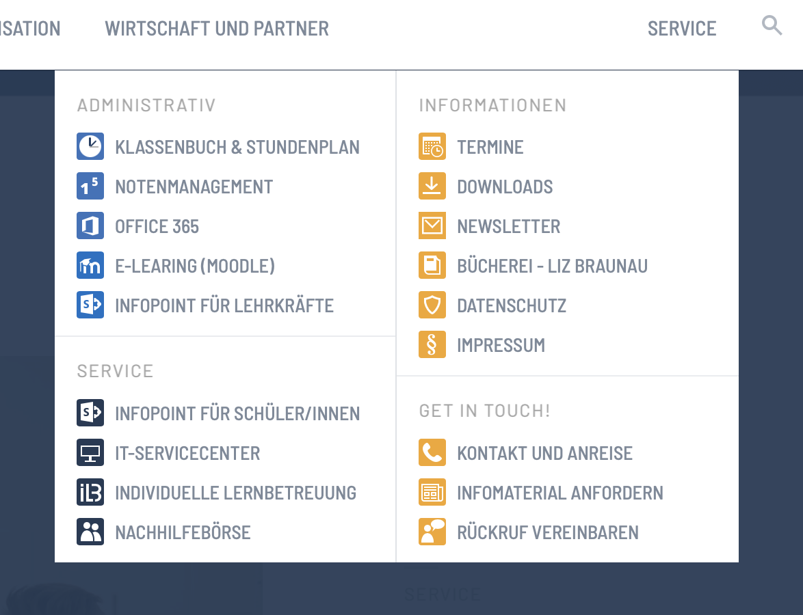
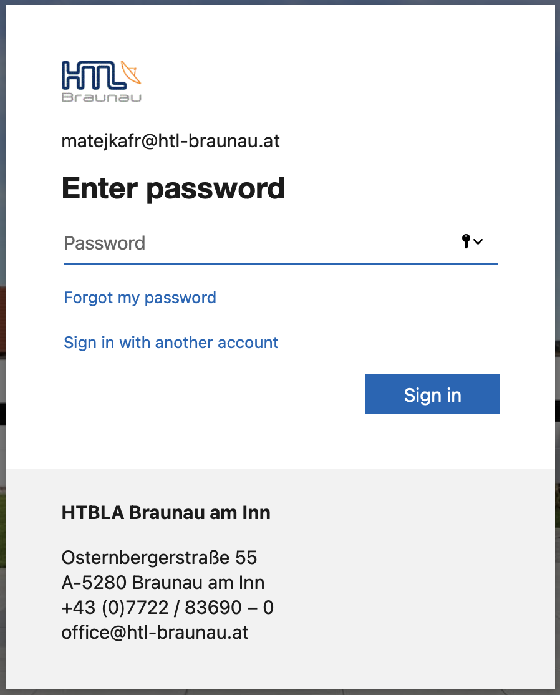
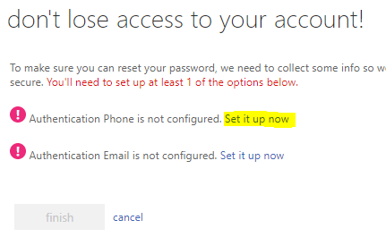

* TOC
{:toc}
# Erster Login

- Ein Passwort überlegen (≥8 Zeichen, Großbuchstabe, Ziffer, Sonderzeichen) darf nicht Teile des Vor-/Nachnamens enthalten
- Mit den Login Daten einloggen
- Passwort ändern

# Office 365

- [www.htl-braunau.at](https://www.htl-braunau.at) > Service
  
  
- OFFICE 365 – User (inkl. `@htl-braunau.at`) und Passwort eingeben
  

- 

- Handynummer eingeben, dann später rücksetzen des Passworts möglich (wenn vergessen)

- Einloggen in office 365

  - Installation von Office 365
  - Word, Excel, Powerpoint 365
  - Outlook Email
  
  

# Word 365 + Email

- Erstelle ein Word Dokument mit Überschriften und Text. 3 x Überschrift: Fächer der HTL, Text: kurze Beschreibung was in diesem Fach schon gemacht wurde.
- Ergänze im Word Dokument in der Kopfzeile: Name, Klasse, Datum
- Ergänze einen Titel im Word Dokument: "Erste Versuche mit Word"
- Erstelle aus dem Word Dokument ein PDF Dokument
- Sende dieses PDF Dokument in einer höflichen Email an `franz.matejka@htl-braunau.at` 

# Email Programm am Handy

Outlook am Handy installieren (Vorteil: automatischer Benachrichtigung wenn eine neue Email).

Siehe HTL Braunau Homepage > Service > [IT-Servicecenter](https://www.htl-braunau.at/service/it-servicecenter)

# OneDrive

Cloud Speicher – unter Office 365

Handy App verfügbar

# Teams

- Unter Office 365
- Teams am Handy installieren!
- Kanalbenachrichtigungen einschalten!

Abgaben mit Teams:

- Lehrer erstellt eine Aufgabe

- Gib das vorher erstellte PDF Dokument unter der Teams Aufgabe ab.

# WebUntis

Klassenbuch & Stundenplan – über HTL Braunau Homepage aufrufen.

Handy App: Untis

# Infopoint

Infopoint für Schüler/innen – über HTL Braunau Homepage aufrufen.

Sharepoint Handy App installieren

# Notenmanagement

über HTL Braunau Homepage aufrufen

# Netzlaufwerke

- O: Lehrer
- P: Privates Laufwerk
- ?: Klassenlaufwerk

# replit.com

Webbasierte Entwicklungsumgebung zum Programmieren.

Eigener Login notwendig.
