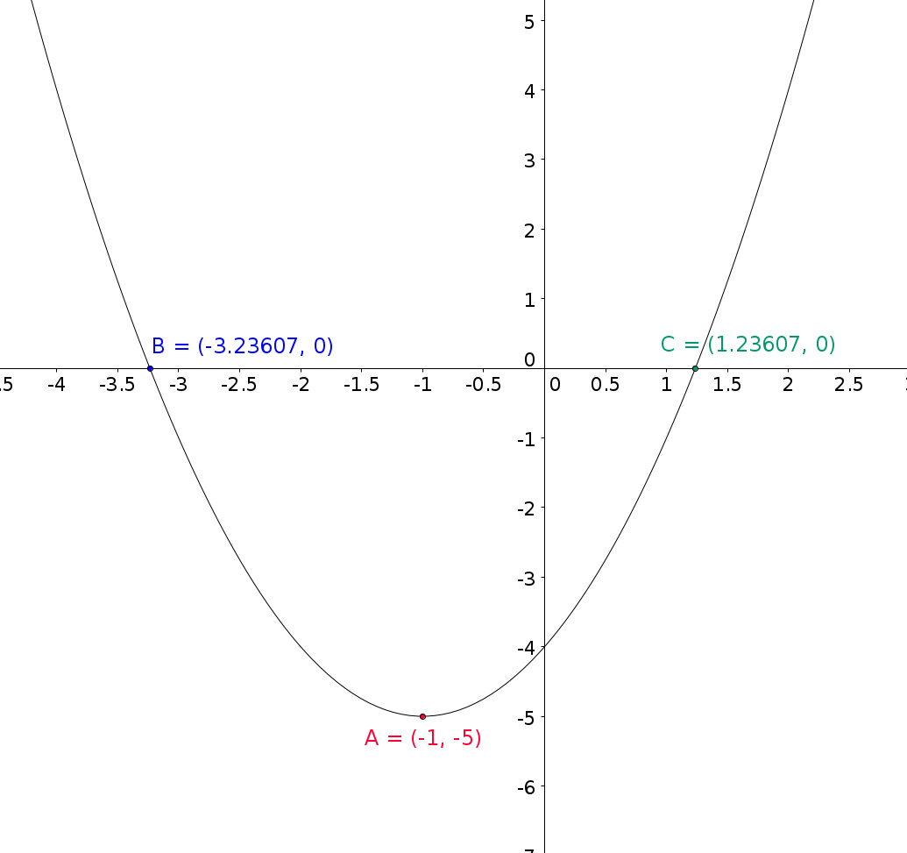
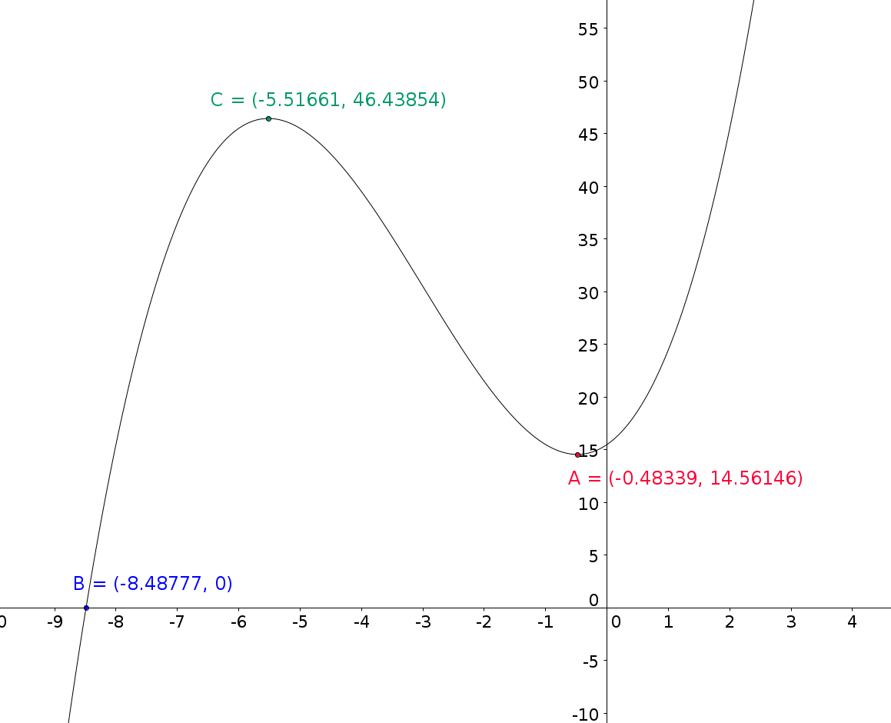

# Klasse Polynom

© Robert Berger

## Aufgabenstellung

 Ein kubisches Polynom hat die Gestalt $f(x) = a \cdot x^3+b \cdot x^2+c \cdot x+d$. Die Werte a, b, c und d heißen die "Koeffizienten" des Polynoms. Definieren Sie eine **unveränderliche (immutable) Klasse** `Polynom` zur Repräsentation eines höchstens kubischen Polynoms mit den folgenden Methoden.

**Filenamen**:

- `Polynom.java`
- `PolynomTest.java`

**Randbedingungen**:

- Die 4 Koeffizienten sind in einem Array abzulegen, wobei $d=$`koeff[0]`, $c=$`koeff[1]`, $b=$`koeff[2]`, $a=$`koeff[3]`. Dies passt zur allgemeineren Schreibweise eines Polynoms:
  
  $f(x) = a_0 \cdot x^0 + a_1 \cdot x^1 + a_2 \cdot x^2 + a_3 \cdot x^3$$

## Konstruktoren

Erstellen Sie folgenden Konstruktoren:

- `public Polynom()`: Setzt alle Koeffizienten auf Null
- `public Polynom(double c, double d)`: Erzeugt folgendes Polynom: $0 \cdot x^3+0 \cdot x^2+c \cdot x+d$$
- `public Polynom(double b, double c, double d)`: Erzeugt folgendes Polynom:  $0 \cdot x^3+b \cdot x^2+c \cdot x+d$$
- `public Polynom(double a, double b, double c, double d)`: Erzeugt folgendes Polynom:  $a \cdot x^3+b \cdot x^2+c \cdot x+d$$

 

## toString - Methoden 

Überladen Sie die `toString()`-Methode. Die Methoden sollen einen String in folgender Form ausgeben.

 z.B.: `+6.0*x^3 + 8.0*x^2 - 4.0*x^1 + 10.0`

**Randbedingungen:**
- Glieder mit dem Koeffizienten 0 werden nicht ausgegeben.

 

## Setter/Getter-Methoden

 `public double getCoeff(int n)`: Erstellen Sie eine `Getter-`Funktion für die Abfrage der Polynom-Koeffizienten.

###  Immutable

Eine Immutable Klasse ist eine Klasse deren Objekte sich nach dem Instanzieren nicht mehr ändern. Das bedeutet anders, dass Instanzvariablen nur in den Konstruktoren gesetzt und dannach nicht mehr beschrieben werden. 

Um ein Verändern von "außen" zu verhindern werden die Instanzvariablen als `private` deklariert (dann von außen nicht sichtbar) und der Zugriff erfolgt nur über eine sogenannte getter Methode.

```java
class ImmutableBeispiel {
  private int a;
  public int getA() {
    return a;
  }
}
```


## Erweiterungen der Polynom Klasse

- `public double apply(double x)`: berechnet den Wert dieses Polynoms für ein gegebenes x. z.B.: `double y = p.apply(3.0);`
- `public Polynom dx()`: liefert das nach x abgeleitete Polynom dieses Polynoms. (1. Ableitung) z.B.: `Polynom t  = p.dx();`. Hinweis: Diese Methode erzeugt ein neues Objekt der Klasse `Polynom` und liefert dieses als Rückgabewert.
- `public double slope(double x)`: Berechnet die Steigung des Polynoms an der Stelle x. z.B.: `double slope = p.slope(3.0);`
- `public Polynom add(Polynom poly)`: addiert ein weiteres Polynom zu diesem Polynom und liefert die Summe als neues Polynom, wie z.B. `Polynom r = p.add(q);`


---

- `public double zero(double leftBound, double rightBound)`: bestimmt die **erste** Nullstelle dieses Polynoms in einem gegeben Intervall $[\text{leftBound},\text{rightBound}]$. 
   - Die Methode geht folgendermaßen vor: Das Intervall wird in einer festen Anzahl (`final int NUMOFSTEPS=1000`) Schritte nach einem Vorzeichenwechsel abgesucht. Beim ersten Vorzeichenwechsel wird das ursprüngliche Intervall zusammengezogen auf die Grenzen des Schrittes, zwischen denen der Vorzeichenwechsel liegt. Mit den neuen Grenzen (kleineres Intervall) wird der Suchvorgang wiederholt.
   - Sobald die Intervallbreite einen kleinen, fest vorgebenen Grenzwert $\epsilon$ (z.B.: `final double EPSILON = 10E-8;`) unterschreitet, wird der Suchvorgang beendet und die Mitte des Intervalls als Approximation der Nullstelle zurückgegeben.
   - Überlegen Sie sich, wie die Methode auf ein Intervall reagieren soll, das überhaupt keine Nullstellen enthält (Stichwort: `Double.NaN`)
   - **Hinweis:** Die wiederholte Anwendung der Suche in einem Intervallen kann/soll wenn möglich als Rekursions-Funktion realisiert werden.


---

- `public double max(double leftBound, double rightBound)`: sucht nach einem lokalen Maximum im gegebenen Intervall. Überprüfen Sie mit den vorhandenen Funktionen auch, ob es sich tatsächlich um ein Maximum handelt. Wird kein Maximum gefunden, so liefert die Funktion den Wert `Double.NaN` zurück.
- `public double min(double leftBound, double rightBound)`: sucht nach einem lokalen Minimum im gegebenen Intervall. Überprüfen Sie mit den vorhandenen Funktionen auch, ob es sich 
   tatsächlich um ein Minimum handelt. Wird kein Minimum gefunden, so liefert die Funktion den Wert `Double.NaN` zurück.
   


## Testpolynome

$f(x) = 4 x ^3 -8x^2 -44x +48$ : Nullstellen  $x_1 = -3, x_2 = 4, x_3 = 1$$


$f(x) = x^2 +2 x -4$ : Nullstellen  $x_1 = -3.236067977499789, x_2 = 1.2360679774997898$$



$f(x) = 0.5 x ^3 + 4.5 x^2 +4x +15.5$ : Nullstellen  $x_1 = -8.48777$, $x_2$ und  $x_3$  sind komplexe Lösungen



## Erweiterungen

- Erstelle eine Methode `zero2` die Nullstellen durch fortgesetztes halbieren des Intervalls findet.
- Erstelle eine Methode `zero3` die Nullstellen mit Hilfe der Newton Methode findet.

 