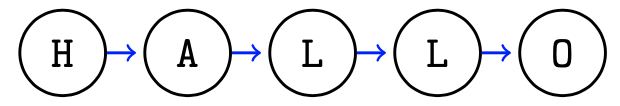

>  Was eine guten Meister macht: Wissen, Können und Wollen. (Deutsches Sprichwort)

# Verkettete Listen


## Datenstrukturen
Datenstrukturen speichern **zusammengehörige Datenobjekte**.

Z.B. alle Schüler einer Klasse, alle Lieferungen an einen bestimmten Kunden.

**Operationen** die eine Datenstruktur (meist) unterstützt :

- Einfügen
- Entnehmen / Löschen
- Iteration
- Suchen
- Anzahl

**Arrays** und **Listen** sind Datenstrukturen. Eine Datenstruktur beschreibt die Art der Datenspeicherung (z.B.: Anordnung im Speicher).


## Listen vs. Arrays


**Arrays**


- Fixe Größe
- Kein Hinzufügen / Löschen
- Einfach und schnell


**Listen**


- Flexible Größe
- Einfaches Hinzufügen / Löschen
- Ein wenig aufwendiger 

Listen sind **flexibler** als Arrays und spielen in der Informatik schon sehr lange eine wichtige Rolle. 


In der **Programmiersprache LISP** (List Processor) sind Listen sogar das zentrale Element. LISP wurde 1956 von John~McCarty entwickelt und ist bis heute in Verwendung.


# Verkettete Liste

Eine verkettete Liste ist eine Menge von aneinandergereihten Elementen (=**Knoten**). 

Bei einer verketteten Liste wird bei jedem Knoten ein Verweis auf den folgenden Knoten mit abgespeichert. 

Bei Listen sind die Knoten daher beliebig im Speicher verteilt und müssen nicht wie bei Arrays hintereinander abgespeichert sein.

Eine Liste besteht aus einzelnen **Knoten** (engl.\ node).
Ein Knoten enthält die zu speichernden Daten und den Verweis auf den **nächsten** Knoten.


**Beispiel:**



Jeder Knoten enthält hier einen Buchstaben und einen Verweis auf den folgenden Knoten. Die Knoten können daher im Speicher durcheinander sein.


## Implementierung

Klasse `Node` für einen Knoten der einen Buchstaben speichert.

```java
public class Node {
    char data;
    Node next;
}
```

## Anfang und Ende
Eine Liste hat einen Anfang und ein Ende.

- Anfang: Spezielle `start` Referenz.
- Ende: `next` verweist auf `null`

Eine Liste kann auch leer sein.


## Listenoperationen

### Eine Klasse List

Alle Daten und Methoden die für eine verkettete Liste notwendig sind werden in einer eigenen Klasse List zusammengefasst.


### Einfügen am Anfang

Es soll ein neuer Knoten angelegt und dieser am Anfang der Liste eingefügt werden.

*Skizze + Quelltext.*


### Liste abarbeiten

Alle Knoten sollen "`besucht"' werden. Zum Beispiel um alle Daten in den Knoten auszugeben.


- `Node n = start` – Erster Knoten
- solange weitergehen (`n = n.next`) 
	
	- ... bis Ende der Liste erreicht.
	

---

**Übung (Ausgabe):** Schreibe ein Programm, das die Ausgabe aller `data` Variablen in der verketteten Liste ermöglicht.

```java
Node n=start;
while (n!=null) {
    System.out.println(n.data);
    n = n.next;
}
```


### Erstes Element entnehmen

Der erste Knoten soll aus der Liste entnommen werden.
Spezialfall berücksichtigen: Liste ist leer.

**Übung**


# Spezialfälle Stack und Queue

Häufiger Anwendungsfall – Zwischenspeichern von Datenobjekten:

- Ein einzelnes Datenobjekt wird gelesen
- Das Datenobjekt wird zwischengespeichert (gemeinsam mit anderen, bereits gelesenen Datenobjekten)
- Weitere Datenobjekte werden zwischengespeichert
- Die zwischengespeicherten Objekte werden in einer gewissen Reihenfolge wieder entnommen.
	
	- Last-In / First-Out  $\rightarrow$ Stack (LiFo)
	- First-In / First-Out $\rightarrow$ Queue (FiFo)
	- höchste Priorität zuerst $\rightarrow$ Priority Queue
	
- Speichern und Entnehmen kann in beliebiger Reihenfolge auftreten

Die Datenstrukturen Stack und Queue können mit verketteten Listen implementiert werden.
Dabei finden die Einfüge und Entnahme Operationen nur am Beginn oder Ende der Liste statt.


## Stack

Stapel, LIFO (last in first out)

Operationen:

- `push` – oben auf legen
- `pop` – von oben entfernen


Bsp.: Stapel Bücher

Ein Stack 
(\href{http://de.wikipedia.org/wiki/Stapelspeicher}{$\rightarrow$Link})i st eine Datenstruktur in der Elemente einzeln hinzugefügt und entfernt werden können. Diese beide Operationen heißen `push` für hinzufügen und `pop` für entfernen. Das Verhalten ist dabei **wie ein Stapel**, `push` legt etwas oben auf und `pop` entfernt das oberste Element (z.B.\ ein Stapel von Büchern). Einen Stack nennt man daher auch einen LIFO (last in, first out) Speicher, weil jenes Element das zuletzt abgelegt wurde, zuerst wieder entnommen wird.


---

**Übung (Stack zeichnen):** Zeichne den Stack der sich ergibt durch:

```
push('H')
push('e')
push('l')
push('o')
pop()
pop()
push('W')
pop()
pop()
```

Ein Stack lässt sich sehr gut mit einer einfach verketteten Liste implementieren.
Hinzufügen und Entfernen findet am Anfang der Liste statt.

---

### Klasse für Stack

```java
public class Stack {
    public void push(char c){...}
    public char pop(){...}
    public boolean empty(){...}
}
```
Zur Verwendung dieser Klasse genügt zu wissen:

- Welche Methoden es gibt (push, pop, empty) und
- wie sich diese verhalten (Stack/LIFO).

Daher kann die Klasse die eigentliche Implementierung vor dem Anwender verbergen.
D.h. um diese Klasse anwenden zu können muss man nicht wissen, dass der Stack als verkettete Liste implementiert wurde.


Dies ist ein allgemeines Prinzip des objekt-orientierten Programmierens und wird **information hidding** (Geheimnisprinzip) genannt.

Welcher Teil einer Klasse öffentlich und was verborgen ist wird ausgedrückt durch:

- `public` Öffentlich
- `private` Verborgen


### Auswerten eines arithmetischen Ausdrucks

```
3 * (2 + ( 1 + ( 7- 4) ) * (8 - 2) )
```

Arithmetischer Ausdruck ist als String vorgegeben und soll ausgerechnet werden. Vereinfachung: Vollständig geklammert, d.h. aus `1+2+3` wird `1+(2+3)`.

**Problem:** Man muss sich Zwischenergebnisse für später merken. Das geht mit Stacks, für diese Aufgabenstellung ist der Dijkstra Algorithmus eine bekannte Lösung, dieser verwender 2 Stacks, einen für die Operanden (Zahlen) und einen für die Operatoren.

**Dijkstra Algorithmus – Ablauf**

- Wert: auf Werte-Stack.
- Operator: auf Operator-Stack.
- `"("` ignorieren.
- `")"` Operator + 2 Werte von den Stacks 
	
	- Ergebnis auf Werte-Stack
	

*Zeichne Ablauf für `(3 * (2 + 1 ) )`*


## Wie wird ein gültiger Ausdruck beschrieben?

Gültig?

```
(3 * (2 + 1 )
(3 * (2 + 1) )
(3 * (2 + 1 ) + 2)
```

**Regel als Text:** Paarweise vollständig geklammert, Zahlen nur ein Buchstabe, kein Vorzeichen

Zur mathematisch exakten Formulierung verwendet man Produktionsregeln.  Wenn sich ein Ausdruck durch wiederholte Anwendung dieser Regeln erzeugen lässt ist er gültig.

**EBNF:** (Extended Backus-Naur Form)

```
expr = "(" term op term ")"
term = digit | expr
op  = "+" | "-" | "*" | "/"
digit  = "0" | "1" | "2" | "3" | "4" | "5" | "6" | "7" | "8" | "9"
```

EBNF: Syntax von Programmiersprachen ([JavaBNF](https://cs.au.dk/~amoeller/RegAut/JavaBNF.html))


## Queue

FIFO first in, first out


