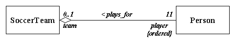
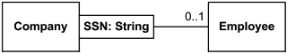
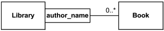

# Collections

Collection = Zusammenfassung gleichartiger Objekte (bzw. Referenzen darauf)

Mögliche Formen:

- List (Geordnet, Array, verk. Liste)
- Map (key/value Zuordnung, Baum, Hashtabelle)
- Set (Ungeordnet, mathematische Menge)

# Set
Hash-Tabelle, Binär-Baum

`HashSet`, `TreeSet`

Eigenschaften:

* Wie eine mathematische Menge.
* Keine doppelten Elemente.
* Keine definierte Reihenfolge (ungeordnet).
* Beispiel: Spielkarten in der Hand.
* Überall wo Reihenfolge keine Rolle spielt,
    * Menge der Mitarbeiter einer Firma (Alle Ingenieure, Buchhalter, Vertrieb),
    * Alle Schüler mit Auszeichnung
    * Alle Fachtheorie Lehrer 

```java
Set<String> s = new HashSet<>();
s.add("Eins");
s.add("Zwei");
s.add("Drei");
s.add("Eins");
for(String str:s) {
    System.out.println(str);
}
int anz = s.size();
boolean cont = s.contains("Drei");
System.out.println(cont);
s.remove("Eins");
System.out.println(s);
```

# List

Array (dynamisch), verkettete Liste.

Geordnet, Es gibt eine Reihenfolge, Zugriff über Index

`ArrayList` / `LinkedList`


```java
List<String> l = new ArrayList<>();
l.add("eins");
l.add("drei");
System.out.println(l);
String s = l.get(0);
l.add(1, "zwei");
l.remove(2);
for (int i = 0; i < l.size(); i++) {
    System.out.println(l.get(i));
}
```

# Map

dictionary, symbol table, associative array

Speichert einen Wert unter einem Schlüssel (meist String).

Bestandteil Programmiersprachen: PHP, Python, JavaScript, ...

`HashMap` / `TreeMap`


Beispiele:

* Person --> Alter
* SVNR --> Person
* Fachkürzel --> Beschreibung, FSST --> fachspezifische Software Technik
* Stadt --> Einwohnerzahl, "New York City":8175133
* Buchstabe --> Morse Code, "P" : ".--.", (http://www.python-course.eu/python3_dictionaries.php)
* Land --> Hauptstadt, "Switzerland":"Bern"
* Sprachkürzel, z.B. HTML Header
`<meta http-equiv="Content-Language" content="fr">`
fr-->Französisch,
2-letter tags: ISO standard 639

```java
Map<String, Integer> m = new HashMap<>();
String[] words={"dies","ist","ein","text","ein","ein","was",};
// Wortfrequenz
for (String a : words) {
    Integer freq = m.get(a);
    if (freq == null) {
        m.put(a, 1);
    } else {
        m.put(a, freq + 1);
    }
}
System.out.println(m.size() + " distinct words:");
System.out.println(m);
```


# Anwendung Set

Mit Set können 1:N und N:M Beziehungen implementiert werden.

\ 


```java
class Person {
    String firstName;
    String lastName;
    Company worksFor;

    public Person(String firstName, String lastName) {
        this.firstName = firstName;
        this.lastName = lastName;
    }

    @Override
    public String toString() {
        return "{" + firstName + " " + lastName + "}";
    }
   
}
```

```java
class Company {
    String companyName;
    Set<Person> employees = new HashSet();

    public Company(String companyName) {
        this.companyName = companyName;
    }
}
```

```java
public class Main {

    public static void main(String[] args) {
        Company richCorp = new Company("Rich Inc.");
        Person p1 = new Person("Max","Mustermann");
        p1.worksFor = richCorp;
        richCorp.employees.add(p1);
       
        Person p2 = new Person("Hans","Mueller");
        p2.worksFor = richCorp;
        richCorp.employees.add(p2);

    }
   
}
```

Darstellung einer M:N Beziehung, durch zwei 1:N Beziehungen.

Beispiel: Person und Sprache.

# Anwendung List

\ 


\ 


\ 


# Anwendung Map

\ 


\ 


# Übungsaufgaben

**Schüler**
Erstelle eine Klasse `Schueler` die die Daten eines Schülers speichert (Vornamen, Nachname, Matrikelnummer, Geburtsdatum, Klassenbezeichnung).

* Erstelle eine Liste von Schülern.
* Ermittle wie viele und welche Klassen es in dieser Liste gibt. Das Ergebnis soll eine Liste mit Klassenbezeichnungen sein. Hinweis: Es kann ein Set zur Lösung dieser Aufgabe verwendet werden.
* Erstelle für jede Klasse die Menge der Schüler in dieser Klasse. D.h. eine Liste von Mengen (Set).
* Erstelle aus der Liste der Schüler eine Map, der Zugriff soll über die Matrikelnummer möglich sein.
* Erstelle eine Methode die aus einem Set von Schülern jenen mit dem kleinsten Geburtsdatum ermittelt (d.h. den ältesten Schüler).


**Klassenvorstand**  
Erstelle eine Klasse `Klassenvorstand`, mit Vornamen, Nachname und Klassenbezeichnung. Speichere einige Objekte davon in einer Liste. Verbinde das Klassenvorstandsobjekt mit den Schülerobjekten (aufgrund der Klassenbezeichnung), so dass die Navigation in beiden Richtungen möglich ist.


**Test und Ergebnisse**  
Erstelle eine Klasse `Test` mit Fachbezeichnung und Datum. Weiters eine Klasse `Ergebnis` (speichert die Note).
Implementiere die Voraussetzungen für die N:M Beziehung.
Testergebnisse sollen aus einer CSV Datei eingelesen werden können.

**Zeugnisdruck**  
Erstelle ein Programm das automatisch die Jahreszeugnisse für jeden Schüler ausgibt. 
Dies soll geordnet nach Klasse erfolgen.
