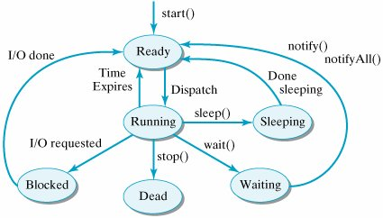

# Threads

Betriebssystem, verwaltet Rechner Resourcen:

- Prozessor(en) (=Rechenleistung)
- Speicher (RAM)
- Peripherie (Netzwerk, Festplatte)

Diese Resourcen werden an Programme vergeben.

Programm mit Speicher und Zugriff auf Prozessor und Peripherie wird **Prozess** genannt.

Normalerweise laufen viele Prozesse gleichzeitig, das BS sorgt dafür, dass jeder Prozess einen fairen Anteil der Resourcen erhält.

Prozesse sind voneinander abgeschottet.
Ein Prozess kann z.B. nicht in den Speicher eines anderen Prozesses zugreifen.

Programm (Prozess) soll oft mehrere Dinge gleichzeitig machen:

- Datei downloaden + surfen
- Mehrere Internetseiten gleichzeitig laden
- Internetseite anzeigen während noch Bilder geladen werden
- Server mit gleichzeitigen Verbindungen

Innerhalb eines Prozesses sind für diesen Zweck mehrere **Threads** möglich.
Threads werden parallel zueinander ausgeführt.
Diese geschieht entweder durch Zuweisung eines eigenen Prozessors oder (meist) durch schnelles hin- und herschalten zwischen den Threads (im ms Bereich). Die Prozessorzuteilung ist Aufgabe des BS.
Jeder Thread hat für sich seinen eigenen Programmablauf (sequentiell ausgeführte Befehle).

Einen Thread gibt es immer, dies ist der MainThread.

Alle Treads teilen sich den Speicher des Prozesses.

Eine zentrale Anwendung von Threads ist die **asynchrone Programmierung**.
Dabei geht es darum einen Thread (meistens den MainThread) nicht während einer länger dauernden Operation zu blockieren.
Zum Beispiel ist es nicht gut wenn das Benutzerinterface während eines länger dauernden Netzwerkzugriffs einfriert.
In diesem Anwendungsfall werden länger dauernde Schreib-/Lese Operationen in eigene Threads ausgelagert und die notwendige Operationen in disen Threads asynchron zum MainThread erledigt. 
Dass diese Threads dann zeitweise blockieren ist nicht weiter schlimm da der MainThread ja weiter läuft.

# Programmierung

Ein Thread wird in Java durch ein Objekt der Klasse
[Thread](http://docs.oracle.com/javase/7/docs/api/java/lang/Thread.html)
angelegt.

Hinweis:
Alternativ zur Klasse Thread kann auch das Interface `Runable` implementiert werden.

Die Klasse `Thread` definiert die Methoden `run()` und `start()`.
Mit `start()` wird der Thread gestartet.
Innerhalb dieses neue gestarteten Threads wird `run()` einmal aufgerufen.
Wird die Methode `run()` beendet so stoppt auch der Thread.

```java
MyThread t = new MyThread();
t.start();
System.out.println("Hello from main");
```

```java
public class MyThread extends Thread {
    public void run() {
        System.out.println("Hello from MyThread");
    }
}
```

# Erweitertes Beispiel


```java
public class Main {
    public static final int BUSY=50000;
    public static void main(String[] args) {
        MyThread t = new MyThread();
        t.start();
        double rand;
        for(int i=0;i<1000;i++) {
            for(int j=0;j<Main.BUSY;j++)
                rand=Math.random(); // burn some time
            System.out.println("main: "+i);
        }
    }
}
```

```java
public class MyThread extends Thread {
    public void run() {
        double rand;
        for(int i=0;i<1000;i++) {
            for(int j=0;j<Main.BUSY;j++)
                rand=Math.random(); // burn some time
            System.out.println("MyThread: "+i);
        }
    }
}
```

Ein Thread kann auch mehrfach gestartet werden.
Lege mehrere Instanzen der Klasse `MyThread`
Definiere eine Instanzvariable die einen Namen für den Thread speichert, diese soll über einen Konstruktor gesetzt werden.
In der `run()` Methode zähle bis 1000 und gib zusätzlich den Namen des Threads aus.

# Scheduler

Der Scheduler ist der Teil des Laufzeitsystems (meist des Betriebssystem) der dafür sorgt, dass auf einem Rechner eine große Zahl an Threads laufen können. Es gibt wesentlich mehr Threads die auf einem Rechner laufen als Prozessorkerne zur Verfügung stehen.
Um dieses Problem zu lösen wird in schneller Abfolge von einem Threads zum nächsten umgeschaltet.
Üblich ist, dass ein Thread immer nur für ein kurze Zeitscheibe von wenigen Millisekunden bearbeitet wird. 
Dannach wird zum nächsten Thread weitergeschaltet.
Der Scheduler sorgt dafür, dass alle Threads gleichmäßig dran kommen.

Durch das schnelle hin und herschalten entsteht der Eindruck, dass alle Threads quasi gleichzeitig laufen.
Obwohl in Wirklichkeit zu einem konkreten Zeitpunkt natürlich nur so viele Threads aktiv sein können wie Prozessorkerne vorhanden sind.

Gesteuert durch den Scheduler kann jeder Thread in einem der folgenden Zustände sein:


\ 

Nur im Zustand Running wird der Thread durch einen Prozessor ausgeführt.
In allen anderen Zuständen wird durch den Thread praktisch keine Rechenleistung konsumiert.

Aufgabe:
Schreibe ein Programm mit mehreren Threads um den Scheduler zu beobachten.
Jeder Thread soll ein unterschiedliches Zeichen ausgeben - in einer Schleife.
Zwischen den Zeichen den Threads etwas einbremsen:

```java
for(int j=0; j<5000000; j++);
```


# Race Condition

Beim Verwenden von Threads entstehen ganz besondere Probleme.
Eins davon tritt auf wenn mehrere Threads auf gemeinsame Variablen zugreifen.
Da die Threads quasi im Wettbewerb um die Variablen stehen, nennt man diese Situation **Race Condition**.

Im folgenden Programm tritt eine Race Condition auf:

```java
public class Main 
{
    public static void main(String[] args) 
    {
        MyThread myThread;
        myThread = new MyThread();
        myThread.start();
        while(true) {
            MyThread.n++;
        }
    }
    
}
```

```java
public class MyThread extends Thread{
    public static int n=0;
    public void run() {
        int old=-1;
        while(true) {
            if(n!=old && n%2==0)
                System.out.println(n);
        }
    }
}
```

Aufgabe:
- Was ist die Auswirkung der Race Condition?
- Finde die Ursache für die Race Condition.

# Synchronized

Java bietet eine fest in die Sprache eingebaute Lösung für das Problem der Race Conditions.
Dazu können Methoden mit dem Modifizierer `synchronized` versehen werden.


Das Schlüsselwort `synchronized` sorgt dafür, dass ein Objekt immer nur von einem einzigen Thread verwendet wird.
Dazu hat jedes Objekt eine Art Schloss (_lock_).
Wird eine `synchronized` Methode aufgerufen, so wird das Schloss gesperrt.
Beim Verlassen der `synchronized` Methode wird das Schloss wieder geöffnet.

Ist das Schloss eines Objekt versperrt und ein anderer Thread versucht eine `synchronized` Methode aufzurufen so wird dieser Thread angehalten (Zustand: _waiting_) bis das Schloss wieder geöffnet wird.

Normale Methoden kümmern sich nicht um den Zustand des Schlosses.

* * *
Aufgabe:

Fred und Lucy sind verheiratet und haben ein gemeinsames Bankkonto.
Beide können unabhängig voneinander Einzahlungen oder Abbuchungen durchführen.
Abbuchungen werden jedoch nur dann durchgeführt, wenn es dabei zu keiner Kontoüberziehung kommt.
- Schreibe ein Programm, dass in einer Klasse Bankkonto diese Aufgaben erledigt.
- Schreibe für Fred und Lucy jeweils einen Thread der Einzahlungen und Abbuchungen (zufällig) durchführt.
- Erkläre wie es durch eine Race Condition zu einer Kontoüberziehung kommen kann und versuche diese Situation im Programm herzustellen.
- Verändere dann das Programm so, dass keine Race Condition mehr auftreten kann.

* * *


# Deadlock

Durch synchronized ist ein Objekt gesperrt (locked) wenn ein Thread eine Methode aufruft, bei Verlassen der Methode wird die Sperre aufgehoben. 
Solange ein Objekt gesperrt ist müssen andere Threads die auch eine Methode des Objekts aufrufen wollen warten.

Dabei kann es passieren, dass sich zwei Threads gegenseitig aussperren (=Deadlock).

Zum Beispiel:
Thread 1 und 2 verwenden gemeinsam die Objekte A und B über synchronized Methoden.

Threads sperren sich wechselweise aus, Beispiel:

- Thread 1 sperrt Objekt A
- Thread 2 sperrt Objekt B
- Thread 1 möchte auch Objekt B verwenden muss aber warten da von Thread 2 gesperrt.
- Thread 2 möchte seinerseits Objekt A verwenden muss aber warten da von Thread 1 gesperrt.

Beide Threads warten nun ewig, das System ist "tod".

# Fazit

Ein Thread ist eigentlich immer vorhanden, es ist jener der die main() Funktion ausführt. 
Alle weiteren Threads werden im Programm erzeugt.

Prozesse (im Gegensatz zu Threads) sind voneinander getrennt, ein Prozess kann nicht auf den Speicher eines anderen Prozesses zugreifen. 
Damit wird verhindert dass Prozesse sich gegenseitig "`abschießen"' können.

Threads sind jedoch nicht so streng voneinander getrennt, sie teilen sich den Speicher eines Prozesses.
Daher werden Threads auch manchmal als _lightweight_ process bezeichnet.
Prozesse können aus mehreren Threads bestehen.

**Race Conditions** sind ganz blöde Geschichten - warum also nicht immer gleich alle Methoden als synchronized deklarieren? 
Zum einen würde das ziemlich sicher zu **Deadlocks** führen (und die sind mindestens genauso blöd wie Race Conditions).
Zum anderen führt der Modifizierer synchronized zum Blockieren von Threads, was die parallele Abarbeitung (die eigentliche Aufgabe der Threads) wieder verhindert.

Das Auftreten von Race Conditions und Deadlocks macht das Programmieren mit Threads schwierig.
Eine Anwendung mit mehreren Threads sollte daher sehr vorsichtig geplant und umgesetzt werden.

# Synchronized

Der synchronized Modifizierer wirkt immer auf die ganze Methode und sperrt für die ganze Laufzeit der Methode andere Methodenaufrufe für diese Objekt aus.
Meist kann man aber die Synchronisierung auf einen kleinen Teil beschränken, dies geht mit einem \textbf{Synchronized Block.

```java
public void doStuff() {
	// not synchronized code
	synchronized(this) {
		// synchronized code
    }
	
	// not synchronized code
```

Als Parameter kann hier weiters angegeben werden auf welches Objekt synchronisiert werden soll (z.B. this, was meistens Sinn macht, aber es ist auch möglich die Sperre eines anderen Objekts anzufordern).

# Kommunikation zwischen Threads

Threads können über die Methoden `wait()`, `notify()` und `notifyAll()` ihre Abarbeitung aufeinander abstimmen.
Mit `wait()` schickt sich ein Thread selbst in die Warteposition und wird von einem anderen Thread dann mit `notify()` wieder aufgeweckt.


# Zeitsteuerung

Mit Hilfe der Klasse
(Timer](https://docs.oracle.com/javase/7/docs/api/java/util/Timer.html)
und
(TimerTask](https://docs.oracle.com/javase/7/docs/api/java/util/TimerTask.html)
können zeitgesteuerte Abläufe realisiert werden.

Dafür sind 2 zusätzliche Imports notwendig:

Beispiel --- Innerhalb einer Klasse `Counter` soll ein Zähler jede Sekunde um 1 erhöht werden.

```java
public class Counter{
	private int counter=0;
	private Timer timer;
	public Counter(){
		final long delay = 5000;
		final long period = 1000;
	    timer = new Timer();
        timer.schedule(new CounterTimerTask(), delay, period);
	
    class CounterTimerTask extends TimerTask {
        public void run() {
            counter++;
        }
    }
```

Hier wird innerhalb der Klasse `Counter` eine weitere Klasse `CounterTimerTask` (innere Klasse) definiert. Dies hat den Vorteil, dass alle Methoden und Instanzvariablen der umgebenden Klasse auch in der inneren Klasse sichtbar sind (im Beispiel die Instanzvariable `counter`.

Eine Instanz der Klasse `Timer` muss für zeitgesteuerte Abläufe angelegt werden. Mit der Methode `schedule()` wird ein Task-Objekt definiert, dass nach Ablauf einer bestimmten Zeit (im Beispiel 5000 Millisekunden) zum ersten Mal aufgerufen wird, dannach erfolgen periodische Aufrufe nach einer Zeit die als weiterer Parameter von `schedule() angegeben werden kann (im Beispiel 1000 Millisekunden --- also genau eine Sekunde).

Nach Instanzierung eines Objekts der Klasse `Counter` zeigt sich daher folgendes Verhalten. Anfangs ist der Wert von `counter` noch 0, nach 5 Sekunden wird die Methode `run()` der inneren Klasse `CounterTimerTask` aufgerufen und daher der Wert von `counter` um 1 erhöht. Weitere Aufrufe von `run()` folgen danach im Sekundenabstand.

Die Methode `schedule()` kann auch mit lediglich 2 Parametern aufgerufen werden. Beispielsweise:
`timer.schedule(new CounterTimerTask(), 4000)`

Dies führt zu einem einmaligen Aufruf (ohne weitere periodische Aufrufe).


# Deadlock Beispiel

Ein konkretes Programmbeispiel bei dem ein Deadlock auftritt:

```java
class Friend {
    private String name;
    public Friend(String name) {
        this.name = name;
    }
    
    public String getName() {
        return this.name;
    }
    
    public synchronized void bow(Friend bower) {
        System.out.format("%s: %s has bowed to me!%n",
                this.name, bower.getName());
        bower.bowBack(this);
    }
    public synchronized void bowBack(Friend bower) {
        System.out.format("%s: %s has bowed back to me!%n",
                this.name, bower.getName());
    }
}
```

```java
public class Main {
    static Friend alphonse = new Friend("Alphonse");
    static Friend gaston = new Friend("Gaston");

    public static void main(String[] args) {
        Thread threadAlphonse = new ThreadAlphonse();
        Thread threadGaston = new ThreadGaston();
        threadAlphonse.start();
        /*try {
            Thread.sleep(100);
        
        catch (InterruptedException e) {
        */
        threadGaston.start();
    }
    

    static class ThreadAlphonse extends Thread{
        public void run() {
            alphonse.bow(gaston);
        }
    }

    static class ThreadGaston extends Thread{
        public void run() {
            gaston.bow(alphonse);
        }
    }
}
```

Hier kommt es zu einem Deadlock wenn die Methode bow() der zwei Objekte alphonse und gaston jeweils gleichzeitig von zwei Threads (alphonse und gaston) aufgerufen wird und damit gesperrt ist.

Kommt es zu einem Deadlock so sieht die Ausgabe des Programms so aus:

```
Alphonse: Gaston has bowed to me!
Gaston: Alphonse has bowed to me!
```

```
Alphonse: Gaston has bowed to me!
Gaston: Alphonse has bowed back to me!
Gaston: Alphonse has bowed to me!
Alphonse: Gaston has bowed back to me!
```

Beide Fälle können durch das obige Programm auftreten, durch das gleichzeitige Starten der beiden Threads ist die Wahrscheinlichkeit, dass es zu einem Deadlock kommt sehr hoch.


Bei Aufruf von `alphonse.bow(gaston)`, wird versucht das Objekt alphonse zu sperren. Gelingt das wird ein Text ausgegeben und dann `gaston.bowBack(alphonse)` Aufgerufen. 
An diesem Punkt wird nun das andere Objekt gaston gesperrt. Ist diese Sperrung geglückt wird die `bowBack()` fertig abgearbeitet und dann die Sperre von gaston aufgehoben und anschließend auch alphonse wieder freigegeben.

Bei einem Deadlock ergeben sich die Sperren in einer Reihenfolge die es keinem Thread ermöglichen fortzusetzen. 
Beispiel:
- Thread 1: Sperrt alphonse.
- Thread 2: Sperrt gaston.
- Thread 1: Gibt Text aus.
- Thread 1: Versucht gaston zu sperren - geht schief da bereits von Thread 2 belegt. Thread 1 muss daher warten.
- Thread 2: Gibt Text aus.
- Thread 2: Versucht nun alphonse zu sperren was ebenfalls nicht geht da alphonse von Thread 1 gesperrt ist. Thread 2 muss daher auch warten.


Verbesserung:

```java
threadAlphonse.start();
try {
    Thread.sleep(100);

} catch (InterruptedException e) {
    //...
}
threadGaston.start();
```

Oder noch besser mit `threadAlphonse.join()` darauf warten, dass der Thread beendet wird.

Es gibt leider keine allgemeingültige Maßnahme um Deadlocks zu vermeiden.
Man muss so programmieren, dass keine Deadlocks auftreten können.
Das ist insbesondere bei vielen komplex miteinander verbundenen Threads nicht immer einfach.


# Thread beenden

Die häufigste Methode einen Thread zu beenden ist durch das Setzen eines Flags.

```java
public class MyThread extends Thread {
    ...
    private volatile boolean done = false;
    ...
    public void run( ) {
        while (!done) {
            ...
        }
    }
        
    public void setDone( ) {
        done = true;
    }

}
```

Besonders zu beachten ist hier das Schlüsselwort `volatile`.
Es zeigt an, dass die Variable `done` von außerhalb des Threads gesetzt werden kann, z.B.\ durch einen anderen Thread der die Methode `setDone()` aufruft.
Grund:
Die JVM versucht ein Programm so optimal wie möglich abzuarbeiten, dazu gehört, dass besonders oft benötigte Variablen nicht nur im Hauptspeicher sondern auch in besonders schnellen Zwischenspeichern (Registern) gehalten werden können.
Wäre das bei der Variable `done` der Fall, so würden Änderungen von außerhalb (die sich im Hauptspeicher nicht aber im Register auswirken) nicht erkannt werden.
