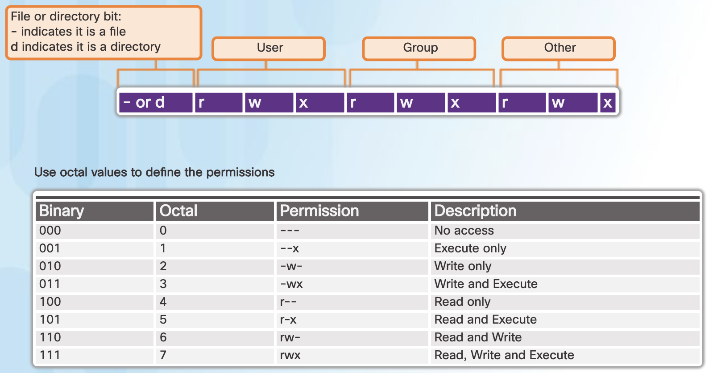

* TOC
{:toc}
Unix/Linux verfolgt die Idee **"Everything is a file"**. Bedeutet: fast alle Ressourcen des Betriebssystems werden über das Filesystem zugänglich gemacht. Zugriffsrechten auf Dateien bestimmen daher universell die Möglichkeiten des Users.

# Basics

```bash
$ pwd
/home/htluser
$ touch myfile.txt
$ mkdir mydir
$ ls -l
total 4
drwxr-xr-x 2 htluser htluser 4096 Nov  3 09:38 mydir
-rw-r--r-- 1 htluser htluser    0 Nov  3 09:37 myfile.txt
```

10 permission Flags

- 1x directory/file
- 3x file owner permissions
- 3x group permissions
- 3x permissions für alle Anderen (other)

```
-rw-r--r-- 1 htluser htluser    0 Nov  3 09:37 myfile.txt
^
|
directory
```

```
-rw-r--r-- 1 htluser htluser    0 Nov  3 09:37 myfile.txt
 ^  ^  ^     ^       ^
 |  |  |     owner   group
 |  |  |
 |  |  other
 |  group
 owner
```

Ein File/Directory hat genau einen **owner** (User/Besitzer) und gehört zu genau einer **group** (Gruppe). Ein User kann zu beliebig vielen Gruppen gehören. Die group permissions gelten wenn ein User zwar nicht der owner ist aber zur Gruppe des Files gehört. Die Benutzerrechte **other** gelten wenn man weder der owner ist noch zur Gruppe gehört.

Siehe auch:  [tutorialspoint](https://www.tutorialspoint.com/unix/unix-file-permission.htm)




# File Access Modes

- **Read**: erlaubt lesen, z.B. Inhalt eines Files anzeigen

- **Write**: erlaubt schreiben, z.B. eine Zeile in einer Textdatei löschen.

- **eXecute**: erlaubt ein File als Programm zu starten


## chmod

```bash
$ chmod o=rw myfile.txt # o ... other
$ chmod g-r myfile.txt  # g ... group
$ chmod u+x myfile.txt  # u ... user
$ chmod +x myfile.txt 
```

Oktale Schreibweise

```bash
$ chmod 755 myfile.txt
# das selbe wie:
$ chmod u=rwx,g=rx,o=rx myfile.txt
```

`rwx` sind 3 Bits (0–7 = Oktalzahl)

Beispiel: `r-x`=`101`=5


# Directory Access Modes

Ähnlich wie Files, [[Linux File Permission Confusion pt 2](https://www.hackinglinuxexposed.com/articles/20030424.html)]

**Read**: Directory kann angezeigt werden

**Write**: erlaubt erzeugen, umbennen und löschen von Files sowie das Ändern der directory permissions. Allerdings: ohne execution Rechte sind die Write Rechte bedeutungslos.

**Execute**: Setzen als Arbeitsverzeichnis (`cd`) erlaubt, sowie der Zugriff auf darin befindliche Files und Directories. Ist `x` gesetzt, `r` aber nicht so kann man zwar den Inhalt des Directories nicht anzeigen aber in ein Subdir darin wechseln geht (wenn man weiß wie dieses heißt).

**Spezialfall**: Bei write + execute permissions auf ein Directory können Elemente daring gelöscht/umbenannt werden auch wenn keine write permission auf diese Elemente besteht. Das sticky bit kann verwendet werden um dass zu verhindern.

## Beispiele

Anhand des `/var/www` (Apache Web-Server) Verzeichnisses

```sh
# user: root
$ cd /var
# remove read permission for other
$ chmod o-r www
$ ls -l
drwxr-x--x  3 root root  4096 Feb 23 05:13 www
```

`r` flag für User `kali` ist nicht gesetzt daher kann der Inhalt des Directories nicht angezeigt werden:

```sh
# user: kali
$ cd /var
$ ls www
ls: cannot open directory 'www': Permission denied
```

Aber, da das `x` Flag gesetzt ist, kann das Directory durch den User `kali` betreten werden, d.h. das Working Directory kann `www` sein:


```sh
# user: kali
$ cd www                                                                                                                                                                                      $ ls    
ls: cannot open directory '.': Permission denied
```

In weitere Unterverzeichnis kann weiter gewechselt werden:


```sh
# user: kali
$ cd html                                                                                                                                                                                     $ ls                                                                                                                                                                                        index.html  index.nginx-debian.html
```

Nun `r` Flag gesetzt, `x` Flag gelöscht:


```sh
# user: root
$ chmod o+r www
$ chmod o-x www
```


```sh
# user: kali

$ ls www
ls: cannot access 'www/html': Permission denied
html
# Fehlermeldung aber der Inhalt wird angezeigt

# working directory kann nicht gesetzt werden
$ cd www
cd: permission denied: www

# Weitere subdirs sind nicht erreichbar
$ cd www/html
cd: permission denied: www/html

$ ls www/html
ls: cannot access 'www/html': Permission denied
```


# change owner/group

Ändert den owner bzw. die Gruppe einer Datei oder eines Verzeichnisses.

owner ändern:

```
chown user file/dir
```

owner und Gruppe ändern:

```
chown user:group file/dir
```

Gruppe ändern:

```
chown :group file/dir
```

Rekursive Änderungen `-R` (bei Directories werden alle weiteren Unterverzeichnisse und Dateien mitgeändert), mehr Ausgaben `--verbose`

```bash
$ chown -R --verbose linoxide:www-data /var/www/html
```

Mit dem Befehl `chgrp` (change group) kann die Gruppe geändert werden:

```bash
$ chgrp group file.txt
```


# User und Gruppen

Als welcher User bin ich eingeloggt:

```sh
$ whoami
matejkafr
```

Zu welchen Gruppen gehöre ich:

```sh
$ id
uid=501(matejkafr) gid=20(staff) groups=20(staff),12(everyone),61(localaccounts),79(_appserverusr),80(admin),81(_appserveradm),98(_lpadmin),701(com.apple.sharepoint.group.1),33(_appstore),100(_lpoperator),204(_developer),250(_analyticsusers),395(com.apple.access_ftp),398(com.apple.access_screensharing),399(com.apple.access_ssh),400(com.apple.access_remote_ae)
```

uid ... user ID

gid ... group ID (Primary Group ID des Users)

groups ... supplementary group IDs. Zusätzliche Gruppen für Zugriffsrechten auf Files/Directories

[[GID, current, primary, supplementary, effective and real group IDs?](https://unix.stackexchange.com/a/18203)]

Erzeugt ein User ein neues File/Directory so erhält dieses als Gruppenzuordnung die Primary Group des Users.

Auch mit dem Kommando `groups` werden die zugeordneten Gruppen angezeigt

```sh
$ groups
staff everyone localaccounts ...
```


- Neue Gruppe: `groupadd`
- Gruppe eines Files/Dirs ändern: `chgrp`
- Hinzufügen eines Users zu einer Gruppe: `usermod -aG`

```bash
# logged in as user 'htluser'

# create a new group 'prj'
$ sudo groupadd prj
$ cd /
$ mkdir projects
mkdir: cannot create directory 'projects': Permission denied
$ sudo mkdir projects 
$ ls -ld projects
# -d ansonsten sieht man den content des directories
drwxr-xr-x 2 root root 4096 Nov  3 13:40 projects

# Gruppe des dir ändern
$ sudo chgrp prj projects
$ ls -ld projects 
drwxr-xr-x 2 root prj 4096 Nov  3 13:40 projects

# htluser ist nicht in der Gruppe 'prj' und auch nicht owner d.h. es gelten die permissions für 'other'

$ cd /projects
$ touch myfile.txt
touch: cannot touch 'myfile.txt': Permission denied
```

Mit Hilfe der root Shell eine Datei anlegen

```bash
$ sudo -i
# cd /projects/
# cat >file.txt
das ist
eine datei
zum testen 
der 
permissions
^C
# exit
$ 
```

`htluser` zu Gruppe `prj` hinzufügen

```bash
$ sudo usermod -aG prj htluser
# htluser must relogin now!
```

Anzeige der Gruppen denen der User zugeordnet ist:

```sh
$ groups
htluser sudo prj
$ cd /projects/
$ cat file.txt
```


# Advanced Directory Permission Flags

- [Linux File Permission Confusion](https://www.hackinglinuxexposed.com/articles/20030417.html)

- [Linux File Permission Confusion pt 2](https://www.hackinglinuxexposed.com/articles/20030424.html)

- [How to use special permissions: the setuid, setgid and sticky bits](https://linuxconfig.org/how-to-use-special-permissions-the-setuid-setgid-and-sticky-bits)


## Sticky Bit

The **sticky bit** () states that files and directories within that directory may only be deleted or renamed by their owner (or root). 

So what do you do when you need to allow write permissions on a directory for a group of people, but don't want to let them delete each other's files? That's the purpose of the "sticky" bit, `t` which you can apply to a directory. When this bit is set, a user can only delete files if they are the owner. This is most common in directories like `/tmp`:

Anzeige statt other-execution Permission

```bash
$ ls -ld /tmp
  drwxrwxrwt    4 root     root         4096 Jan 22 16:43 /tmp
#          |
#          +-- t = sticky + x
#              T = sticky (execute bit not set)
```

While to apply the sticky bit: 

```sh
$ chmod o+t test
```


## Set group id bit

If you set the sgid bit on a directory, any files created in that directory will have their group ownership set to the directory's group owner.

Anzeige statt group-execution Permission

```bash
$ cd /path/to/some/sgid_directory; ls -ld .
  drwxrwsrwt    2 root     fuzzies      4096 Oct 13  9:52 .
#       |
#       +-- s = sgid + x
#           S = sgid (execute bit not set)
```

Set the `setgid` bit on a directory:

```bash
$ chmod g+s test
```


## Set uid bit

Normally, on a unix-like operating system, the ownership of files and directories is based on the default `uid` (user-id) and `gid` (group-id) of the user who created them. The same thing happens when a process is launched: it runs with the effective user-id and group-id of the user who started it, and with the corresponding privileges. This behavior can be modified by using special permissions.

When the `setuid` bit is used, the behavior described above it's modified so that when an executable is launched, it does not run with the privileges of the user who launched it, but with that of the file owner instead. So, for example, if an executable has the `setuid` bit set on it, and it's owned by root, when launched by a normal user, it will run with root privileges. It should be clear why this represents a potential security risk, if not used correctly. 

An example of an executable with the setuid permission set is `passwd`, the utility we can use to change our login password. We can verify that by using the `ls` command: 

Anzeige statt owner-execution Permission

```bash
ls -l /bin/passwd
-rwsr-xr-x. 1 root root 27768 Feb 11  2017 /bin/passwd
#  |
#  +-- s = setuid + x
#      S = setuid (execute bit not set)
```

How to identify the `setuid` bit? As you surely have noticed looking at the output of the command above, the `setuid` bit is represented by an `s` in place of the `x` of the executable bit. The `s`implies that the executable bit is set, otherwise you would see a capital `S`. This happens when the `setuid` or `setgid` bits are set, but the executable bit is not, showing the user an inconsistency: the `setuid` and `setgit` bits have no effect if the executable bit is not set. The setuid bit has no effect on directories.

To apply the `setuid`

```sh
$ chmod u+s file
```


# Aufgabe

Wie sollte man die permissions des eigenen Homedirectories setzen damit niemand spionieren kann?

# Aufgabe

Idee:
Admin/super user/root legt einen Ordner `projects` an in dem befinden sich weitere Projektordner die unterschiedlichen Gruppen zugeordnet sind.

- User: Alice, Bob
- User: Carol, Dan
- Gruppe: math
- Gruppe: sew


# 2do

- ACL (access control lists)
    - [Access Control Lists(ACL) in Linux](https://www.geeksforgeeks.org/access-control-listsacl-linux/)
    - [FilePermissionsACLs](https://help.ubuntu.com/community/FilePermissionsACLs)

# Quellen

- [Ryans Tutorials Linux Tutorial - 8. Permissions](https://ryanstutorials.net/linuxtutorial/permissions.php)
- [Unix / Linux - File Permission / Access Modes](https://www.tutorialspoint.com/unix/unix-file-permission.htm)
- [Unix file types](https://en.wikipedia.org/wiki/Unix_file_types)
- [What do the fields in ls -al output mean?](https://unix.stackexchange.com/questions/103114/what-do-the-fields-in-ls-al-output-mean)

## Exercises

"linux file permissions exercises"

- [](https://devconnected.com/30-linux-permissions-exercises-for-sysadmins/)
- [](https://blog.pentesteracademy.com/practice-linux-permissions-basics-with-13-easy-questions-part-i-75aeaf299ebf)
- [](http://csis.pace.edu/adelgado/rha-030/workbooks/rha030-workbook04-student-6.1-2.pdf)
