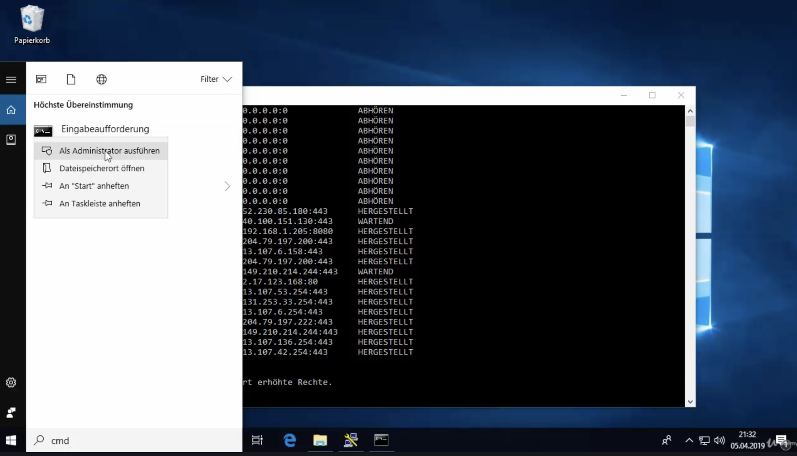
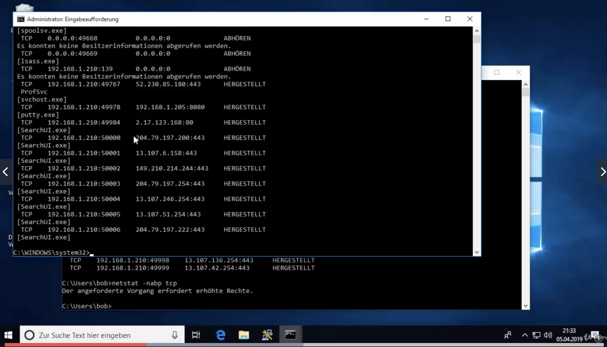

Eingestellte IP Adresse

```bash
C:> ipconfig
```


DHCP release/renew

```bash
C:> ipconfig /release
C:> ipconfig /renew
```


ARP Cache leeren

```bash
C:> arp -d
```


Offene Verbindungen mit `netstat` [[*](https://docs.microsoft.com/en-us/windows-server/administration/windows-commands/netstat)]

```bash
C:> netstat
```


```
C:> netstat -nap tcp
```

- `-n` Displays active TCP connections, addresses and port numbers are expressed numerically
- `-a` Displays all active TCP connections and the TCP and UDP ports on which the computer is listening.
- `-p tcp` Shows connections for the protocol

Option `-b` Anzeige des Prozesses dafür sind allerdings Admin Rechte erforderlich







DNS Cache leeren

```bash
C:> ipconfig /flushdns
```


