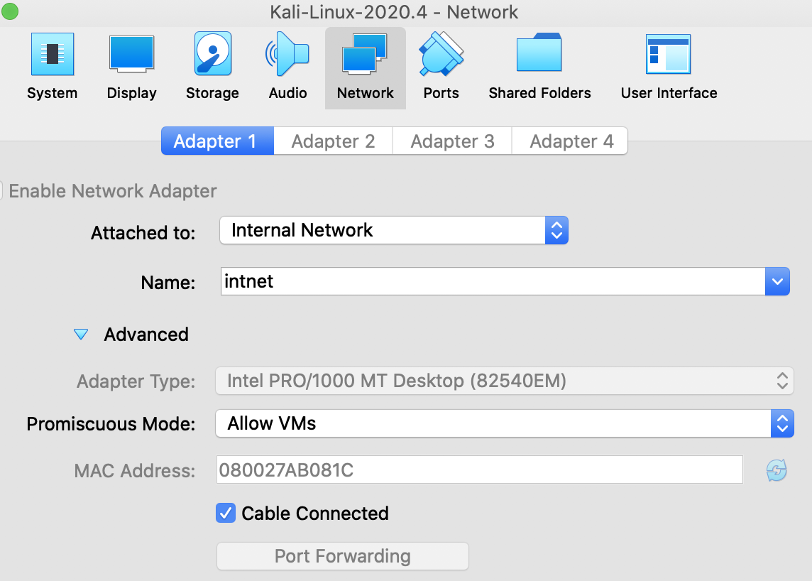

# KALI Linux

Kali Linux für Wireshark konfigurieren:

Promiscuous Mode:



# Capture Filter

[Filtering while capturing](https://www.wireshark.org/docs/wsug_html_chunked/ChCapCaptureFilterSection.html)

**telnet** to and from a particular **host**:

```
tcp port 23 and host 10.0.0.5
```

Capture only traffic to or **from IP address** 172.18.5.4:

```
host 172.18.5.4
```

Capture traffic to or from a **range of IP addresses**:

```
net 192.168.0.0/24
```


# Display Filter

[Wireshark display filter syntax and reference](https://www.wireshark.org/docs/man-pages/wireshark-filter.html)

[Building Display Filter Expressions](https://www.wireshark.org/docs/wsug_html_chunked/ChWorkBuildDisplayFilterSection.html)

http

```
tcp.port == 80
```

ARP/ICMP (Echo,...)

```
arp or icmp
```

DNS

```
dns
```

DHCP

```
bootp
```

TCP von und zu IP Adresse

```
tcp and ip.addr==198.246.117.106
```

FTP

```
ftp
```

Show only SMTP (port 25) and ICMP traffic:

```plaintext
 tcp.port eq 25 or icmp
```

Show only traffic in the Subnet (192.168.x.x):

```plaintext
ip.src==192.168.0.0/16 and ip.dst==192.168.0.0/16
```

From and to

```
ip.addr==10.43.54.65
```

Eine IP Adresse komplett ausblenden

```
not ip.addr==10.43.54.65
```

