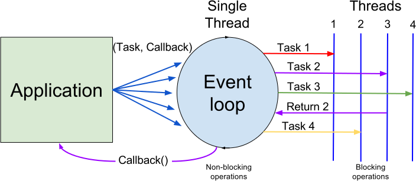

# NodeJS


\ 

NodeJS ermöglicht das Erstellen von **JavaScript** Programmen auf der **Server** Seite.
Es besteht im Kern aus der JS Engine von Google Chrome und verwendet ein **ereignisorientiertes nicht blockierendes** I/O Model.
Weiters sind diverse **Softwaremodule** für gängige Aufgaben (File-, Netzwerk) sowie ein Paktemanager (`npm` - Node Packet Manager) enthalten. Mit `npm` können Libraries zu Projekten hinzugefügt werden. 
`npm` ist aktuell eines der umfangreichsten und aktivsten Open Source Systeme.


# Download und Setup

Siehe:
[Homepage NodeJS](https://nodejs.org/)


# Quellen

- [Homepage NodeJS](https://nodejs.org/)
- [Homepage npm](https://www.npmjs.com)
- [The Node Beginner Book](http://www.nodebeginner.org)
- [tutorialspoint: Node.js Tutorial](https://www.tutorialspoint.com/nodejs/)
- [stackoverflow: How do I get started with Node.js](http://stackoverflow.com/questions/2353818/how-do-i-get-started-with-node-js)


# Hello World

Datei mit dem Namen `helloworld.js` erstellen:

```javascript
console.log("Hello World");
```

aus der Komandozeile starten:

```
node helloworld.js
```


# Module

Diverse Standard Funktionen können als Module nachgeladen werden.
Es gibt in Node JS **eingebaute** Module und per `npm` **nachladbare** Module.

Module müssen mit `require` in den eigenen Code integriert werden.
Beispiel - Ermitteln aller CPU's und CPU Kerne:

```javascript
const os = require('os')
console.log(os.cpus())
```

Beispiele für eingebaute Module:

- `os` Operating System
- `fs` File System
- `http` Für http Client und Server
- `path` File Pfade
- `url` verarbeiten von URL Strings (inkl. query)


Beispiele für nachladbare `npm` Module:

- `express` http Server (web framework)
- `request` einfache http Requests
- `mysql` Zugriff auf mySQL Datenbanken
- `nodemailer` Senden von Emails
- über 400000 weitere Module


<div class="uebung" caption='Modul os'>
Teste die Funktionen des Moduls `os`:

- `freemem`
- `networkInterfaces` und
- `platform`
</div>


# Selbstgeschriebene Module

In einer `.js` Datei definieren:

```javascript
// mymod.js
function test() {
    return 42
}
exports.test = test
```

Verwenden:

```javascript
const mymod = require('./mymod')
let ret = mymod.test()
console.log(ret)
```

<div class="uebung" caption='Modul os'>
Schreibe und verwende ein NodeJS Modul das die folgenden Funktionen beinhaltet:

- Funktion die eine als Parameter übergebene Zahl verdoppelt zurückgibt.
- Funktion der ein HTML Tag Name und ein Text übergeben werdenf. Die Funktion gibt ein vollständiges HTML Element mit Start- und End-Tag zurück, dazwischen soll sich der Text befinden.

</div>


# Asynchrone I/O Operationen

Alle Operationen die mit Input und Output zu tun haben, d.h. File Zugriffe, Netzwerkoperationen etc. sind um einiges langsamer als die CPU.
Auf das Beenden einer I/O Operation zu warten macht Anwendungen langsam und Benutzerschnittstellen träge (*unresponsive*).

Als Lösung dieses Problems werden I/O Operationen asynchron ausgeführt.

Ablauf **asynchrone I/O** im Programm:

- Auftrag absetzen
- Programm läuft weiter und erledigt andere Aufgaben
- Im Hintergrund kümmert sich ein Laufzeitsystem um die I/O Operation
- Ist die Operation abgeschlossen wird das Programm informiert

<div class="definition">
Die Rückmeldung nach beenden der I/O Operation erfolgt über einen **callback**.
Dies ist eine Funktion des Programms die vom I/O Laufzeitsystem aufgerufen wird.
</div>

<div class="example">

**Beispiel:**
Reaktion auf Datei Änderungen:

```javascript
const fs = require('fs')
fs.watch('target.txt', function(event, filename) {
    console.log(`File ${filename} change with event ${event}`)
})
console.log('watching target.txt now')
```

Zum Test die Datei `target.txt` ändern:

```bash
$ touch target.txt
```
</div>

## NodeJS Event Loop

In der Event Loop von NodeJS werden asynchrone Operationen bedient.


\ 


\ 


# Module request

Beispiel für das verwenden des nachladbaren Moduls [request](https://www.npmjs.com/package/request), zum Absetzen von http requests:

```bash
$ mkdir request_test
$ cd request_test/
$ npm init
$ npm install request --save
```

```javascript
const request = require('request')

const linkStr = 'https://query.yahooapis.com/v1/public/yql?q=select%20*%20from%20weather.forecast%20where%20woeid%3D15000000&format=json&diagnostics=true&callback='

request(linkStr, function (error, response, body) {
    if (error) {
        console.log('error:', error)
    } else {
        console.log('statusCode: ', response.statusCode) 
        // console.log('body:', body)
        let weatherJson = JSON.parse(body)
        console.log(weatherJson)
    }
});
```

<div class="uebung" caption="Request Modul - Wetter">
Gib die Wettervorhersage für den aktuellen Tag aus.
</div>

<div class="uebung" caption="Request Modul - Wetter 2">
Erweitere so, dass durch eine Kommandozeilenoption der gewünschte Tag ausgewählt werden kann. Aufruf:

```bash
$ node weather -day=2
```

0 soll der aktuelle Tag sein, 1 morgen, usw.

Hinweis:
Die Kommandzeilenargumente befinden sich in `process.argv`.
</div>


# File Read/Write

Mit `fs.readFile` und `fs.writeFile`

Siehe
[Node.js Documentation](https://nodejs.org/dist/latest-v6.x/docs/api/fs.html)

<div class="uebung" caption='Konverter csv nach json'>
Eine csv Datei mit Überschriften einlesen und die Daten im JSON Format in eine weitere Datei schreiben.


Beispiel:

```csv
forename;lastname;age
Max,Mustermann,42
Eva,Musterfrau,32
```

```json
[
    {"forename": "Max", "lastname": "Mustermann", "age": 42 },
    {"forename": "Eva", "lastname": "Musterfrau", "age": 32}
]
```

Die JSON Keys (`forename`, `lastname`, `age`) sollen aus der ersten Zeile der csv Datei erstellt werden (nicht fix im Code vorgeben).

</div>
