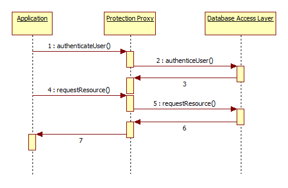

# Proxy – Design Pattern

- [wikipedia: Proxy Pattern](https://en.wikipedia.org/wiki/Proxy_pattern) 

  > A *proxy*, in its most general form, is a class functioning as an interface to something else. The proxy could interface to anything: a network connection, a large object in memory, a file, or some other resource that is expensive or impossible to duplicate. In short, a proxy is a wrapper or agent object that is being called by the client to access the real serving object behind the scenes. Use of the proxy can simply be [forwarding](https://en.wikipedia.org/wiki/Forwarding_(object-oriented_programming)) to the real object, or can provide additional logic. In the proxy, extra functionality can be provided, for example caching when operations on the real object are resource intensive, or checking preconditions before operations on the real object are invoked. For the client, usage of a proxy object is similar to using the real object, because both implement the same interface.

- [refactoring.guru](https://refactoring.guru/design-patterns/proxy) – Super gemacht!

- GoF Pattern


## Beispiel – Protection Proxy

 [Protection Proxy](https://sites.google.com/site/designpatternswiki/SecurityDesignPatterns/protection-proxy)

> a layer between the user interface code and database logic

- [](https://sites.google.com/site/designpatternswiki/SecurityDesignPatterns/protection-proxy/Protection Proxy.png?attredirects=0)


```csharp
// (c) G. Waser
using System;
using System.Collections.Generic;
using System.Linq;
using System.Text;
using System.Threading.Tasks;

namespace ProxyTheoryCode
{
    class Program
    {
        static void Main(string[] args)
        {
            ProtectionProxy subject = new ProtectionProxy();

            Console.WriteLine(subject.Request());

            subject.Authenticate("Abracadabra");

            Console.WriteLine(subject.Request());

            Console.ReadLine();
        }
    }

    class Subject
    {
        public string Request()
        {
            return "Subject Request " + "Choose left door\n";
        }
    }

    public interface ISubject
    {
        string Request();
    }

    public class ProtectionProxy : ISubject
    {
        // An authentication proxy first asks for a password
        Subject subject = null;
        string password = "Abracadabra";

        public string Authenticate(string supplied)
        {
            if (supplied != password)
            {
                return "Protection Proxy: No access";
            }
            else
            {
                subject = new Subject();
            }
            return "Protection Proxy: Authenticated";
        }

        public string Request()
        {
            if (subject == null)
            {
                return "Protection Proxy: Authenticate first";
            }
            else
            {
                return "Protection Proxy: Call to " + subject.Request();
            }
        }
    }
}

```

