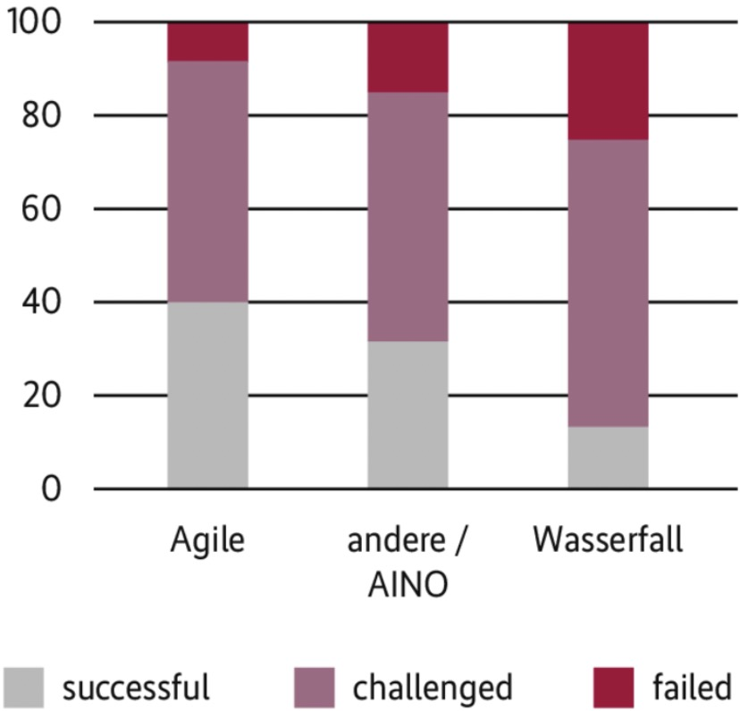
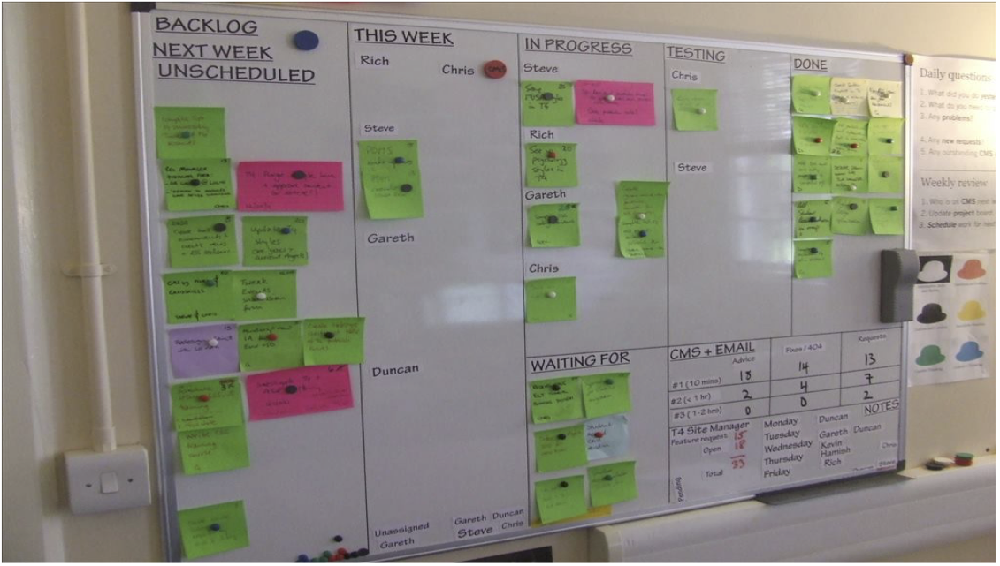

Langjährige Erfahrung hat gezeigt, dass erfolgreiche SW Entwicklung **besondere Erfordernisse** an das Projektmanagement stellt.
Unter dem Begriff "Agil" sind eine Menge von Ideen, Methoden und Praktiken zusammengefasst die sich **in der Praxis bewährt** haben.
Siehe: ["Manifesto for Agile Software Development"](http://agilemanifesto.org)

We are uncovering better ways of developing software by doing it and helping others do it. Through this work we have come to value:

- **Individuals and interactions** over *processes and tools*
- **Working software** over *comprehensive documentation*
- **Customer collaboration** over *contract negotiation*
- **Responding to change** over *following a plan*

That is, while there is value in the items on the right, we value the items on the left more.

Die 12 Punkte des **Agile Manifestos**

- Our highest priority is to satisfy the **customer** through **early and continuous** delivery of valuable software.
- Welcome **changing requirements**, even late in development.
- Deliver working software **frequently** (weekly or monthly).
- Business people and developers must **work together daily** throughout the project.
- Build projects around **motivated individuals**. Give them the **environment and support** they need, and **trust** them to get the job done.
- The most efficient and effective method of conveying information to and within a development team is **face-to-face conversation**.
- Working software is the **primary measure** of progress.
- Sustainable development. The sponsors, developers, and users should be able to maintain a **constant pace** indefinitely.
- Continuous attention to technical **excellence** and **good design** enhances agility.
- **Simplicity** is essential.
- The best architectures, requirements, and designs emerge from **self-organizing** teams.
- At regular intervals, the **team reflects** on how to become more effective, then tunes and adjusts its behavior accordingly.

# Agile Methoden

- **Scrum**
- eXtreme Programming (XP)
- Crystal
- Lean

# Agile Prinzipien

1. Put the customer at the center
2. Accept change
3. Let the team self-organize
4. Maintain a sustainable pace
5. Produce minimal software
    1. Produce minimal functionality
    2. Produce only the product requested (What’s the simplest thing that could possibly work?)
    3. Develop only code and tests
6. Develop iteratively
    1. Produce frequent working iterations
    2. Freeze requirements during iterations
7. Treat tests as a key resource
    1. Do not start any new development until all tests pass
    2. Test first
8. Express requirements through scenarios (user story)

# Projekt–Erfolg

Agile Projekte haben laut Chaos-Report eindeutig die größten Erfolgsaussichten (Abb. 2).

AINO = Agile In Name Only

Eigentlich müssten echte agile Prozesse also die Frage, ob sie den anfangs geplanten Umfang geliefert haben, stets verneinen. Sie liefern etwas anderes als das, was der Kunde ursprünglich wollte, und darin liegt ein Vorteil. Sie liefern Dinge, über die der Kunde am Anfang des Projekts noch nicht nachgedacht hat.

aus iX 2021

# Anforderungen

Unvollständige, missverständlich, falsche oder falsch verstandene Anforderungen sind für mehr als **50%** der Probleme (Bugs) verantwortlich.
Erschwerend kommt hinzu, dass auch der **Kunde** nicht in der Lage ist alle Anforderungen "up front" zu definieren.

Zentrale Idee der Agilen SW Entwicklung ist die **laufende** Sammlung, Analyse und Umsetzung von **Anforderungen** in sehr kurzen Zyklen (Iterationen) genannt **Sprints** (1-3 Woche/n).

Es entsteht am Ende jedes Sprints ein **lauffähiges System**, der Kunde kann daran prüfen ob die Anforderungen tatsächlich erfüllt wurden, falls nicht geht dies als Anforderung in den nächsten Zylus ein.

## User Story
Anforderungen werden als User Story erfasst, nach dem Grundgerüst:

As a `user_or_role`  
I want `business_functionality`    
so that `business_justification`

Beispiel:

As a *customer*,  
I want *to see a list of my recent orders*,  
so that *I can track my purchases with a company.*

Als *Registrierter User*  
möchte *ich mich anmelden können*  
um *auf den Inhalt für zahlende Nuztzer zugreifen zu können*

# Rollen (Scrum)

Scrum definiert 3 Rollen für Personen die an einem Projekt beteiligt sind.

- Team
- Product Owner (=customer)
- Scrum Master

## Team

- Organisiert sich selbst
- 7 (+/- 2) Mitglieder
- Wählt Sprint Ziele aus, teilt die Arbeit untereinander auf
- Wählt selbst die Mittel um das Ziel zu erreichen
- Präsentiert die Ergebnisse dem product owner

## Product owner

- Vertritt den Auftraggeber aus fachlicher Sicht
- Stellt, sammelt und priorisiert die Anforderungen (Product Backlog)
- Bewertet die Umsetzung
- Ist für Fragen des Teams erreichbar

## Scrum Master (Team Coach)

Ist der Coach, Sekretär und Organisator des Teams.
Er/Sie ist **nicht** ein Manager/in im traditionellen Sinn.
Aufgaben:

- Ermöglicht die produktive Arbeit und den Informationsfluss
- Beseitigt Hindernisse, vermittelt und unterstützt
- Schützt das Team vor Eingriffen während des Sprints
- Plant und moderiert die Meetings
- Entwickelt normalerweise nicht selbst

Der Scrum Master ist nicht der Chef der anschafft. Insbesonder weisst er nicht die Arbeit zu. Der Scrum Master ist weiters nicht der product owner. 

# Praktiken

## Planungs Meeting

- Am Beginn eines Sprints
- Festlegen des Arbeitsumfangs (für diesen Sprint)
- Auswahl von Anforderungen aus dem Product Backlog
- Ergebnis: Sprint Backlog, Zeitschätzungen

## Daily Scrum

Ziel: Festlegen der Tagesarbeit

- tägliches Team stand-up-meeting
- Time Boxed (max. 15 Minuten)
- Jeder Teilnehmer:
    - Was wurde gestern gemacht?
    - Was ist das heutige Vorhaben?
    - Was steht im Weg?

## Review Meeting

- Am Ende des Sprints
- Vorführung (lauffähiges System!) der Ergebnisse
- Team präsentiert
- Nicht abgeschlossene Arbeitspakete?
- Feedback seitens Product Owner
- Der Product Owner entscheidet ob das Ergebnis produktiv gesetzt wird (Deployment)

## Retrospective Meeting

- Am Ende des Sprints
- Was ist gut/schlecht gelaufen?
- Verbesserungsmöglichkeiten?

# Hilfsmittel

- Product Backlog
- Sprint Backlog
- Blocks List (impediments, unanswered questions)
- Storyboard
- Burndown Chart

## Storyboard

Visualisiert die Stories/Tasks eines Sprints

\ 

## Burndown Chart

Visualisiert den Sprint Fortschritt

\ 

