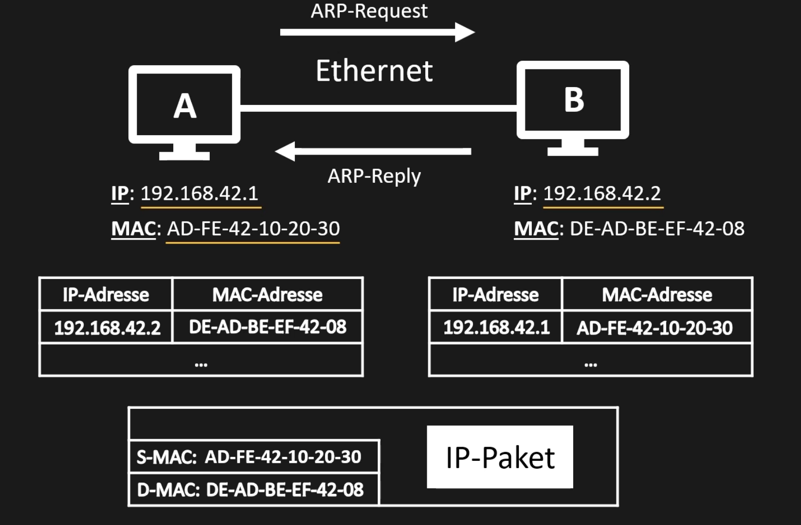
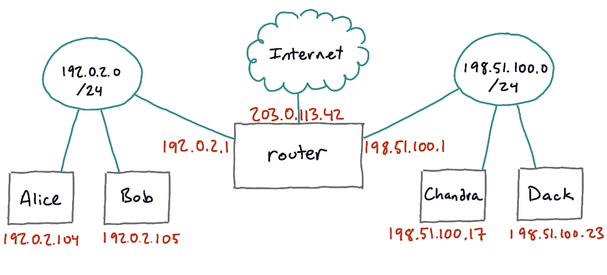

Das Internet verbindet immer mehr Geräte miteinander (IoT – Internet of Things). Viele Angriffe nutzen Schwachstellen der Netzwerktechnologien.

Daher ist eine gute Kenntniss der Netzwerktechnologien zentral für IT Sicherheit.

Dieses Kapitel zeigt Angriffe auf unterster Netzwerkebene: 

- ARP (ARP cache poisoning) und 
- Switches (CAM overflow)

# Beispiele zur Motivation

Systeme sind zunehmend vernetzt. 

[Cyberthreat Map](http://threatmap.fortiguard.com)

Videos:

- Beispiel Auto: [Video: Hackers Remotely Kill a Jeep on a Highway | WIRED [5:06]](https://youtu.be/MK0SrxBC1xs)

- Interessante Liste: [Video: Top 10 Unexpected Things That Can Be Hacked [7:50]](https://youtu.be/K98ZyAFEgoQ)

- [Video: Hacked Medical Devices: The Most Dangerous Examples [4:01]](https://youtu.be/m49OreAs1WY)
- [Video: Protecting Medical Devices from Cyberharm | Stephanie Domas | TEDxColumbus [10:15]](https://youtu.be/EyqwUFJKZo0)

- [Video: DoDIIS 2017- Teddy Bear Hacking with 11/ yo Cyber Prodigy Reuben Paul [9:45]](https://youtu.be/8z3XuRQ3-bI)

# Lockdown

Wir wollen uns einen Angriff ansehen der auf unterster Netzwerkebene stattfindet, das sogenannte ARP cache poisoning. Dazu müssen wir aber zuerst einige Netzwerkbasics wiederholen. Bitte schaut euch dazu die folgenden Videos an:

- [MAC- und IP-Adressen - Unterschiede und Einsatzorte (2:48)](https://youtu.be/D_VW0yi5bPo)
- [Netzwerk: Wie funktioniert das Internet? - Die MAC-Adresse (2:43)](https://youtu.be/jkyKLepmWgw)
- [Netzwerk: Wie funktioniert das Internet? - Die IPv4-Adresse (5:09)](https://youtu.be/f2NkqTMFlwA)
- [Das ARP-Protokoll (3:05)](https://youtu.be/ttgXMAvkJfo)
- [Udacity: Routers and Default Gateways (1:41)](https://youtu.be/JOomC1wFrbU)

Abgabe: PDF Format. Zu jedem Video 1-2 Sätze schreiben um was es in diesem Video geht.

# Wiederholung Networking Basics

- Netzwerkarchitektur
  -  Subnetz
  - Router
- Ethernet
  - 8 Byte MAC Adresse, `BA:BE:CA:FE:BE:EF:FA:CE`
  - Unicast, Broadcast
- IP
  - 4 Byte IP Adresse
  - dotted decimal 192.168.10.1
  - subnet mask 255.255.0.0
  - Default Gateway

## Videos

- [MAC- und IP-Adressen - Unterschiede und Einsatzorte (2:48)](https://youtu.be/D_VW0yi5bPo)
- [Netzwerk: Wie funktioniert das Internet? - Die MAC-Adresse (2:43)](https://youtu.be/jkyKLepmWgw)
- [Netzwerk: Wie funktioniert das Internet? - Die IPv4-Adresse (5:09)](https://youtu.be/f2NkqTMFlwA)
- [Das ARP-Protokoll (3:05)](https://youtu.be/ttgXMAvkJfo)

- [Udacity: Routers and Default Gateways (1:41)](https://youtu.be/JOomC1wFrbU)
  

## Quellen / Infos

- Ethernet, MAC Adressen
  - Video: `CYBER501_4/1 MAC and IP Addresses _ 4.1 Networking 1 _ CYBER501x Courseware _ edX`
- IP Adressen
  - IP Adresse
  - Subnet Mask
  - Default Gateway
- ARP: `Cisco_CCNA_Cyber_Ops_Doc/Chapter_4_Network_Protocols_and_Services.md`, 
  - 4.2.1 Ethernet, 
  - 4.2.3 IPv4 Addressing Basics, 
- Switch, SAT – Switch address table
  - Video für Switch SAT: `CYBER501_5/3 How switches work _ 5.1 Networking 2 _ CYBER501x Courseware _ edX`

