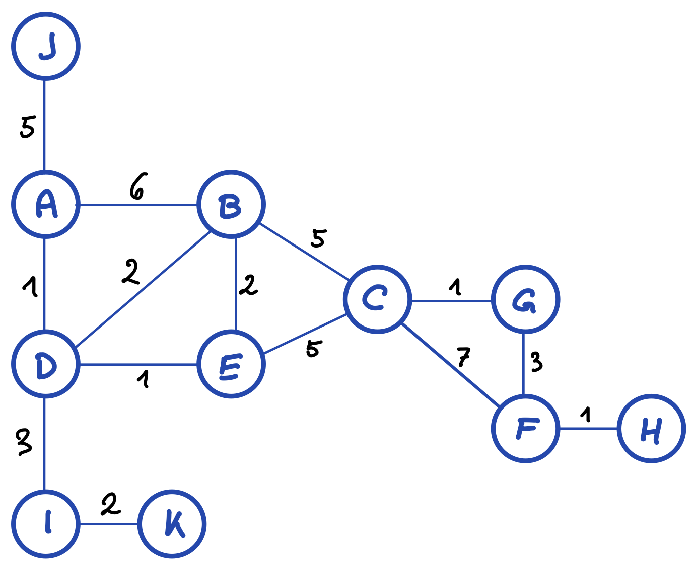

# Graphen API Erweiterung II

**Aufgabe:**

Erweitere das C# API (Application Programming Interface).

-   Klasse `Graph`: Erweitere um folgende Methoden:
    -   `List<Vertex> getTwoHopNodes(Vertex start)`: Ermittelt alle Knoten die innerhalb von 2 "Hops" von einem Startknoten aus erreicht werden können. Dabei soll kein Knoten in der Ergebnismenge mehrfach vorkommen. Z.B. Start in A – Knoten B soll nur einmal vorkommen.
    -   `List<Vertex> depthFirstOrder(Vertex start)`: Depth First Traversal

**Tests:**

Für Tests kann der folgende Graph verwendet werden (`graph02.txt`):

**Abzugeben:** 

1.  Sourcecode (die .cs Files) 
2.  Screenshot der Ausgabe (nur das Ausgabefenster)