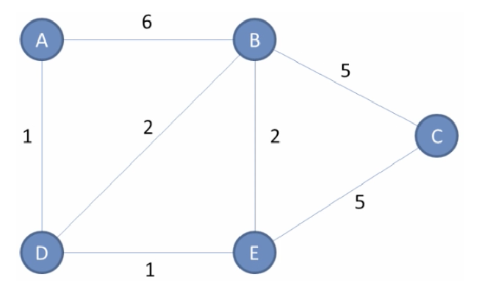
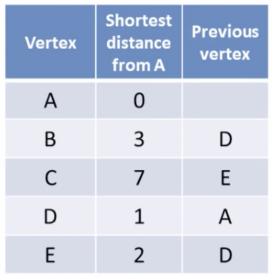
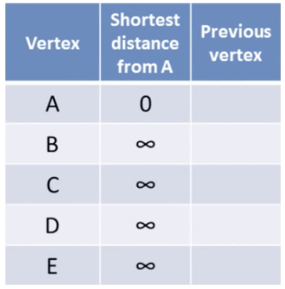

# Dijkstra Shortest Path – Implementierung

Es ist der Dijkstra Shortes Path Algorithmus zu implmentieren.

Ausgehend von einem Knoten in einem gegebenen Graphen soll die Abstandstabelle zu allen anderen Knoten ermittelt werden.



Beispiel: Abstandstabelle für Knoten A.



-   Erstelle die Klasse `DijkstraTableEntry`, die eine Zeile der Tabelle abbilden kann. Die Klasse beinhaltet:
    -   `Vertex destination`, `double distance`, und `Vertex previous`.
    -   Konstruktor `public DijkstraTableEntry (Vertex destination, double distance)`, der die Instanzvariable entsprechend setzt. Die Referenz zum vorangehenden Vertex soll mit null initialisiert werden.
-   Erstelle die Klasse `DijkstraTable`, die ein Dictionary aus `DijkstraTableEntry` verwaltet, Index des Dictionaries ist `Vertex destination`. In dieser Klasse werden alle Methoden implementiert, die zur Berechnung der kürzesten Distanz vom Ausgangspunkt zu allen anderen Knoten notwendig sind.
    -   Implementiere in der Klasse den Konstruktor public `DijkstraTable(Vertex v, Graph g)`.
        Der `Vertex` v stellt den Startpunkt der Abstandstabelle dar und wird somit als erster Eintrag mit Abstand 0 im Dictionary gespeichert.
        Im Graphen g sind alle Vertices gespeichert – diese sollen ebenfalls in der Liste gespeichert werden. Der Abstand soll mit `Double.PositiveInfinity` initialisert werden:
    
	
	-   Implementiere eine `print` Methode die die Abstandstabelle ausgibt.
	
	-   Implementiere `DijkstraTableEntry getNearestEntry(HashSet<Vertex> visited)`. Ermittelt den Knoten in der Tabelle, der den geringsten Abstand zum Ausgangspunkt aufweist. Dabei sollen allerdings nur die Elemente berücksichtigt werden, die noch nicht besucht wurden, dazu wird `HashSet<Vertex> visited` – mit allen bisher bereits besuchten Knoten – übergeben).
	    Hinweis: Der Startknoten ist auch in `visited` enthalten.
	
	-   Implementiere eine Methode `        public void calculate()` die die Tabelle mit Hilfe des Dijkstra Shortest Path Algorithmus erstellt. Tip: Zuerst nur den ersten Schritt des Algorithmus programmieren, danach ist vielleicht das folgende Grundgerüst hilfreich:
	
	    ```csharp
	    public void calculate()
	    {
	      var visited = new HashSet<Vertex>();
	      while (true)
	      {
	        // get nearest unvisited vertex as next current 
	        var nearestEntry = getNearestEntry(visited);
	        if (nearestEntry==null)
	        {
	          // all nodes visited - finished
	          break;
	        }
	        var currentVertex = nearestEntry.Destination;
	      }
	      //...
	    }
	    ```
	
	-   Erstelle eine Methode `void printShortestPath(Vertex to)`, die die kürzeste Route vom Ausgangspunkt darstellt:
	    ``` 
	    ----------------------------------------
	    Shortest Path from A to C: 7 km
	    ----------------------------------------
	      
	    A ------- 0 km 
	    | 1 km
	    D ------- 1 km 
	    | 1 km
	    E ------- 2 km 
	    | 5 km
	    C ------- 7 km
	    
	    ----------------------------------------
	    ```