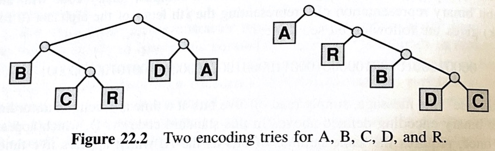

# Datenkomprimierung

Sedgewick, S319

## run length encoding (RLE)

String aus nur Großbuchstaben

```
AAAABBBAABBBBBCCCCCCCCDABCBAAABBBBCCCD
4A  3B AA5B   8C      DABCB3A 4B  3C D
4A3BAA5B8CDABCB3A4B3CD
```


String aus beliebigen Buchstaben: mit escape character (z.B. #)

```
#4A = AAAA
## = #
AAA = AAA (erst ab 4 Buchstaben wird komprimiert)
```

Aufgabe: `compress` und `uncompress` implementieren.


## variable-length encoding

Codieren von

```
ABRACADABRA
```

11 Zeichen x 8 Bit = 88 Bit.

Idee: variabel lange Bitmuster je nach Häufigkeit der Buchstaben

```
+----- Buchstabe
| +--- Häufigkeit
| | +- Code
| | |
A 5 0
B 2 1
R 2 01
C 1 10
D 1 11
```

```
ABRACADABRA = 
010101001101010
```

Das könnte aber auch RRRARBRRA sein (d.h. nicht eindeutig dekodierbar).

Wichtig daher: kein Zeichencode darf der präfix eines anderen Zeichencodes sein.

Folgender Code erfüllt diese Eigenschaften:

```
A 11
B 00
R 011
C 010
D 10
```

Wie lange wird der kodierte Text?

Gibt es eine optimalere Lösung?

### Trie

Diese Art von Code kann als Trie dargestellt werden. Trie = Baum mit 2 Arten von Knoten: internen und externen. Ein interner Knoten als linker Nachfolger ist eine 0. Ein interner Knoten als linker Nachfolger ist eine 1. Die externen Knoten enthalten die Buchstaben.




Wie kommt man zu einem optimalen Code-Trie?

### Huffmann Coding

D. Huffman 1952

[Video: Huffman-Codierung - (So geht´s) - deutsch](https://youtu.be/eSlpTPXbhYw)

Shannon Fano Erklärvideo(Explanatory video): [https://youtu.be/OpEqn_IKqsk](https://www.youtube.com/watch?v=OpEqn_IKqsk) Shannon Fano Beispiel (example): [https://youtu.be/6xAjwzeyzns](https://www.youtube.com/watch?v=6xAjwzeyzns) Huffman Code Erklärvideo (Explanatory video): [https://youtu.be/leHRXp55R_k](https://www.youtube.com/watch?v=leHRXp55R_k) Huffman Code Beispiel example: [https://youtu.be/jUU6c4ROaeo](https://www.youtube.com/watch?v=jUU6c4ROaeo) Shannon Fano vs. Huffman Code (Vergleich): [https://youtu.be/QRU0mRG7A-8](https://www.youtube.com/watch?v=QRU0mRG7A-8)


Aufgaben:

-   Erstelle einen Huffman Code für ABRACADABRA, MISSISSIPPI

-   Implementiere einen Trie und die ermittlung des Huffman Codes in C#.

