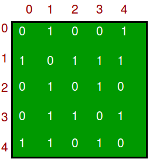
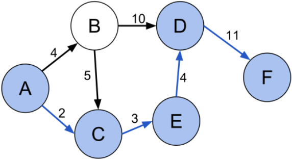
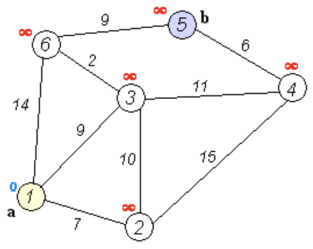

# Graphen

- Graph
  - Knoten (Node, Vertex)
  - Kanten (Edges)
  - Zusammenhängend (connected)
  - Gewichtet (weighted)
  - Gerichtet (directed)
- Graphentheorie
- Baum ist ein spezieller Graph (undirected, Zusammenhängend, kein Zyklus, nur 2 Nachfolger)

Anwendungen:

- Computernetzwerke
- Karten / Navi
- WWW
- social networks
- usw.

Darstellung im Programm:

- Adjacency Matrix
- Adjacency List

Graph API - für gewichteten ungerichteten Graphen, siehe Skript von Christian

Evtl. Erweiterungen:

- Given a node, return it’s neighbors as a list.
- Return a list of all the nodes in the graph.

# Dijkstra shortest path

Beispiel:

Nur Knoten und Entfernungen gegeben: was ist der kürzeste Weg von A nach F?

Aus wikipedia:

