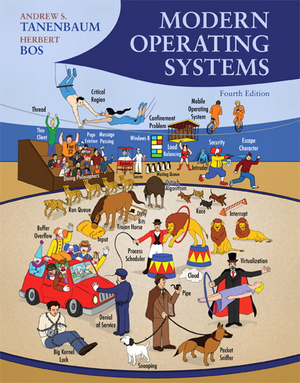

[GitHub Repo](https://github.com/matejkaf/SYTB_Konzept)

# SYTB

Systemtechnik Betriebssysteme

# Ideen

- „modernen Server-Betriebssystemen“: Konzentration auf Li- nux (als virtuelle Maschine auf den Laptops der Schüler)

-  „... implementierten Konzepte anwenden“: Files, Directory, Prozess, Thread, Speichermanagement, Bootvorgang, Hinter- grundprozesse (services), ...

- „wiederkehrende Abläufe ... automatisieren“: Shell Scripts (bash) programmieren, CRON jobs, evtl. Python Basics

- „grundlegende Serverdienste“: Webserver (apache, nginx) konfigurieren, ...

- „Server-Überwachungssoftware“: was könnte da gemeint sein? Fernwartung? Lieblingsthema eines am Lehrplan be- teiligten?

- „Verzeichnisdiensten“: LDAP?, Samba?

- „Virtualisierungstechniken“: VirtualBox, ausführen diverser

  Linux und Windows Versionen in virtuellen Maschinen, ist auch in ITSI ein Thema (Metasploitable, Kali Linux, ...)

# Kapitelstruktur

- 

# Quellen

- [pearson.com](https://www.pearson.com/us/higher-education/program/Tanenbaum-Modern-Operating-Systems-4th-Edition/PGM80736.html?tab=contents)

