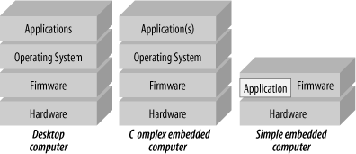
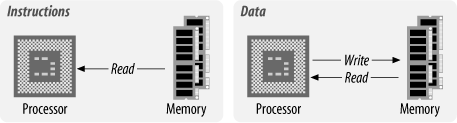

Ziel: Durch verstehen wie Computer intern funktionieren IT Systeme besser anwenden können.

Computer:

- Desktop
- Server
- Mobil
- IoT – Internet of Things
- Embedded – Computer die man nicht sieht  (Beispiele: Auto, im Haushalt? – Fernseher)

Computer sind Geräte auf denen Programme laufen. Diese können fix programmiert sein (bei den meisten Embedded Systemen) oder können beliebige Anwendungen ausführen (z.B. Desktop Computer).

Die zugrundeliegenden Architektur-Prinzipien (Hardware und Software) sind bei allen Arten von Computer-Systemen grundsätzlich gleich.

Hardware

- Speicher
- CPU
- Peripherie

Software (Schichten)

- Anwendung
- Betriebssystem
- Firmware (mit Bootloader)
- (Hardware)

*<<< Woche 1*

Die **Firmware** ist fest ("firm") im Gerät gespeichert und wird unmittelbar nach dem Einschalten aktiv. Dient zum initialisieren des Systems. Der **Bootloader** lädt das Betriebssystem von der Festplatte und startet dieses.

# Grundlegende Systemarchitektur

*Ziel: Von Neumann Architektur erklären*

Zentral: Wie sind Speicher und Prozessor miteinander verbunden? Am häufigsten eingesetzt:

## Von Neumann Architektur

Speicher enthält das Programm (instructions) **und** die Daten.

Datenfluss:

Eigenschaften Von Neumann:

- Daten und Code aus der Sicht des Prozessors nicht unterscheidbar. Für IT-Sicherheit: Daten können als Programm interpretiert werden. Viele Sicherheitslücken nutzen dies aus.
- Die Bedeutung der Daten (Buchstabe, Zahl, ...) entsteht durch die Art und Weise wie diese im Programm verwendet werden. Für den Prozessor sind es nur 0 und 1.
- Daten und Programm teilen sich den Speicher. Beim Laden von der Festplatte wird das Programm wie Daten behandelt (von einem anderen Programm).
- Speicher ist eine große zusammengehörige Aneinanderreihung von Speicherstellen (Bytes). Der Speicherbereich des Prozessors enthält in einem einzigen ununterbrochenem Speicherraum:
  - das Betriebssysten, 
  - alle laufenden Anwendungen, und
  - die zugehörige Daten.

## Harvard Architektur

Alternative zur von Neumann Architektur. Programm und Datenspeicher sind völlig voneinander getrennt. Hoher Aufwand weil die Speicherschnittstelle doppelt vorhanden sein muss. Nicht besonders häufig im Einsatz.

Most microprocessors available are standard Von Neumann machines. The main deviation from this is the *Harvard architecture* , in which instructions and data have different memory spaces ([Figure 1-5](https://www.oreilly.com/library/view/designing-embedded-hardware/0596007558/ch01.html#dbhardware2-CHP-1-FIG-5)) with separate address, data, and control buses for each memory space. This has a number of advantages in that instruction and data fetches can occur concurrently.

# Speicher

Arbeitsspeicher / Hauptspeicher / main memory

Organisiert in Bytes = 8 Bit 

*Zeichnung für Byte, Bitnummerierung, Wertigkeit*

(Arbeits-)Speicher = durchnummerierte Bytes. CPU kann jedes Byte direkt lesen bzw. schreiben = wahlfreier Zugriff, daher der Begriff RAM (random access memory).

*Zeichnung Speicherblock mit Adressen und ein paar Bytes als Beispiel. Unterscheidung Daten/Adressen. Verbindung mit CPU.*

Arbeitsspeicher kann auch 16, 32 oder 64 Bitweise organisiert werden. Dann betrifft ein Speicherzugriff gleich mehrere Bytes (2, 4 oder 8) was zu einer höheren Geschwindigkeit führt.

*Beispiel: 32 Bit breiten Speicherblock zeichenen, zeigen dass die Adressen immer um 4 springen. Bits und Bytes nummerieren, 0..31, 0..3*

## Bus

Die Aufgabe der CPU (Prozessor) ist es Anweisungen auszuführen und damit Daten zu bearbeiten (beides ist im Hauptspeicher). Der **Bus** ist die Verbindung der CPU mit deren Umgebung insbesondere dem Hauptspeicher.

Bus besteht aus 3 Arten von digitalen Leitungen

-   Adressen
-   Daten
-   Control

*ToDo Skizze – Beispiel 16 Bit Addressbus, 8 Bit Datenbus, Control: R/W*

**Datenbus**-Breite bestimmt wie viele Daten auf einmal transportiert werden können. Typisch 8/16/32/64 Bit.

Der **Adressbus** bestimmt auf welches Byte gerade zugegriffen werden soll. Die Anzahl der maximal adressierbaren Bytes ergibt sich durch 2 hoch (Anzahl der Adressleitungen).

-   *Beispiel 10/16/20/32/64 Addressleitung*
-   *Hinweis auf: kB (sind 10 Leitungen!), MB, GB, TB (1024 Stückelung).*
    -   Dezimapräfix (k,M,T,...) = SI Präfixe vs. Binärpräfix IEC (KiB, MiB, TiB)
    -   Bei Hauptspeicher sind immer Binärpräfixe in Verwendung. Ansonsten wird aber wild gemischt! Aufpassen!

Trend zu **64 Bit** Systemen. Daten und Adressen sind 64 Bit. Vorher: 32 Bit Adressen – 4 GB Speichergrenze.

Der **Control Bus** enthält alle Signale die zusätzlich noch notwendig sind. Z.B. RD ... lesen und WR ... schreiben.

