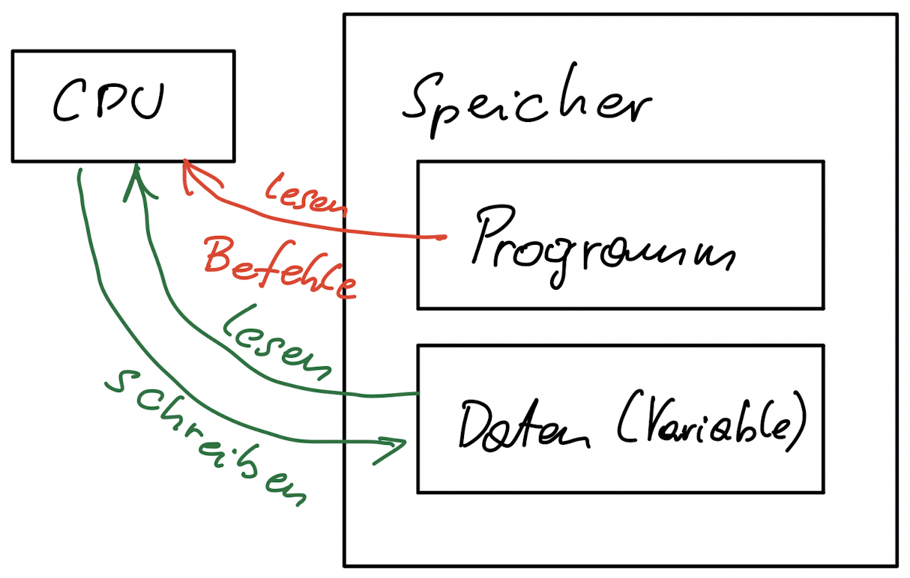
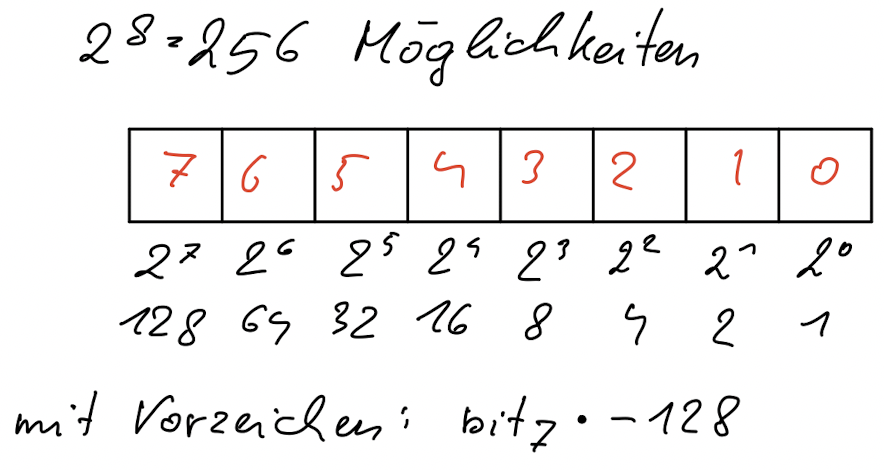
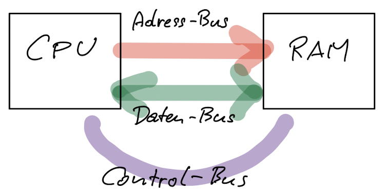
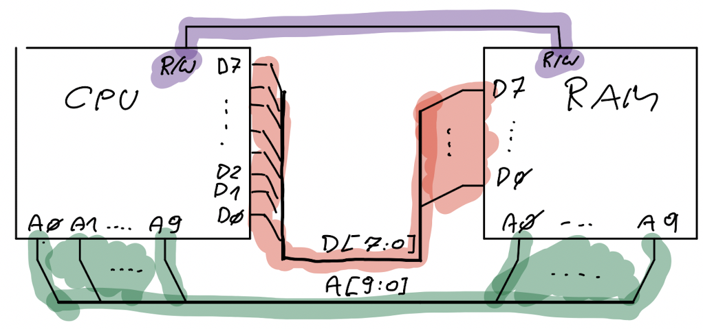
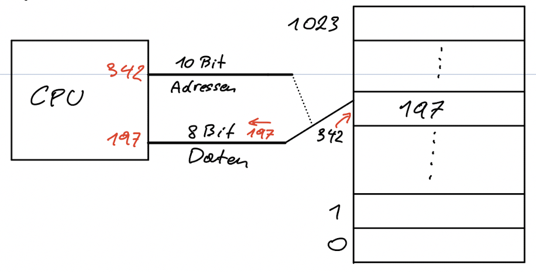
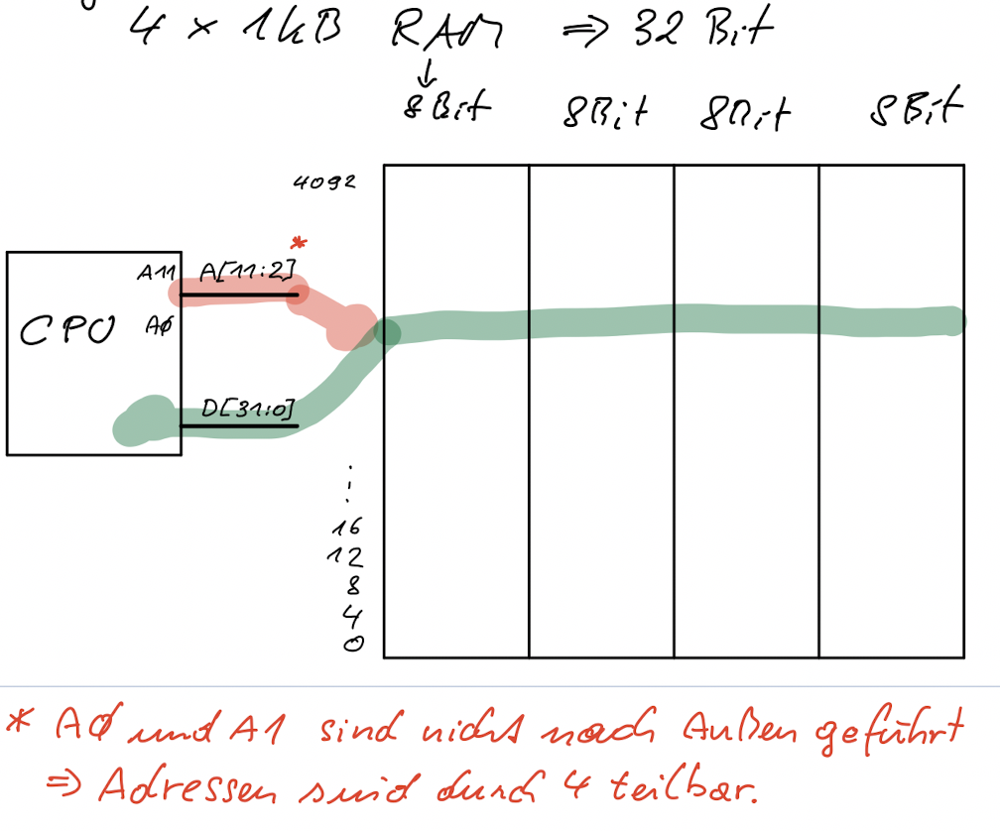

SYTG – Computerarchitektur

Ziel:  Verstehen wie Computer intern funktionieren, dadurch IT Systeme besser anwenden können.

Was ist ein Computer?

Computer sind Geräte auf denen Programme laufen. 

- beliebige Anwendungen (Software)  (z.B. Desktop Computer) oder auch 
- fix programmiert (Firmware)

Computer:

- Desktop
- Server
- Mobil
- IoT – Internet of Things
- Embedded – Computer die man nicht sieht  (Beispiele: Auto, im Haushalt? – Fernseher, Rasenroboter)

Die zugrundeliegenden Architektur-Prinzipien (Hardware und Software) sind bei allen Arten von Computer-Systemen grundsätzlich gleich.

Die Hardware besteht aus

- CPU
- Speicher
- Peripherie

Software (Schichten)

- Anwendung
- Betriebssystem
- Firmware (mit Bootloader)
- (Hardware)

Die **Firmware** ist fest ("firm") im Gerät gespeichert und wird unmittelbar nach dem Einschalten aktiv. Dient zum initialisieren des Systems. Der **Bootloader** lädt das Betriebssystem von der Festplatte und startet dieses.

# Grundlegende Systemarchitektur

*Ziel: Von Neumann Architektur erklären*

Betrachtung von CPU, Speicher und Bus genügt.

Arten von Daten im Speicher:

Zentral: Wie sind Speicher und Prozessor miteinander verbunden? Am häufigsten eingesetzt:

## Von Neumann Architektur

Speicher enthält das Programm (instructions) **und** die Daten.

Datenfluss:

Eigenschaften Von Neumann:

- Daten und Programm im gleichen Speicher. 
  - Laden von der Festplatte: Programm sind Daten
  - CPU führt Programm aus: Daten sind Maschinencode
- Daten und Code aus der Sicht des Prozessors nicht unterscheidbar. Für IT-Sicherheit: Daten können als Programm interpretiert werden. Viele Sicherheitslücken nutzen dies aus (code execution vulnerabilities – buffer overflow).
- Die Bedeutung der Daten (Buchstabe, Zahl, ...) entsteht durch die Art und Weise wie diese im Programm verwendet werden. Für den Prozessor sind es nur 0 und 1.
- Speicher: zusammengehörige Aneinanderreihung von Speicherstellen (Bytes). Enthält:
  - das Betriebssysten, 
  - alle laufenden Anwendungen, und
  - die zugehörige Daten.

## Harvard Architektur

Alternative zur von Neumann Architektur. Programm und Datenspeicher sind völlig voneinander getrennt. Hätte Vorteile (Sicherheit, Geschwindigkeit) aber wegen dem hohen Aufwand kaum im Einsatz.

Most microprocessors available are standard Von Neumann machines. The main deviation from this is the *Harvard architecture* , in which instructions and data have different memory spaces ([Figure 1-5](https://www.oreilly.com/library/view/designing-embedded-hardware/0596007558/ch01.html#dbhardware2-CHP-1-FIG-5)) with separate address, data, and control buses for each memory space. This has a number of advantages in that instruction and data fetches can occur concurrently.

# Speicher und Bus

Arbeitsspeicher / Hauptspeicher / main memory

Organisiert in Bytes = 8 Bit 

Verbindung CPU ↔ Speicher (Adress-, Daten-, Control-Bus)

(Arbeits-)Speicher = durchnummerierte Bytes. CPU kann jedes Byte direkt lesen bzw. schreiben = wahlfreier Zugriff, daher der Begriff RAM (random access memory).

Beispiel CPU/RAM: 

- 8 Bit Datenbus
- 10 Bit Adressbus

Programmiermodell:

Arbeitsspeicher kann auch 16, 32 oder 64 Bitweise organisiert werden. Dann betrifft ein Speicherzugriff gleich mehrere Bytes (2, 4 oder 8) was zu einer höheren Geschwindigkeit führt.

Breite (Anzahl der Leitungen) des Adress-Bus bestimmt die maximal adressierbare Speichergröße

Der **Adressbus** bestimmt auf welches Byte gerade zugegriffen werden soll. Die Anzahl der maximal adressierbaren Bytes ergibt sich durch 2 hoch (Anzahl der Adressleitungen).

-   *Beispiel 10/16/22/32/64 Addressleitung*
-   *Hinweis auf: kB (sind 10 Leitungen!), MB, GB, TB (1024 Stückelung, SI: 1000er Schritte).*
    -   Dezimapräfix (k,M,T,...) = SI Präfixe vs. Binärpräfix IEC (KiB, MiB, TiB)
    -   Bei Hauptspeicher sind immer Binärpräfixe in Verwendung. Ansonsten wird aber wild gemischt! Aufpassen!
        -   Beispiel SSD mit 256 GiB wären 256*2^30 / 10^9 = 274,9 GB – macht sich im Werbetext besser

## Weiteres

- [Video: How Smartphones Operate: Inside the Primary Processor/ System on a Chip/ Brain of your Smartphone](https://youtu.be/NKfW8ijmRQ4), Super Animationen
