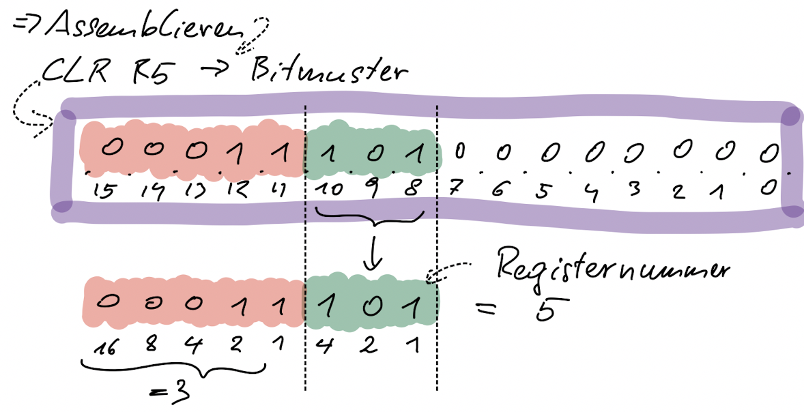
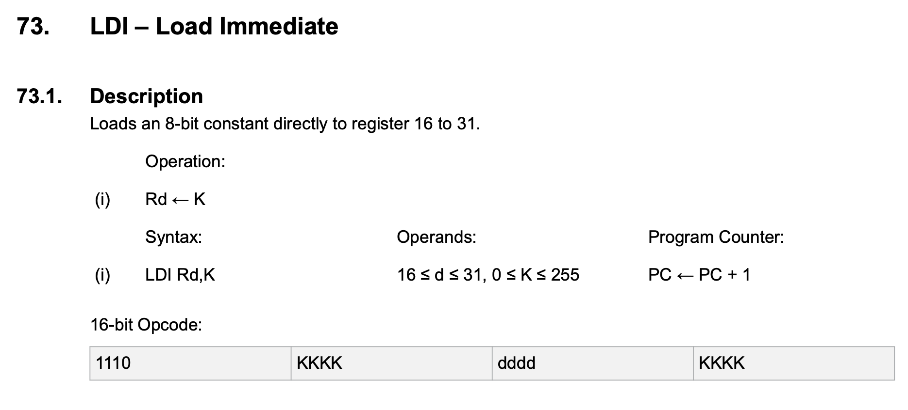

* TOC
{:toc}

Der Prozessor (CPU) führt Programme (=Folge von Befehlen) aus die im Speicher stehen.

Grundsätzlicher Ablauf (*instruction cycle*) in CPU :

-   fetch –  Befehl aus dem Hauptspeicher in die CPU transportieren
-   decode – feststellen was zu tun ist
-   execute – Befehl ausführen

Befehle werden in fixen Zeitabständen ausgeführt = **Takt**. Gängig 1–5 GHz, Bei µC auch im MHz Bereich.


*Dauer für einen Befehl bei 1GHz?*

Interne Struktur einer CPU

-   **Register**
    Speicherelement mit 8, 16, 32 oder 64 Bits. Begrenzte Anzahl, z.B. 16 oder 32. Register bestehen aus Flip-Flops (FF pro Bit)
-   **PC** (program counter)
    Speicher-Adresse des nächsten Befehls
-   **IR** (instruction register)
    Enthält den auszuführenden Befehl
    [! 2AHITS 09.11.2021]
-   **ALU** – algorithmic and logic unit
    Führt Berechnungen aus, hat 2 Eingänge und einen Ausgang


-   **SR** (status register) besteht aus Flags (Bits)
    
    Zustände der Bits leiten sich ab aus der vorhergehenden Operation der ALU. Ergebnis ist 0 setzt z.B. das zero-flag. Auch Fehlersituationen werden so gemeldet (overflow-flag)

# Übersichtsbild CPU 

mit grundsäzlichem Ablauf


# Maschinensprache

= Befehle die ein Prozessor versteht (Befehlssatz), kodiert als Bitmuster.

Eindeutige Nummer für jeden Befehl (= **opcode**)


## Bsp. hypothetischer Prozessor

Nur für Grundprinzip/Idee, nicht real existent.

8 Register (R0-R7), 16 Bit Befehlssatz, opcode in obersten 5 Bits (2^5=32 Befehle).

3 Befehle als Beispiel

- CLR – Löschen eines Registers
- LDI – Laden eines Registers mit Wert
- ADD – Zwei Registerwerte addieren

**Assembler** Code = Maschinencode als lesbarer Quelltext

```
CLR R5 # R5 = R5 XOR R5
```

- [15:11] opcode = 3
- [10:8] reg
- [7:0] reserved

Aufgabe: Assemblieren



```
LDI R5,22
```

- [15:11] opcode = 27
- [10:8] reg
- [7:0] value

Aufgabe: Assemblieren


```
ADD R3,R5  # R3=R3+R5
```

- [15:11] opcode = 30
- [10:8] regA
- [7:5] regB
- [4:0] reserved

Aufgabe: Assemblieren


## Assemblieren

Assembler Code:

```
LDI R2,18 # Setze Register Nr. 2 auf den Wert 18
LDI R3,22 # Setze Register Nr. 3 auf den Wert 22
ADD R2,R3 # addiere R2 mit R3, speichere Ergebnis in R2
```

Maschinencode in hex:

```
...todo...
```

*Gesamten Programmablauf in der CPU Skizze nachstellen*

## Disassemblieren: 

von Maschinensprache in Assembler (Hacking Tool). Allgemeiner Begriff: reverse engineering

Maschinencode anhand des Przessors **ATmega16** (16 Bit Befehle) – µC der Firma Atmel (µC = CPU+Speicher+Peripherie auf einem Chip)

Speicherdump:

```
05E11EE0100F
```

The **AVR** is "little-endian", d.h. low byte zuerst im Speicher.

D.h. E105 ist ein Maschinensprachebefehl.

Disassembly:

```
E105 = LDI R16,21
E01E = LDI R17,14
0F10 = ADD R17,R16
^      ^
|      |
|      +--- Assembler Mnemonics
+---------- Maschinencode (in Hex)
```

Siehe `doc/atmel-0856-avr-instruction-set-manual.pdf`

- LDI Seite 115, opcode ganz links 4 Bits: 1110
- ADD Seite 32, opcode ganz links 6 Bits: 000011




## Bedeutung Maschinensprache/Assembler

- Zum Verstehen wie ein Prozessor funktioniert. 
- Reverse Engineering (Schadsoftware analysieren)
- Hacker: Suchen von Schwachstellen für Angriffe
- Programmiert wird in Assembler weniger:
  - Mühsam
  - C-Compiler sind ausreichend gut optimierend
  - Ausnahmen
    - Nutzen von speziellen Prozessor Features oder besonderer HW Componenten
    - Boot/Firmware Code


# Multicore-Architektur

- Multi-Core: Mehrere CPU Kerne in einem Prozessor (Dual, Quad, Octa, ...).
  - Es werden mehrere Programme gleichzeitig ausgeführt – Jeder Core kann  ein Programm ausführen.

z.B. Quad-Core (=4)


# Mehrprozessor-Architekturen

- Multi-Prozessor: Getrennte Prozessoren (evtl. Multi-Core) teilen sich Bus, Speicher und I/O.


# Videos

- [Wie funktioniert ein Prozessor (CPU)? Erklärvideo von BYTEthinks (7:21)](https://youtu.be/ergYcSJ3Zns)
- [How a CPU Works (20:42)](https://youtu.be/cNN_tTXABUA)
- [Playlist: Evolution of CPU processing power](https://youtube.com/playlist?list=PLC7a8fNahjQ8IkiD5f7blIYrro9oeIfJU)
- [How Do CPUs Work? (10:39)](https://youtu.be/jx-w2o-Lj8g)
- [From Sand to Silicon: The Making of a Microchip | Intel (4:44)](https://youtu.be/_VMYPLXnd7E)
