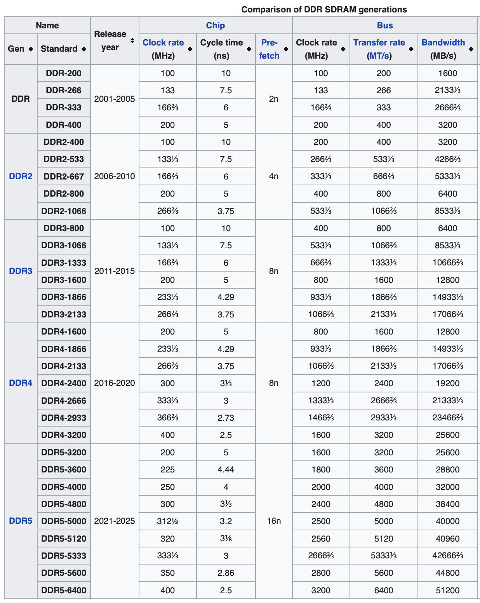

*Bild: CPU Bus Speicher (evtl. vom vorhergehenden Kapitel)*

Für Programme und Daten, von der CPU aus über den Bus direkt und byteweise adressierbar.

Arten:

-   Flüchtiger Speicher (volatile, Strom weg => Daten weg)
    -   RAM - Random Access Memory 
        -   SRAM – Static RAM (D Flip Flops, schnell, teuer), nur für spezielle Anwendungen
        -   **SDRAM** – Synchronous Dynamic RAM (Kondensator, langsamer, billiger) – der Standard!

- Nicht-flüchtiger Speicher (non volatile, behält die Daten bei Spannungsverlust)
  - ROM - Read Only Memory 
    - EEPROM – electrically erasable programmable read-only memory, byteweise löschen und neu programmieren möglich. Lebensdauer ca. 1 Mio. Zyklen. Meist nur wenige MB und teuer.
    - **Flash** – spezieller günstiger EEPROM Typ der nur in großen Blöcken (>=512 Bytes) gelöscht werden kann. Lebensdauer ca. 10.000 Zyklen. Im GB/TB Bereich verfügbar. Verwendung in SSD (Solid State Disk), Handys, Tablets, ...

# SDRAM

SDRAM (Synchron Dynamic RAM), für Hauptspeicher von Computern, seit ca. 20 Jahren. Kostengünstig verfügbar. Größen typisch 8 bzw. 16 GByte. Ständige technische Verbesserungen und erhöhung der Taktfrequenz.

- Dynamic: pro Bit Transistor+Kondensator, Ladung muss ständig erneuert werden (z.B. DDR2 SDRAM alle 64 ms)
- DRAM ist volatil: verliert Daten bei fehlender Stromversorgung
- **S**DRAM: spezieller Typ (synchron)
- Aktuell: DDR (double data rate – auch neg. Flanke wird genutzt).
- DDR SDRAM – ist die genaue Bezeichnung
- Datenbreite 64 Bits (8 Bytes)
- Bauform: (DIMM – Dual Inline Memory Module)
  .jpg)
- SO-DIMM, Small Outline DIMM für Notebooks

### Historisch

- **DDR:** 1998
- **DDR2:** 2003
- **DDR3:** 2007
- **DDR4:** 2014
- **DDR5:** 2021

### Performance Rechnungen

Richtiges Interpretieren der technischen Daten. 

([Quelle wikipedia](https://en.wikipedia.org/wiki/DDR_SDRAM#Generations))

[**Raspberry Pi 4** Tech Specs](https://www.raspberrypi.org/products/raspberry-pi-4-model-b/specifications/)

Was bedeutet **DDR4-3200**?:

- Chip clock rate: 400 (MHz) – intern im SDRAM
- Bus clock rate: 1600 (MHz) – CPU↔SDRAM
- Bus transfer rate: 3200 (MT/s)
- Bus bandwidth: 25600 (MB/s)

Zusammenhänge:

- Chip **Clock Rate** (400 MHz) → Bus transfer rate (3200 MT/s)
  Pro chip-clock werden 8 hintereinanderliegende 64 Bit Blöcke gelesen. (**[8n prefetch](https://en.wikipedia.org/wiki/Synchronous_dynamic_random-access_memory#DDR_SDRAM_prefetch_architecture)**). Daher am Bus die 8-fache **transfer rate**  (3200 MT/s) notwendig.
- DDR: am Bus wird  steigende und fallende Flanke genutzt, daher ist die **bus clock rate** die halbe transfer rate 3200 / 2 = 1600 MHz

- Pro Transfer werden 64 Bits (8 Bytes) übertragen, daher Bandbreite (bus bandwith) = 3200*8=25600 MB/s. DIMMs sind häufig mit der Bezeichnung **PC4-25600** im Handel.

### Detail-Infos DRAM

*Info. Nicht für Unterricht*

-   The naming convention for DDR, DDR2 and DDR3 modules specifies either a maximum speed (e.g., DDR2-800) or a maximum bandwidth (e.g., PC2-6400). The speed rating (800) is not the maximum clock speed, but twice that (because of the doubled data rate). The specified bandwidth (6400) is the maximum megabytes transferred per second using a 64-bit width. In a dual-channel mode configuration, this is effectively a 128-bit width. Thus, the memory configuration in the example can be simplified as: two DDR2-800 modules running in dual-channel mode. [Memory bandwidth](https://en.wikipedia.org/wiki/Memory_bandwidth)

-   Beschriftung mit (doppelter) Taktfrequenz (DDR4-1600) oder Bandbreite im MB/s (PC4-12800)
    DDR4-1600 (pos. und neg. Flanken) => 800 MHZ I/O Bus (zwischen memory-controller und DIMM), Speichertakt (im DIMM) 200 MHz, die Differenz zwischen 200 auf 1600 MHz wird durch einen Trick (8x Prefetch) im Speichermodul ermöglicht. ([wikipedia](https://de.wikipedia.org/wiki/DDR-SDRAM), [elektronik-kompendium.de](https://www.elektronik-kompendium.de/sites/com/1312291.htm))

### DDR5

Höhere Bandbreiten werden benötigt weil immer mehr CPU Cores auf einen gemeinsamen Speicher zugreifen.

- Verfügbar 2021, zuerst in Servern
- Geringerer Stromverbrauch
- DDR4: max. 32GB pro DIMM Modul, DDR5: 128GB
- Transfer Rate: ab DDR5-3200, in 400er Schritten bis DDR5-6400 (Zukunft: 8400MT/s).
- 16n Prefetch (d.h. 16*8=128 Bytes pro Speicherzugriff)
- Diverse Optimierungen um **reale Datenrate** zu erhöhen. Ca. ⅓ schneller als DDR4 bei gleicher Transfer Rate.
  

[c't: Schnelles DRAM: DDR5-Spezifikation lernt DDR5-6400 kennen](https://www.heise.de/news/Schnelles-DRAM-DDR5-Spezifikation-lernt-DDR5-6400-kennen-6233489.html)

### Dual / Quad / Octa Channel

Dual Channel: 2 DIMM Steckplätze werden parallel verwendet, verdoppelt die Busbreite auf 128 Bits.

Quad Channel: 256 Bits.

Octa Channel: 512 Bits

# Videos DRAM

- [RAM Explained - Random Access Memory](https://youtu.be/PVad0c2cljo) – Basics, Allgemeine Einführung, DIMM, SRAM, SDRAM, Bandwidth (PC-100, PC-133), RIMM, DDR, DDR2, DDR3, DDR4, ECC

  -   data path width 64 Bits = 8 Bytes. Manchmal genannt "line" (en)
  -   DDR-333, PC2700 – warum nicht doppelt soviel (333x8x2=5333), wegen double data rate)
      Antwort: 333MHz ist bereits die verdoppelte Frequenz (d.h. zählt auch die negativen Flanken) 

- [Dynamic Random Access Memory (DRAM). Part 1: Memory Cell Arrays](https://youtu.be/I-9XWtdW_Co)

- [Microchip – What is DRAM?](https://youtu.be/Lozf9sceW_o) – gute Einführung in die Interna's. Beschreibt eine etwas andere Arbeitsweise als das Video vorher.

- [Dynamic Random Access Memory (DRAM). Part 2: Read and Write Cycles](https://youtu.be/x3jGqOrXXc8)
  Part 3/4 erklärt Multiplexer und Decoder.

- [Dynamic Random Access Memory (DRAM). Part 5: DIMM Organisation](https://youtu.be/Mhqi70OPW0o)
  Video erklärt wie Speicherchips intern organisiert sind: Banks, Mehr-Bit Organisation. Im Video wird suggeriert dass ein DIMM 8 Bit hat was nicht korrekt ist (sind 64, es sind 8 Chips mit x8).

  >   Most DIMMs are built using "×4" ("by four") or "×8" ("by eight") memory chips with nine chips per side; "×4" and "×8" refer to the data width of the DRAM chips in bits. Quelle: https://en.m.wikipedia.org/wiki/DIMM

- [Dynamic Random Access Memory (DRAM). Part 6: Burst Mode and Bank Interleaving](https://youtu.be/9BjVUmaXaCQ)

- [Dynamic Random Access Memory (DRAM). Part 7: Memory Address Mapping](https://youtu.be/8Ha1Zd0T1r0), erklärt wie durch geschicktes interpretieren der Speicheradresse bank-interleaving und prefetching zur Beschleunigung genutzt werden kann.

# Weiterführend

- [What Every Programmer Should Know About Memory](https://akkadia.org/drepper/cpumemory.pdf)

