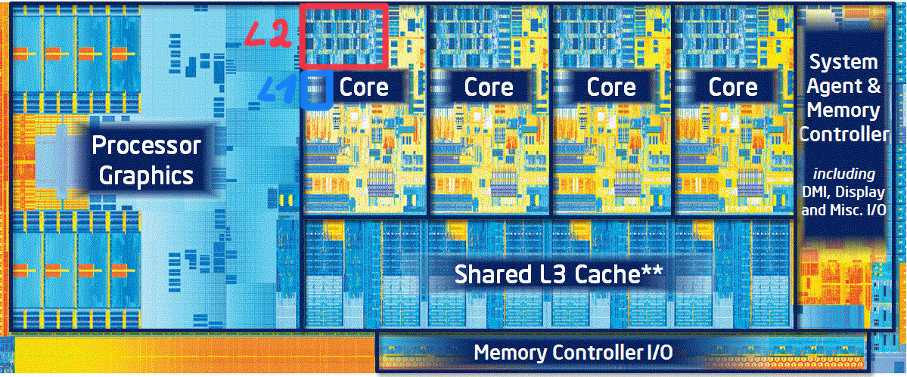

Systeme mit geringer Taktfrequenz (ca. 100-400MHz) und wenig Speicher (kB-MB) – µC

- Main Memory ⟷ CPU

SRAM kann als Speicher eingesetzt werden. CPU und Speicher etwa gleich schnell.

Hohe CPU Taktfrequenz (GHz), viel Hauptspeicher (GB)

- Main Memory ⟷ Cache(s) ⟷ CPU(s) (Multicore)

In diesen Größen: SDRAMs – langsamer als CPU (ca. 10x). CPU muss lange warten – Memory Bottleneck.

Lösung: **Cache**  – schneller SRAM Zwischenspeicher – zwischen CPU und SDRAM . Im Cache sind Daten die die CPU jetzt gerade bzw. sehr häufig braucht (z.B. Schleifen und lokale Variable). Cache Speicher ist teuer: 10–100x normales SDRAM und in diesen Größen nicht verfügbar.

[How Does CPU Cache Work and What Are L1, L2, and L3?](https://www.makeuseof.com/tag/what-is-cpu-cache/)

Caches können hierarchisch organisiert sein. Aktuell max. 3 Level

-   L1 Cache, am nähesten zum CPU Kern, der schnellste Cache, z.B. 256 kB. 
    -   Häufig 2 Caches: **L1i**=instruction cache, **L1d**=data cache
-   L2 pro CPU Kern, etwas langsamer, z.B. 2MB
-   L3 Cache, teilen sich alle CPU Kerne, z.B. 8MB

- Es wird immer mehr aus dem SDRAM gelesen als aktuell gerade gebraucht wird (Cache-Burst). Diese Daten werden sehr wahrscheinlich auch benötigt. Dies passt auch gut zur prefetch Architektur des SDRAMs.

- Die CPU sucht die Daten zuerst im Cache. Werden diese nicht gefunden (Cache miss) wird im darüberliegenden Cache (oder im Hauptspeicher) gesucht.

- Neu aus dem HS gelesene Daten landen im Cache (ersetzen dort ältere Daten)

- Von der CPU im Cache überschriebene Daten werden besonders gekennzeichnet (dirty flag) und bei günstiger Gelegenheit in den darüberliegenden Cache (oder Hauptspeicher) geschrieben.

- Die Gesamtsystem-Performance ist abhängig davon wie gut das Zusammenspiel zwischen der CPU, den Caches und dem Hauptspeicher ist.

*Evtl. ein Video das die Funktion zeigt? [Video: CPU Cache Explained - What is Cache Memory?](https://youtu.be/yi0FhRqDJfo)*

>   Memory is transferred from the main memory into the caches in blocks which are smaller than the cache line size. Today 64 *bits* are transferred at once and the cache line size is 64 or 128 *bytes*. This means 8 or 16 transfers per cache line are needed.
>
>   The DRAM chips can transfer those 64-bit blocks in burst mode. This can fill the cache line without any further commands from the memory controller and the possibly associated delays. If the processor prefetches cache lines this is probably the best way to operate. ([quelle](https://lwn.net/Articles/252125/))

## Processor die

Silizium Chip (die), Intel Quad Core mit Grafik, 1,4 Mrd Transistoren, 160mm2 Fläche (ca. 13x13mm)

*Soll zeigen wie viel Fläche der Cache braucht! Im Core ganz oben sollte der L2 Cache zu sehen sein, links neben dem Text "Core" ist wahrscheinlich der L1 Cache*. Chipfläche = Kosten!

## Weiteres

- [Video: How Smartphones Operate || Inside the Primary Processor/ System on a Chip/ Brain of your Smartphone](https://youtu.be/NKfW8ijmRQ4), Super Animationen

