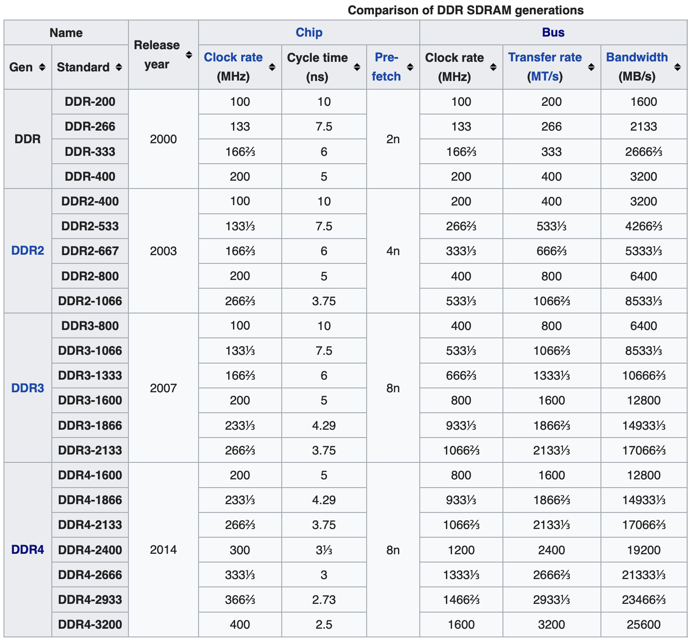
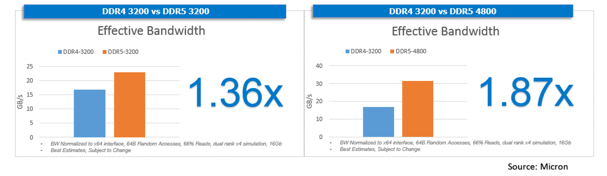

# SDRAM

SDRAM (Synchron Dynamic RAM) wird seit ca. 20 Jahren für den Hauptspeicher von Computern eingesetzt. Wurde durch erhöhen der Taktfrequenz und einiger technischer Tricks immer weiter verbessert.

- Dynamic: pro Bit Transistor+Kondensator, Ladung muss ständig erneuert werden (z.B. DDR2 SDRAM alle 64 ms)
-   DRAM ist volatil: verliert Daten bei fehlender Stromversorgung
-   SDRAM: spezieller Typ (synchron)
-   Aktuell: DDR (double data rate – auch neg. Flanke wird genutzt).
-   Genaue Bezeichnung: DDR SDRAM
-   Datenbreite 64 Bits (8 Bytes)
- Bauform: (DIMM – Dual Inline Memory Module)
  .jpg)
-   SO-DIMM, Small Outline DIMM für Notebooks

# Historisch

- **DDR:** 1998
- **DDR2:** 2003
- **DDR3:** 2007
- **DDR4:** 2014
- **DDR5:** 2021

Chip clock rate * [prefetch](https://en.wikipedia.org/wiki/Synchronous_dynamic_random-access_memory#DDR_SDRAM_prefetch_architecture)  = Bus Transfer Rate

Bus clock rate * 2 = Bus Transfer Rate (DDR Prinzip)

Bezeichnungen: 

- Norm: **DDR4-3200**, 3200 = Bus Transfer rate, MT/s = Megatransfers/s
- Handel: **PC4-25600**, =3200*8 MB/s (weil Bus 8 Bytes breit ist)

8n Prefetch bedeutet es werden 8*8 Bytes (64 Bytes) bei einem Speicherzugriff gelesen. Diese landen im Cache. Das bringt dann etwas, wenn die CPU diese folgenden Bytes auch später benötigt (was häufig der Fall ist).

# DDR5

- Höhere Bandbreiten werden benötigt weil immer mehr CPU Cores auf den einen gemeinsamen Speicher zugreifen.
- Geringerer Stromverbrauch
- Verfügbar 2021, zuerst in Servern
- DDR4: max. 32GB pro DIMM Modul, DDR5: 128GB
- Transfer Rate: ab DDR5-3200 (in 400er Schritten) bis DDR5-6400 (Zukunft: 8400MT/s).
- 16n Prefetch (d.h. 16*8=128 Bytes pro Speicherzugriff)
- Diverse Optimierungen um reale Daterate zu erhöhen. Ca. ⅓ schneller als DDR4 bei gleicher Transfer Rate.
  

# Dual (Quad) Channel

Am Motherboard.

2 DIMM Steckplätze (Dual), erweitert die Busbreite auf 128 Bits.

Quad Channel: 256 Bits.

# Videos

-   [RAM Explained - Random Access Memory](https://youtu.be/PVad0c2cljo) – Basics, Allgemeine Einführung, DIMM, SRAM, SDRAM, Bandwidth (PC-100, PC-133), RIMM, DDR, DDR2, DDR3, DDR4, ECC

    -   data path width 64 Bits = 8 Bytes. Manchmal genannt "line" (en)
    -   DDR-333, PC2700 – warum nicht doppelt soviel (333x8x2=5333, wegen double data rate)
        Antwort: 333MHz ist bereits die verdoppelte Frequenz (d.h. zählt auch die negativen Flanken) 

-   [Dynamic Random Access Memory (DRAM). Part 1: Memory Cell Arrays](https://youtu.be/I-9XWtdW_Co)

-   [Microchip – What is DRAM?](https://youtu.be/Lozf9sceW_o) – gute Einführung in die Interna's. Beschreibt eine etwas andere Arbeitsweise als das Video vorher.

-   [Dynamic Random Access Memory (DRAM). Part 2: Read and Write Cycles](https://youtu.be/x3jGqOrXXc8)
    Part 3/4 erklärt Multiplexer und Decoder.

-   [Dynamic Random Access Memory (DRAM). Part 5: DIMM Organisation](https://youtu.be/Mhqi70OPW0o)
    Video erklärt wie Speicherchips intern organisiert sind: Banks, Mehr-Bit Organisation. Im Video wird suggeriert dass ein DIMM 8 Bit hat was nicht korrekt ist (sind 64, es sind 8 Chips mit x8).

    >   Most DIMMs are built using "×4" ("by four") or "×8" ("by eight") memory chips with nine chips per side; "×4" and "×8" refer to the data width of the DRAM chips in bits. Quelle: https://en.m.wikipedia.org/wiki/DIMM
    >

-   [Dynamic Random Access Memory (DRAM). Part 6: Burst Mode and Bank Interleaving](https://youtu.be/9BjVUmaXaCQ)

-   [Dynamic Random Access Memory (DRAM). Part 7: Memory Address Mapping](https://youtu.be/8Ha1Zd0T1r0), erklärt wie durch geschicktes interpretieren der Speicheradresse bank-interleaving und prefetching zur Beschleunigung genutzt werden kann.

# Infos

-   The naming convention for DDR, DDR2 and DDR3 modules specifies either a maximum speed (e.g., DDR2-800) or a maximum bandwidth (e.g., PC2-6400). The speed rating (800) is not the maximum clock speed, but twice that (because of the doubled data rate). The specified bandwidth (6400) is the maximum megabytes transferred per second using a 64-bit width. In a dual-channel mode configuration, this is effectively a 128-bit width. Thus, the memory configuration in the example can be simplified as: two DDR2-800 modules running in dual-channel mode. [Memory bandwidth](https://en.wikipedia.org/wiki/Memory_bandwidth)

-   most mainstream DDR4 memory kits range from 2,666Mbps to 3,400Mbps

-   Beschriftung mit (doppelter) Taktfrequenz (DDR4-1600) oder Bandbreite im MB/s (PC4-12800)
    DDR4-1600 (pos. und neg. Flanken) => 800 MHZ I/O Bus (zwischen memory-controller und DIMM), Speichertakt (im DIMM) 200 MHz, die Differenz zwischen 200 auf 1600 MHz wird durch einen Trick (8x Prefetch) im Speichermodul ermöglicht. ([wikipedia](https://de.wikipedia.org/wiki/DDR-SDRAM), [elektronik-kompendium.de](https://www.elektronik-kompendium.de/sites/com/1312291.htm))

