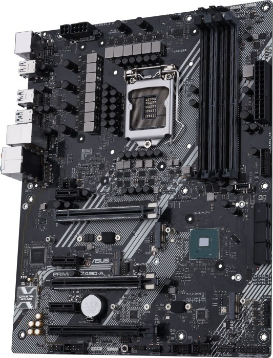
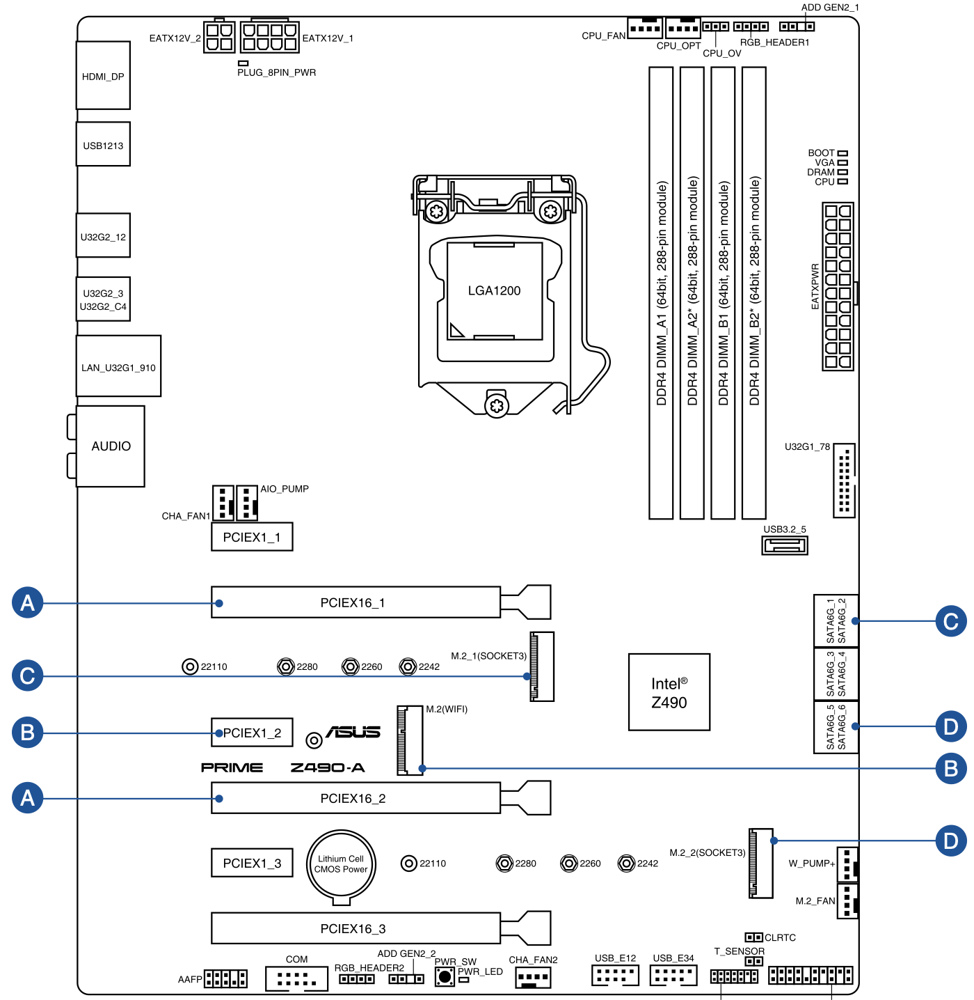
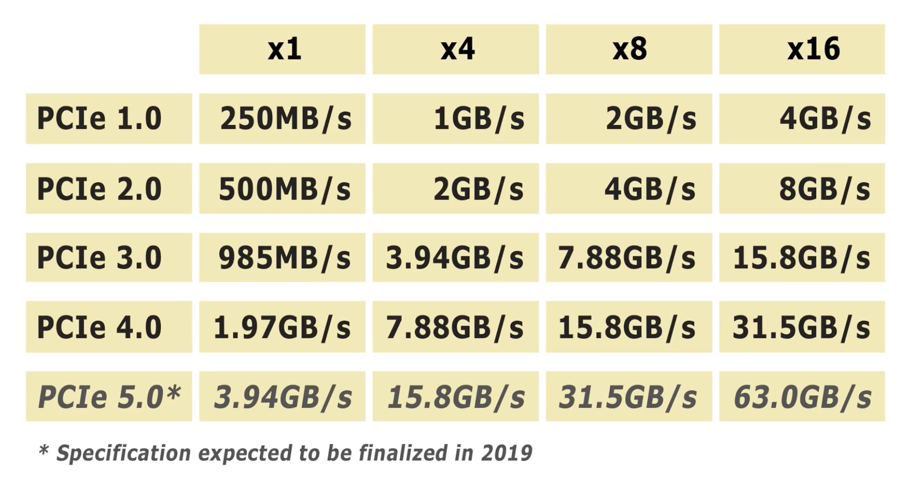
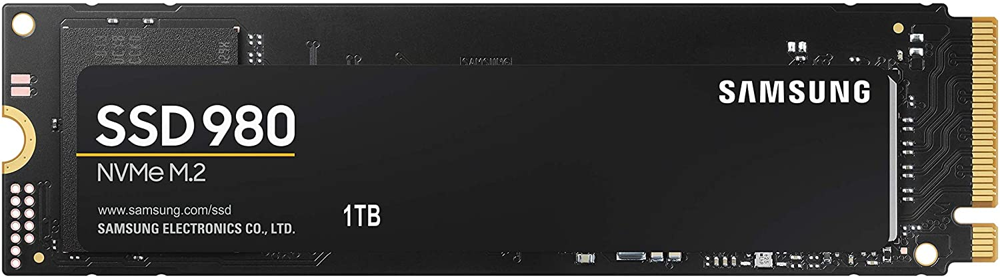
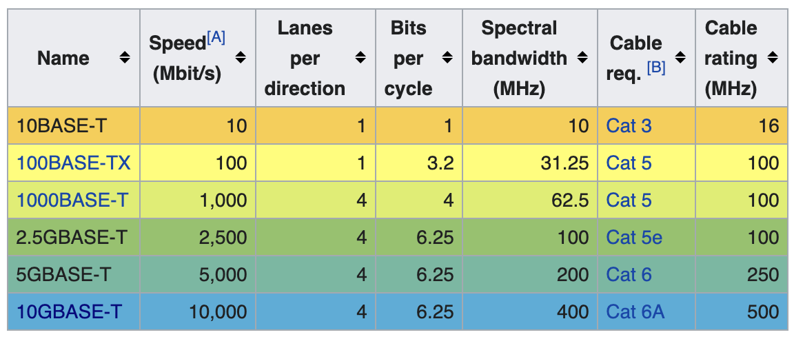

* TOC
{:toc}
- I/O Busse innerhalb des Gehäuses:
  - **PCIe** (direkt am Motherboard), (3.0, x4) 32 Gbit/s
    (Peripheral Component Interconnect Express ): Desktop Motherboard hat typischerweise 2-4 PCIe Steckplätze. Darauf gesteckt werden können Grafikkarten, Festplattenkontroller, Netzwerk-Interface-karten (NIC), etc.
  - **SATA** (per Kabel), (rev 3.0) 6 Gbit/s
    Typisch 6-8 auf Motherboard, für Festplatten.

- I/O Busse außerhalb (Kabel):
  - **DisplayPort**, (1.3) 32 Gbit/s
    Zum Anschluss von bis zu 3 Stk. 4K Monitoren in daisy chain
  - **USB**, (2.0) 0,5 Gbit/s / (3.0) 5 Gbit/s
    (Universal Serial Bus) zum Anschluss diverser Peripheriekomponenten (Tastatur, Maus, Webcam, Mic, Lautsprecher, Externe Festplatten, USB Sticks, ...)
  - **Ethernet** LAN, 1 Gbit/s, Netzwerk
  - **Thunderbolt** (=PCIe+DisplayPort+USB) / (3) 40 Gbit/s
    Universal-Anschluss, kombiniert DisplayPort (damit auch USB) und PCIe. Zusätzlich Netzteil Anschluss möglich ("Power Delivery", z.B. Laptop). Verwendet USB-C Stecker. Ziel: ein Anschluss für alles

Außer PCIe sind alle **hot plugging** fähig, d.h. Geräte können im Betrieb hinzugefügt und entfernt werden.

Beispiel Motherboard (ASUS Prime Z490-A, [geizhals](https://geizhals.at/asus-prime-z490-a-a2284654.html?hloc=at&hloc=de)):

## PCIe

[wikipedia : PCI Express](https://de.wikipedia.org/wiki/PCI_Express)

[Video: Explaining PCIe Slots](https://youtu.be/PrXwe21biJo), [elektronik-kompendium.de](https://www.elektronik-kompendium.de/sites/com/0904051.htm)

-   Slots auf dem Motherboard in den die Karten gesteckt werden
-   Universalanschluss für alle Arten von Erweiterungskarten (inkl. Grafikkarten)
-   Daten werden seriell in Lanes übertragen (bei PCI 3.0 ca. 1GB/s pro Lane)
-   Höhere Datenraten durch mehr Lanes (=längere Slots), 1x, 2x, 4x, 8x, 16x
-   Mit jeder PCIe Version verdoppelt sich die Lane-Datenrate [[wikipedia](https://de.wikipedia.org/wiki/PCI_Express)]
-   In längere Slots (z.B. 16x) können kürzere Karten (z.B. 1x) gesteckt werden
-   Wenn mechanisch möglich sind längere Karten in kürzeren Slots auch OK

## SATA

[Video: SATA 3 - SERIAL ATA](https://youtu.be/T-6z8tCcR38), [wikipedia : Serial ATA](https://de.wikipedia.org/wiki/Serial_ATA)

Serial AT Attachment. Weiterentwicklung von **ATA** "Advanced Technology Attachment": 80er von IBM, wurde de facto Industriestandard. 

Zum Anschluss von Massenspeichern: Festplatten (HDD), SSD's, DVD Laufwerke

Aktuell: SATA revision 3.0 (6 Gbit/s, 600 MB/s, Serial ATA-600)

hot plugging fähig – Geräte können im Betrieb an- und abgesteckt werden – wenn die SW das unterstützt

Für HDD Bandbreiten (ca. 200 MB/s) ist SATA-III ausreichend für aktuelle SSD nicht mehr!  Z.B.: WDS250G3X0C, Lesen: 3100MB/s, Schreiben: 1600MB/s. Es gibt keinen Nachfolgestandard (SATA Express ist gescheitert).

## M.2

[[wikipedia](https://de.wikipedia.org/wiki/M.2)]

Schnittstelle zum Anschluss von schnellen SSDs

Zugriff erfolgt über PCIe (4.0 4x = 7,9 GB/s) oder SATA-III

> Vom M.2-Standard werden folgende drei Bussysteme unterstützt: PCI Express (bis 4.0), SATA Revision 3.x und USB 3.0. Es gibt M.2-Varianten mit bis zu vier PCI-Express-Lanes (bis zu 4 × 16 GT/s), einem SATA Revision 3.x (6 Gbit/s) und/oder einem USB-3.0-Port (5 Gbit/s) – alles über einen Anschluss. Damit kann man sowohl PCI-Express als auch SATA-Speicher per M.2 anschließen. An jedem Port können beide Bussysteme auch parallel genutzt werden. [[wikipedia](https://de.wikipedia.org/wiki/M.2)]

M.2-Steckplatz für Karten mit 42, 60, 80 oder 110 mm Länge (rechts am Bildrand, mit „163006“ beschriftet):

## SAS

Serial Attached SCSI. [wikipedia SAS](https://en.wikipedia.org/wiki/Serial_Attached_SCSI). Alternative zu SATA in Servern. [SAS vs SATA: What's the Difference?](https://store.hp.com/us/en/tech-takes/sas-vs-sata)

Aktuell: SAS-4 (22,5 Gbit/s)

SAS ist performanter und ist technologisch fortschrittlicher als SATA. Ist aber **viel teurer** und wird daher nur im **Server** Bereich eingesetzt.

## DisplayPort

[Video: HDMI, DisplayPort, DVI, VGA, Thunderbolt - Video Port Comparison](https://youtu.be/iFO3EiQbNJ8)

Historie der Grafikschnittstellen

- VGA (Video Graphics Array, 1986) – Analog
- DVI (Digital Visual Interface, 1999) – Digital (teilw. kompatible zu VGA)
- HDMI – (High Definition Multimedia Interface, 2002) – Digital Video+Audio
  - 2009 Erweiterung um 100Mbps Ethernet Kanal
  - 2017: 4K@120Hz, 8K@60Hz
  - Fernseher, Beamer
- [DisplayPort](https://en.wikipedia.org/wiki/DisplayPort) (2006) – Video, Audio, USB
  - Multi Monitor, daisy chain
  - 2016: 8K@60Hz
  - Computer, Monitore
- Thunderbolt (2011) – DisplayPort + PCIe
  - Mini DisplayPort Connector (alt)
  - USB-C Connector

[wikipedia : Graphics display resolution](https://en.wikipedia.org/wiki/Graphics_display_resolution)

## USB

[wikipedia (en)](https://en.wikipedia.org/wiki/USB)

Universal Serial Bus (seit 1996). Zum Verbinden aller möglicher Arten von Peripherie Geräten.

80er/90er: viele unterschiedliche Schnittstellen an einem PC, USB aus dem Bestreben der Vereinheitlichung entstanden (eine Schnittstelle für alles).

Bisher 4 Versionen (aktuell USB 3)

- USB1 (1996): 12 Mbit/s 

- USB2 (2001): 480 Mbit/s
- USB 3.0 (2011) : 5.0 Gbit/s 
  - USB3 Ports sind innen blau
- USB 3.1 (2014) 10 Gbit/s 
  - USB-C Buchsen
  - [derStandard: USB-C: Der einheitliche Anschluss ist zum Albtraum für die Nutzer geworden](https://www.derstandard.at/story/2000120074369/usb-c-der-einheitliche-anschluss-ist-zum-albtraum-fuer-die)
- USB 3.2 (2017): 20 Gbit/s (bei USB-C)
- USB4 (2019): 40 Gbit/s
  - USB 4 ist im wesentlichen Thunderbolt 3 (rückwärtskompatibel mit USB 3.2 and USB 2.0)

[wikipedia : USB Steckverbinder](https://en.wikipedia.org/wiki/USB#Receptacle_(socket)_identification)

Spannungsversorgung: USB kann in allen Versionen angeschlossene Geräte versorgen (5 Volt).

- USB1: 100mA (0,5W)
- USB2: 500mA (2,5W) – z.B. für externe Festplatten
- USB3: 900mA (4,5W)

### USB Battery charging

Normalerweise: Mehr als 100mA muss per Datenkommunikation angefordert werden. Ladegeräte ohne Datenkommunikation ermöglicht die **USB battery charging specification** eine Versorgung mit bis zu 1,5A (7,5W). [[THE BASICS OF USB BATTERY CHARGING](https://www.maximintegrated.com/en/design/technical-documents/tutorials/4/4803.html)]

### USB Power Delivery (USB-PD)

Erlaubt die Versorgung in beiden Richtungen, d.h. auch der Host (z.B. Laptop) kann geladen werden. Mit Typ-C Stecker, bis zu 100 W. Chip im Kabel begrenzt Strom (d.h. nicht jedes Kabel ist geeignet). [[USB-PD - USB Power Delivery](https://www.elektronik-kompendium.de/sites/com/1809251.htm)]

## Ethernet LAN

Siehe Netzwerktechnik.

Quelle: [wikipedia](https://en.wikipedia.org/wiki/2.5GBASE-T_and_5GBASE-T)

[10GBASE-T](https://en.wikipedia.org/wiki/10_Gigabit_Ethernet#10GBASE-T)

[2.5GBASE-T_and_5GBASE-T](https://en.wikipedia.org/wiki/2.5GBASE-T_and_5GBASE-T)

> The intermediate speeds became relevant around 2014 as it became clear that it would not be possible to run 10GBASE-T over the Cat5e cable that had been used for the wiring in many buildings but that, with the development of fast WiFi protocols such as IEEE 802.11ac, there was a significant demand for cheap uplink faster than 1000BASE-T offered. IEEE 802.3bz will also support Power over Ethernet, which has generally not been available at 10GBASE-T.

## Thunderbolt

Thunderbolt-3, USB-C Stecker. 

Achtung: USB-C bezeichnet nur einen Stecker-Typ!

> Thunderbolt combines [PCI Express](https://en.wikipedia.org/wiki/PCI_Express) (PCIe) and [DisplayPort](https://en.wikipedia.org/wiki/DisplayPort) (DP) into two [serial](https://en.wikipedia.org/wiki/Serial_communication) signals,[[5\]](https://en.wikipedia.org/wiki/Thunderbolt_(interface)#cite_note-5)[[6\]](https://en.wikipedia.org/wiki/Thunderbolt_(interface)#cite_note-cunningham2015-6) and additionally provides [DC power](https://en.wikipedia.org/wiki/Direct_current), all in one cable.

40 Gbit/s (5 GB/s), allowing PCIe 3.0, DisplayPort 1.2, and USB 3.1 10 Gbit/s.

Using USB-C on copper cables, it can incorporate USB Power Delivery, allowing the ports to source or sink up to 100 watts of power.

## Kompatibilität

Eine der grundlegenden Designprinzipien der Computerarchitektur ist die **Modularität**, d.h. das man unterschiedliche Komponenten miteinander verbinden kann. Wenn man als Anwender davon ausgehen kann, dass das grundsätzlich funktioniert auch bei unterschiedlichen Herstellern und Alter der Komponenten spricht man von **Kompatibilität**. Kompatibilität wird erreicht indem sich Hersteller an gemeinsame Standards halten und diese Standards (z.B. USB) selbst eine größtmögliche Kompatibilität gewährleisten (was meist mit relativ viel Aufwand verbunden ist).

Man kann unterschiedliche Arten von Kompatibilität unterscheiden:

-   **Herstellerübergreifende Kompatibilität**. Produkte unterschiedlicher Hersteller für den gleichen Zweck sind austauschbar. Z.B. kann man Grafikkarten unterschiedlicher Hersteller am gleichen PC Motherboard betreiben, oder man kann die Maus gegen eine andere tauschen.
-   **Abwärtskompatibilität**. Wenn alte Geräte auch an einem neuen System funktionieren. Z.B. USB1 Geräte sind auf USB2 und auch USB3 Schnittstellen noch verwendbar. In Software ist dies z.B. dann gewährleistet wenn eine neue Version eines Programms auch noch die Dateien einer alten Version lesen kann. Diese Art der Kompatibilität ist vielfach gewährleistet kann aber zu Funktions bzw. Performance Verlusten führen.
-   **Rückwärtskompatibilität**. Wenn neue Geräte auch an einem alten System betrieben werden können. Durchaus auch gängige Art der Kompatibilität bei neueren HW Systemen. Beispiel: Eine PCIe 3.0 Grafikkarte kann in einem PCIe 2.0 Steckplatz betrieben werden, ist dort halt langsamer. Aufwärtskompatibilität in Software ist eher schwierig zu erreichen, denn das würde z.B. bedeuten dass eine Datei die von einem V2.0 Softwarestand erzeugt wurde auch noch vom V1.0 Stand gelesen werden könnte.

