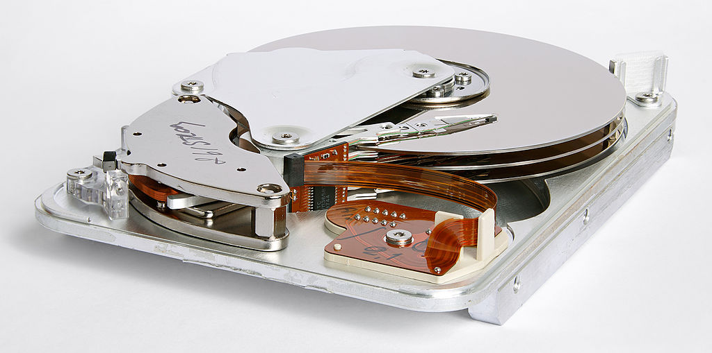
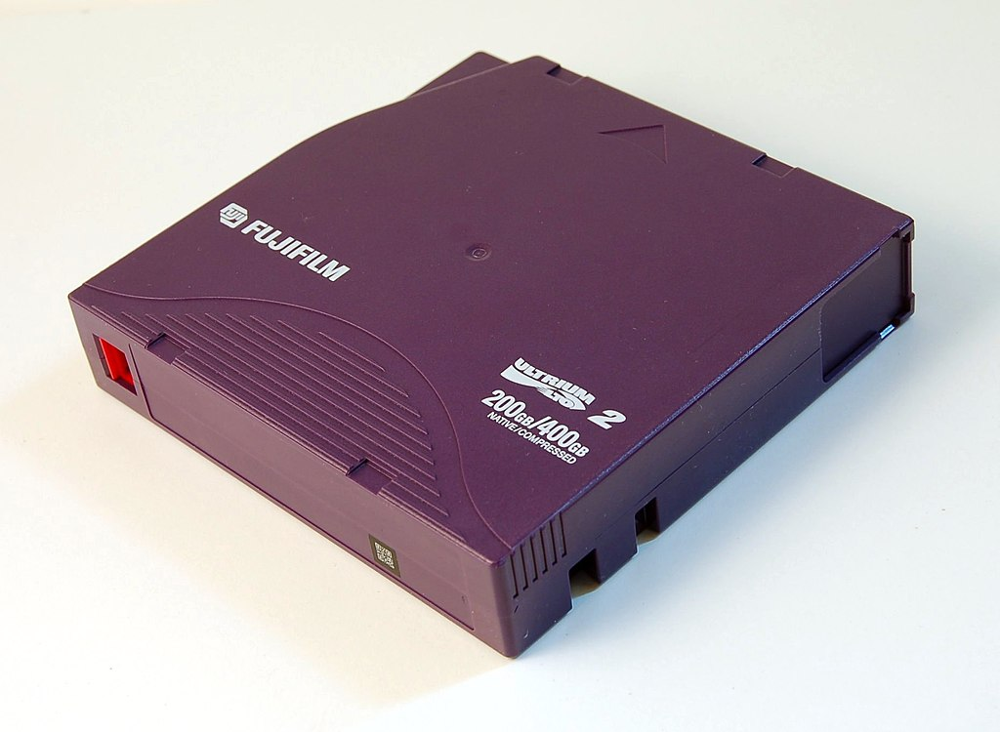

Um große Mengen von Daten (Terrabytes) zu speichern.

Abwägung:

- Kosten/MB
- Geschwindigkeit
- Datenmenge
- Lagerfähigkeit

Technologie:

- Festplatte (Harddisk)
- Flash
  - SSD (Solid State Disk)
  - Speicherkarten (Kameras), USB-Stick
- Magnet-Bänder (Backup)
- Optische Medien (CD, DVD, Blue-Ray)

Anschlussarten:

- Intern (SATA, SAS)
- Extern (USB)

# Festplatte (HDD)

Sich drehende feste Scheiben, sind magnetisch beschichtet. Ein Schreib-Lesekopf greift die Daten ab. Sind  in einem Gehäuse fest verbaut (HDD – Hard Disk Drive). 

[wikipedia de](https://de.wikipedia.org/wiki/Festplattenlaufwerk)

Vorteile:

- Große Datenmengen (**16 TB**) auf kompaktem Raum
- Kostengünstig

Nachteile:

- Mechanik – bewegte Teile
  - Laut
  - Empfindlich bei Erschütterung (Laptops!)
  - Abnutzung
    - Kaputte Sektoren
    - Headcrash
    - begrenzte Lebensdauer
- Vergleichsweise (zu SSD) langsam

Technische Daten:

- Formfaktor: 2,5" (Laptop) vs. 3,5" (ca. Durchmesser der Scheiben)

- Drehzahl 5400 / 7200 min⁻¹ (auch 15000 im Serverbereich) – bestimmt die Datenrate
  - Beispiel: Western Digital Black WD6003FZBX 7200 min⁻¹: 201 MB/s [[Quelle](https://de.wikipedia.org/wiki/Festplattenlaufwerk#Geschwindigkeit)]
- Latenz: 5-15ms mittlere Zugriffszeit (Positionierung des Schreib-Lesekopfs + Warten auf die Daten), 

Daten werden in Tracks und darin in Sektoren (meist 512 Bytes) gespeichert.

- [How a Hard Disk Drive Works](https://youtu.be/NtPc0jI21i0)

- [Take a look inside a hard drive while it's running](https://youtu.be/p-JJp-oLx58)

# SSD

[wikipedia](https://en.wikipedia.org/wiki/Solid-state_drive)

Solid State Disk, verwendet Halbleiter Technologie (meist NAND-Flash), enthält keine bewegten Teile.

Im Vergleich zu HDD: schneller, kürzere Zugriffszeit, kleinere Bauform, geringerer Stromverbrauch, unempfindlich gegen Erschütterung, geräuschlos.

Aber: teuer!

Aktuell: **2 TB**

Nachteile:

- begrenzt Lagerfähig, Datenverlust nach ca. einem Jahr
- Flash wird in Blöcken gelöscht und wiederbeschrieben. Dies nutzt die Blöcke ab. 10.000-100.000 sind aktuelle Herstellerangaben. Untersuchungen legen nahe, dass SSD Festplatten trotzdem 10 Jahre Einsatz aushalten.

[wikipedia : Gegenüberstellung HDD vs. SSD](https://en.wikipedia.org/wiki/Solid-state_drive#Hard_disk_drives)

# Bänder (Tape)

Für den professionellen Bereich.

Prinzip: Magnetband, zu einer Rolle augewickeltes Kunststoffband magnetisch beschichtet.

Anwendung

- Datensicherung (Backup and Restore)
  - Desaster Recovery
  - Schutz gegen Ransomware Angriff (WORM Medien!)

- Archivierung
  - gesetzliche Vorschriften
  - revisionssichere Archivierung (WORM)

Vorteile:

- Kompakteste Form der Datenspeicherung
- Lagerfähigkeit (Jahrzehnte)

Nachteile:

- Zugriffszeit (Spulvorgang)
- Empfindlich gegen Magnetfelder

## LTO – Linear Tape Open

Standard (HP, IBM, Quantum): [wikipedia – LTO Linear Tape-Open](https://en.wikipedia.org/wiki/Linear_Tape-Open)

Austauschbare Medien, "cartridge": Einloch-Kasette, die zweite Wickelrolle ist im Gerät.

Für Backups

- Aktuell LTO 8, **12 TB** pro cartridge (unkomprimiert), ca. €90,- (2021)
- Kompression 2,5:1 (advertised, 12TB=30TB komprimiert)
- Verschlüsselung möglich
- 15-30 Jahre lagerfähig, 200-300 mal beschreibbar.
- Typische Zugriffszeit 50 Sekunden (variiert)
- Spezielle WORM (write once read many) cartridges verfügbar
- Es gibt Laufwerke die die Bänder automatisch wechseln (backup rotation)

# Optische Laufwerke

Eher bedeutungslos geworden. Aktuell Blue-Ray (BD) max. 100GB Kapazität. Hätte den Vorteil der Immunität gegen Magnetfelder.