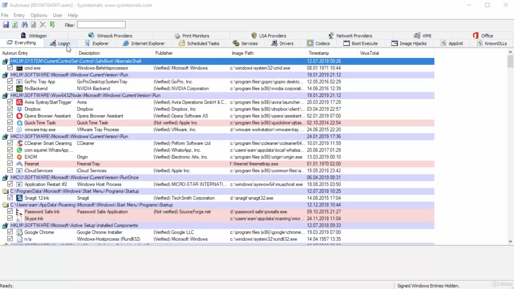

Im Taskmanager ein eigenes Register. Durch Rechtsklick kann ein Eintrag deaktiviert werden.

sysinternals : Autoruns – zeigt alle Prozesse die beim Systemstart gestartet wurden

## Autostart-Programme unter Windows 10 hinzufügen

Nutzen Sie ein Programm sehr häufig, können Sie häufig in den Einstellungen der [Software ](https://praxistipps.chip.de/was-ist-software-einfach-erklaert_41276)festlegen, dass diese automatisch mit Windows startet. Bietet das Programm solch eine Funktion nicht an, können Sie den Autostart manuell einrichten.

1. Drücken Sie gleichzeitig auf die Tasten [Windows] und [R], sodass sich das Fenster "Ausführen" öffnet.
2. Geben Sie den Befehl "shell:startup" ein und klicken Sie auf "OK". Anschließend öffnet sich der Autostart-Ordner.
3. Fügen Sie hier alle Dateien oder Programme ein, die Sie mit dem Start von [Windows](https://praxistipps.chip.de/windows-7-abgesicherten-modus-starten_12651) öffnen möchten.
4. Tipp: Bei Programmen sollten Sie eine [Verknüpfung erstellen](https://praxistipps.chip.de/verknuepfung-auf-dem-desktop-erstellen_1625) und nur diese Verknüpfung in den Autostart-Ordner einfügen.