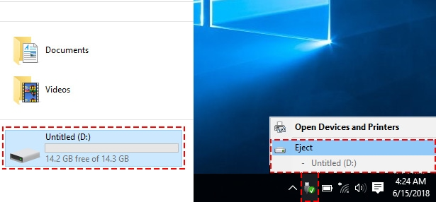
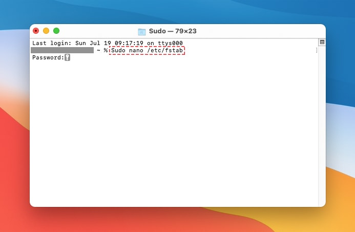
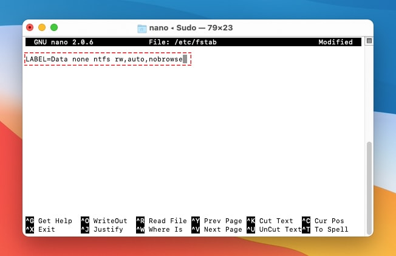
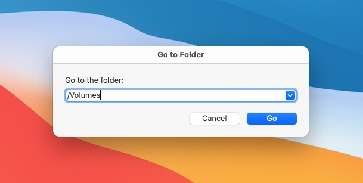
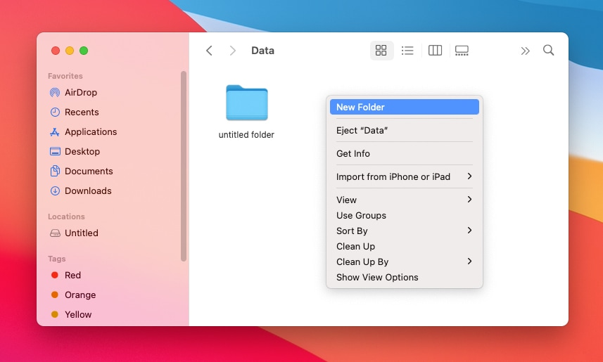

### How to Write NTFS Drives into macOS Big Sur

In this section, we will discuss the ways that you can write NTFS drives into your mac while having macOS Big Sur running.

#### 1. Enable Mac Writing to NTFS Drives Using Terminal in Big Sur

The second method involves working more closely with your mac computer and the software that you already have available, in this case, most likely macOS 11.0 Big Sur. For this method, you will be using some light code work that will be provided in the instructional section below.

Even though there is a line of code and some fancy clocking around, do not feel worried at all. It is very simple and even folks who have no clue how to code can do this!

**Follow these instructions to enable Mac NTFS writing drives in Terminal:**

1. First step you need eject USB Drive on Windows.

Eject USB Drive on Windows

2. Label the NTFS drive you want to use with a one-word name.
3. Launch a Terminal open by pressing Command and the Space Bar at the same time. Type “Terminal” and hit the enter key. You can also open Terminal by going into Applications, then to Utilities, and finally, Terminal.
4. Once you are in Terminal, type the following line of code:
   `sudo nano /etc/fstab`

Open Fstab in macOS Big Sur

Next, add this code “LABEL=**NAME** none ntfs rw,auto,nobrowse” to terminal, and replace the section “**NAME**” with the name of your USB flash drive with the NTFS drive you want to use. In this example, we will use “**Data**” as the file name. Below is the coding.

Enable Read and Write NTFS Drives in macOS Big Sur

Select the Control key and the letter “O” key to save this new file, press “Enter” and then press both the Control key and the letter “X” key to close the GNU.

5. **Unplug the flash drive and then reconnect** the flash drive to the USB flash drive port.

Go to Volumes in macOS 11.0

\6. To access the files and the drive, click on "Go" then go to the folder tab. Type in "/Volumes" into the search box. Now, you should be able to access the NTFS files that are on the drive and change or use them in any way you want.

Write NTFS Drives in macOS Big Sur

To remove or undo any changes that you have done, open the nano editor using the same method as the instructions above read, and delete the lines of code that you input. This method of undoing the actions might work, but also may not work. It depends on the chance that the code had not fully logged into the system or saved.

If you are lucky, it will delete and the coding that you had previously done will be undone. If it does not delete the lines, or the lines of code are deleted but the actions are not undone, you will have to find alternative methods of removing them or undoing the actions you did.