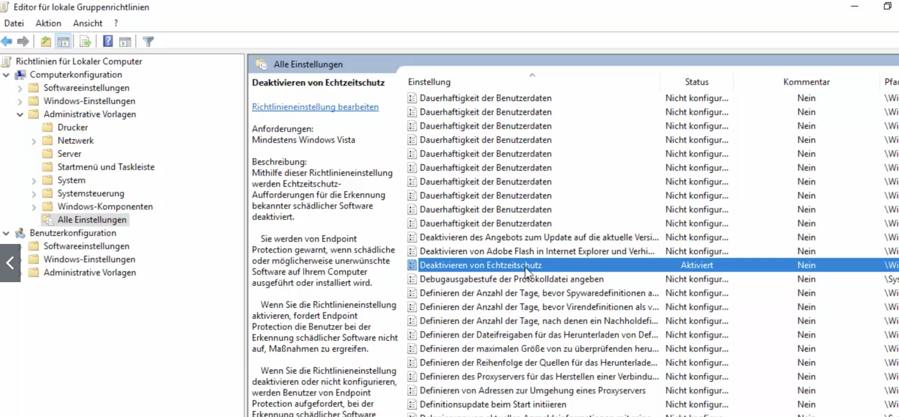
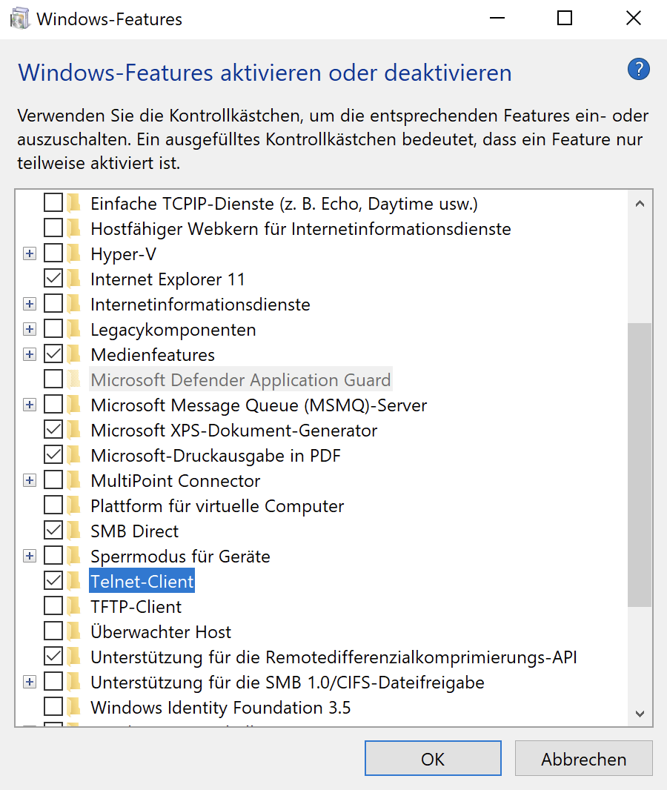

* TOC
{:toc}

# Downloads / Install

- [Get a Windows 10 development environment](https://developer.microsoft.com/en-us/windows/downloads/virtual-machines/) – mit Visual Studio
-  [ISO vom aktuellen Windows](https://www.microsoft.com/de-de/software-download/windows10ISO) – nur Verfügbar wenn das OS nicht Windows ist.
- [Virtual Machines – Test IE11 and Microsoft Edge Legacy using free Windows 10 virtual machines you download and manage locally](https://developer.microsoft.com/en-us/microsoft-edge/tools/vms/)
  -  user: IEUser
  -  pass: Passw0rd!


# Orientierung

- Desktop
- Taskleiste
  - Startmenü
  - Angeheftete App Symbole
  - Laufende Programme
  - Infobereich, Benachrichtigungsfeld , "systray"
- Einstellungen


## en/de

Control Panel = Systemsteuerung

Settings = Einstellungen (Zahnrad)


# Arbeiten mit Filesystem im Datei Explorer


# Arbeiten mit Filesystem im CLI


# Basics / Sammlung

- Dateiexplorer (Dateiendungen, verborgene Dateien)
- Win-R
- Win-D
- cmd
- CLI Basics
- Verknüpfungen


## Bildschirmlupe

[Windows]+[+] Taste zum vergrößern, [Windows]+[-] zum verkleinern

# Autostart

[Windows 10-Autostart: Programme verwalten](https://tipps.computerbild.de/internet/browser/windows-10-autostart-279089.html)

Drücken Sie „Win“ + „R“ und geben Sie den Befehl **shell:startup** ein.

Übung: Ein Programm erstellen das einen Text ausgibt. Im Autostart Ordner eine Verknüpfung auf das Programm ablegen. Ausloggen und wieder einloggen.


# Task Manager

Ctrl-Alt-Del


# Datei Explorer


## Dateiendungen anzeigen lassen

1. Öffnen Sie den **Explorer** auf Ihrem Desktop.
2. Klicken Sie dort im **Reiter** auf "**Ansicht**".
3. Setzen Sie einen **Haken** bei "**Dateinamenerweiterungen**".


## Versteckte Dateien anzeigen

unter Windows 10:

- Explorer öffnen (Win-R)

- Registerkarte "Ansicht" – Kategorie "Ein-/Ausblenden".
- Aktivieren der Option "Ausgeblendete Elemente"


Windows 7 und 8.1:

1. Wählen Sie die Schaltfläche „Start“ und dann **Systemsteuerung (Control Panel) > Darstellung und Anpassung** aus.
2. Wählen Sie **Ordneroptionen** und dann die Registerkarte **Ansicht** aus.
3. Wählen Sie unter **Erweiterte Einstellungen** Ausgeblendete Dateien, Ordner und Laufwerke anzeigen und dann OK aus.


# IP Adressen

Kontrollieren bzw. statische IP Adressen setzen

**To set a static IP address in Windows 7, 8, and 10:**

1. Click **Start Menu** > **Control Panel (Systemsteuerung)** > **Network and Sharing Center** or **Network and Internet > Network and Sharing Center (Netwerk- und Freigabecenter) / Netzwerkstatus und -aufgaben anzeigen).**
2. Click **Change adapter settings**.
3. Right-click on **Wi-Fi** or **Local Area Connection.**
4. Click **Properties**.
5. Select **Internet Protocol Version 4 (TCP/IPv4)**.
6. Click **Properties**. 
7. Select **Use the following IP address**.
8. Enter the **IP address**, **Subnet mask**, **Default gateway**, and **DNS server**.
9. Click **OK**.
   Your computer displays a static IP address.


# Windows Defender AntiVirus

[ct: Windows Defender deaktivieren - so klappt's](https://www.heise.de/tipps-tricks/Windows-Defender-deaktivieren-so-klappt-s-4030040.html)

## Deaktivieren

[Quelle](https://support.microsoft.com/en-us/windows/turn-off-defender-antivirus-protection-in-windows-security-99e6004f-c54c-8509-773c-a4d776b77960)

Turn off Defender antivirus protection in Windows Security

Follow these steps to temporarily turn off real-time Microsoft Defender antivirus protection in Windows Security. However, keep in mind that if you do, your device may be vulnerable to threats.

Start  > Settings  > Update & Security  > Windows Security > Virus & threat protection > Manage settings (or Virus & threat protection settings in previous versions of Windows 10).

Switch **Real-time protection** to **Off**. Note that scheduled scans will continue to run. However, files that are downloaded or installed will not be scanned until the next scheduled scan.

Hinweis: Der Defender aktiviert sich nach gewisser Zeit wieder von selbst.


## Deaktivieren – dauerhaft

Nachhaltig die Echtzeitschutzfunktion von Windows Defender deaktivieren

Gruppenrichtlinien Verwaltungseditor

- Suche nach gpedit.msc und öffnen

- 

- Auf "Aktivieren" stellen (Doppelklick)

- Sollte automatisch aktiviert werden, oder auf Nummer sicher:

  ```
  C:> gpupdate /force
  ```

- Einstellungen (Zahnrad) öffnen > Update und Sicherheit

- Windows Defender

- Echtzeit Schutz ist disabled und aktiviert sich nicht wieder nach einer gewissen Zeit.


# Windows Smartscreen

## Edge

... > Einstellungen > Datenschutz, Suche und Dienste

Sicherheit (fast ganz unten)

- Microsoft Defender Smartscreen – Off
- Potenziell unerwünschte Apps blockieren – Off


## App Start

In den Eigenschaften der EXE Datei. (ausprobieren).


## How to disable Windows Defender SmartScreen

Start  >> Settings/Einstellungen >> Windows Security/Sicherheit  >> App- & Browsersteuerung >> Zuverlässigkeitsbasierter Schutz


# Windows Firewall

Hinweis: Ein Windows 10 System reagiert auch nicht auf PING (in der Firewall deaktiviert).


## Deaktivieren

Start  > Settings/Einstellungen > Windows Security/Sicherheit > Firewall & network protection/Firewall & Netzwerkschutz

Es werden 3 Arten von Netzwerk-Profilen angezeigt, nur eines sollte aktiv sein (z.B. öffentliches Netzwerk)

Auf den Profilnamen  (z.B. öffentliches Netzwerk) klicken > Schieber auf "aus" bewegen


# Netzwerkfreigabe

[support.microsoft.com](https://support.microsoft.com/de-de/windows/dateifreigabe-über-ein-netzwerk-in-windows-10-b58704b2-f53a-4b82-7bc1-80f9994725bf)

Rechtsklick auf Ordner >> Eigenschaften >> Tab Freigabe 

Rechnernamen feststellen: Datei-Explorer >> Rechtsklick auf "Dieser PC" >> Eigenschaften

HTLPC-R83-101

smb://HTLPC-R83-101/

Scheint in der Schule nicht zu funktionieren


# telnet

Windows 10 – **telnet client** in der Kommandozeile:

Telnet muss aktiviert werden. Suchen nach "Features aktivieren" (https://www.heise.de/tipps-tricks/Windows-10-Telnet-Client-aktivieren-4569277.html). "Telnet-Client".
telnet über die Kommandozeile starten.



